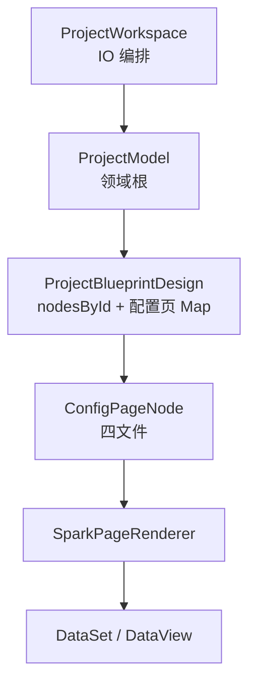

# SPARK AppWorks 项目深度解析

> 更新基准：2026-10。唯一领域根 `ProjectModel`；嵌套子页 = `page` + `hidden` + 无 `path`。当前权威模型见 [`packages/spark-project-model/src/MODEL-HIERARCHY.md`](../packages/spark-project-model/src/MODEL-HIERARCHY.md)；系统总览见 [architecture/system-architecture.md](architecture/system-architecture.md)。

## 定位

SPARK AppWorks 是企业后台的软件项目模型与页面运行平台。它不是 JSON 表单生成器，也不是让 AI 任意生成 Vue 代码的工具。它把项目需求、模块规划、页面功能、结构、数据、脚本、样式和权限收敛到可验证的模型链路。

它是纯前端：浏览器直连外部 lowcode-jdk17 网关，仓内没有服务端。

```text
理念 > 逻辑 > AI 生成代码规则 > SSOT || SOLID > 该删则删 || 该合则合 || 该拆则拆 > 迁移便利
```

## 主模型



`ProjectBlueprintDesign` 持有平铺的 `nodesById` 与配置页 Map，蓝图树和索引（`ProjectBlueprintIndex`）都是投影。`ProjectModel` 另有 `ProjectSession`，保存选中节点、活动页和蓝图 dirty，不落盘。

## 节点设计

节点来自 lowcode 的 `Base_NavigationInfo` 蓝图记录，可序列化形状是 `ProjectBlueprintTreeNodeData`，核心字段：`id`、`title`、`description`、`nodeKind`、`blueprintKind`、`icon`、`order`、`hidden`、`disabled`、`children`。

- `nodeKind`：运行交付投影，决定菜单、页面、链接、引用等输出行为。
- `blueprintKind`：策划业务种类（页面、子页面、需求、原型、数据空间、报表等）。

```text
页面 => 嵌套子页（page + hidden，无 path）
```

顶层页与嵌套子页均为 `ConfigPageNode`；策划输入经 `readPlanningProjection()` 返回的 `effectiveDescription` 消费。完整的企业、应用、蓝图层级见 [architecture/PLATFORM_TENANT_ROUTING.md](architecture/PLATFORM_TENANT_ROUTING.md)。

## 功能策划

节点 `description` 即功能描述，也就是用户需求。祖先节点与本级描述共同约束当前节点，合成为 `effectiveDescription`，并保留来源明细 `descriptionContext`：

```text
project.description
  + module.description
  + page.description
  + subPage.description
  => effectiveDescription
```

项目策划就是模块策划 + 页面策划。模块策划是所属模块下的全子模块、页面、子页面策划；页面策划是页面下的全子页面策划。

## 配置页节点

蓝图元数据（标题、描述、路径、上下文、权限入口）属于 `ProjectBlueprintNode` 基类，所有节点共用。`ConfigPageNode` 只扩展配置页内容子模型：

| 子模型 | 类 | 持久化 |
|---|---|---|
| `rule` | `PageRuleFile` | `rule.json` |
| `dataSet` | `PageDataSetFile` | `pagedata.json` |
| `script` | `PageTextFile` | `script.js` |
| `style` | `PageTextFile` | `style.css` |

四文件是内容投影，不能反过来成为最高事实源。有数据空间绑定的页面，运行数据真源是数据空间，不是 `pagedata.json`。

## 包职责

| 包 | 职责 |
|---|---|
| `spark-utils` | Logger、HTTP、Capability 原语、跨包 SSOT 字面量 |
| `spark-json-document` | JSON 值与路径、JSON Schema、不可变树编辑 |
| `spark-data` | DataSet、DataTable、DataView、CRUD、树与事务、权限快照 |
| `spark-project-model` | `ProjectModel`、蓝图节点、项目策划、配置页节点子模型 |
| `spark-component` | 组件注册、能力系统、页面渲染器、权限判定 |
| `spark-app` | Vue 应用壳、路由、插件、主题、导航合同 |
| `spark-lowcode-api` | lowcode 前端 API 客户端与 wire 合同 |
| `spark-ai` | AI runtime、tool loop、ClassModel、Agent Workflow |

依赖方向（无环）：

```text
spark-utils <- spark-json-document <- spark-ai
spark-utils <- spark-data <- spark-project-model <- spark-component <- spark-app
spark-utils <- spark-lowcode-api
```

`spark-app` 还依赖 `spark-ai`；`spark-lowcode-api` 与 `spark-project-model` 只在宿主 `src/lowcode/` 汇合。

## DevSystem

DevSystem 是消费层，不是模型层。

```text
DevSystem
  -> getAppProjectBlueprintWorkspace(scope)
  -> ProjectWorkspace
  -> ProjectModel
  -> ConfigPageNode 四文件
  -> lowcode 蓝图接口 + 页面文件接口
```

六阶段工作区 `BlueprintWorkspace` 直接经 `lowcodeApi` 读写蓝图字段与设计文件版本，不经过 `ProjectWorkspace`。

pageDesign：`DevSystem` 顶栏「AI 编辑」。projectPlanning：仅 headless / Host Run（无 DevSystem 顶栏）。

## AI 生产线

`spark-ai` 是通用 AI runtime。pageDesign 是业务注册示例，它把工具写入收敛到 `ConfigPageNode` 子模型。

```text
AI Agent Host
  -> readWorkflowDefinition(...)
  -> activatePageDesignAgentWorkflow() | activateProjectPlanningAgentWorkflow()
  -> ProjectWorkspace.project
  -> ProjectModel.openPageDesign(pageId)
  -> ConfigPageNode 子模型
```

AI 写入先进入内存并标 dirty。DevSystem 保持显式保存；自动化 runner 可在运行结束后保存 dirty 四文件。

## 数据运行时

无数据空间绑定时，`pagedata.json` 进入 `ConfigPageNode.dataSet` 子模型，再由 Renderer 初始化 `DataSet`。有绑定时由宿主 `loadRuntimeDataSet` 装载数据空间。组件读取数据必须走：

```text
dataViewKey + dataMember + dataField
```

不要使用旧的成员拼接键、点号数据路径、`pageData` 或 `$data` 旁路。

## 继续阅读

- [architecture/system-architecture.md](architecture/system-architecture.md)
- [architecture/SPARK_PAGE_CONFIG_ARCHITECTURE.md](architecture/SPARK_PAGE_CONFIG_ARCHITECTURE.md)
- [architecture/DATAFLOW_ARCHITECTURE.md](architecture/DATAFLOW_ARCHITECTURE.md)
- [guides/CONFIG_SYSTEM.md](guides/CONFIG_SYSTEM.md)
- [../packages/spark-ai/README.md](../packages/spark-ai/README.md)
