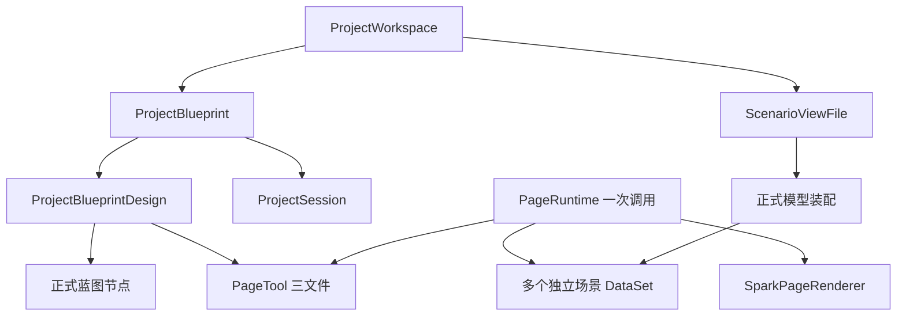

# SPARK AppWorks 项目深度解析

SPARK AppWorks 是纯浏览器应用工场，连接外部 lowcode-jdk17 网关。项目需求、工具定义、场景数据与运行调用各有独立 owner；领域事实见 [模型层级](../packages/spark-project-model/src/MODEL-HIERARCHY.md)。

## 项目与工具

nodeId 定位蓝图节点，pageId 定位可复用工具，scenarioId 定位业务场景，instanceId 定位一次运行调用。节点 DTO 使用 nodeId/parentNodeId/projectId/kind/capability，按需附 navigation/dataSpace/prototype/source；children 是树投影。kind 为 module/page/embedded/service/content，不能以菜单形态替代领域类型。

ProjectBlueprintDesign 索引节点与工具；ProjectSession 保存选中、活动工具、草稿及 dirty。capability.description 是短需求，策划输入和有效约束通过 readProjectPlanningInput/readBlueprintPlanningInputs/readPlanningProjection 读取。

PageTool 不继承节点，多个节点可共用工具。openPageDesign(pageId) 返回只持 rule.json/script.js/style.css 的工具；PageRuleFile 管理结构与历史，PageTextFile 管理文本与历史。工具定义没有业务数据。

## 场景配置与真实数据

ScenarioViewFile 位于 SysForm/<scenarioId>/pagedata.json，持原文、savedText、校验后的 ScenarioViewConfig 和撤销历史。文件声明单场景 tables、正式 modelBinding、命名 views 和 viewCascades；不复制后端模型定义。

loadScenarioDataSet 使用配置引用的模型 Name，通过正式 readModel/readRelations 装配 DataSet。稳定 tableName 用于绑定，modelId 与查询 Name 校验正式模型身份。可表达关系自动生成级联，显式场景级联优先。

DataView 查询与保存共用 DataSpaceRuntimeApi 私有原 query context；API 持 Name/AsName 映射、凭据、差异和回执。组件只消费 DataView.fieldAccess 和动作状态。E 是写白名单，R 必填限于 E；h/m 联合模型与真实行判断，树 c 独立控制新增子行。前端 _pk 不提交；应用和租户来自请求 scope。后端签名强验证不能被页面或 API 映射绕过。

dirty 拒绝覆盖，失败 stale 暂停编辑。同模型多个 dirty 视图拒绝合存；同场景不同模型一次保存不保证事务。

## 每次调用独立

PageRuntime 以 tool/scenarioIds/loadScenario 构造，持本次调用的数据集 Map。load 拒绝共享数据集或场景身份错误，失败与销毁清理已装配内容。resolveView 使用 #scenarioId@table@view；局部 table@view 仅在明确 mainScenarioId 后可物化，绝不选择首空间。

SparkPageRenderer 接收 pageRuntime 和 routeSnapshot。脚本 Render、CSS、组件 registry、timer 与异步代次属于 instanceId。关闭调用后旧动作和回调失效，共用工具的另一调用仍然独立。容器经 PAGE_RUNTIME 解析视图，提供 DATA_SOURCE 和行 DATA_ROW；脚本 $page 暴露同一 getDataSet/resolveView 入口。

## DevSystem 与 AI

ProjectWorkspace 编排蓝图、工具、场景配置及引用 IO；DevSystem 是模型消费层。AI 绑定同一 ProjectWorkspace 根，经 project.openPageDesign(pageId) 编辑工具；只有明确 scenarioId 才编辑场景配置。各 run 使用 requestId、独立 Host 与编辑器，完成校验与 Delivery 分别报告实际结果。

工具 dirtyFiles、ScenarioViewFile.isDirty、PageRuntime.isDirty 分属内容编辑、场景编辑与业务编辑。保存场景执行原文比较和字节读回；没有后端 CAS，不承诺原子并发保护或部分失败全回滚。

工具工作文件使用裸名；版本为真实 N__filename 快照。source.VersionId 保存 rule/script/style 发布引用；恢复工作文件不切换发布引用，dirty 目标拒绝恢复。

## 包职责

| 包 | 职责 |
|---|---|
| spark-utils / spark-json-document | 共享原语、正式字面量、JSON与不可变树 |
| spark-project-model | 项目蓝图、工具、场景文件、运行调用与IO编排 |
| spark-data | DataSet/DataTable/DataView、编辑、关系、树算法 |
| spark-lowcode-api | 平台正式定义、请求scope、原query/save owner与wire合同 |
| spark-component | 能力系统、组件、页面渲染与权限消费 |
| spark-app | 应用壳、路由、认证、主题与调用宿主 |
| spark-ai | 浏览器tool loop、ClassModel与工作流 |

宿主 src/lowcode 将领域模型与平台 API 接线；AppWorks 不启动服务器、不保存平台密钥。

## 继续阅读

- [系统总览](architecture/system-architecture.md)
- [模型架构](architecture/SPARK_PAGE_CONFIG_ARCHITECTURE.md)
- [数据流](architecture/DATAFLOW_ARCHITECTURE.md)
- [配置指南](guides/CONFIG_SYSTEM.md)
- [AI runtime](../packages/spark-ai/README.md)
