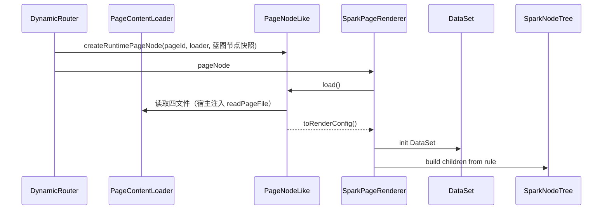

# SPARK 数据流架构

> 当前数据流从项目蓝图开始，经 `ProjectModel.design` 与 `ConfigPageNode` 进入稳定渲染运行时。四文件、lowcode API 和 Vue 组件都是投影或消费层，不是理念入口。总览见 [system-architecture.md](system-architecture.md)。

## 主链路

```text
lowcode 项目蓝图记录
  -> ProjectModel.design (ProjectBlueprintDesign)
  -> ConfigPageNode（page；嵌套子页 = hidden + 无 path）
  -> PageNodeRenderConfig
  -> SparkPageRenderer
  -> DataSet / SparkNodeTree / script / style
  -> UI
```

## 项目节点

**存储真源**是 lowcode 的 `Base_NavigationInfo` 平铺记录；**领域模型**由 `ProjectBlueprintDesign` 持有 `nodesById` 与配置页 Map，`ProjectBlueprintIndex` 提供索引。`ProjectBlueprintTreeData` 与导航树是为 UI、路由和策划遍历生成的投影，不必与表结构同构。

节点的可序列化形状是 `ProjectBlueprintTreeNodeData`，核心字段：

```text
id / title / description
nodeKind        运行交付投影（RuntimeNavigationItemKind）
blueprintKind   策划业务种类（ProjectBlueprintNodeKind）
icon / order / hidden / disabled / childPlacement / context
children
```

嵌套规则：

```text
页面 => 嵌套子页（page + hidden，无 path）
```

## 页面节点

```text
ProjectBlueprintNode            非配置页节点基类
└── ConfigPageNode              nodeKind = page
      rule     PageRuleFile      rule.json
      dataSet  PageDataSetFile   pagedata.json
      script   PageTextFile      script.js
      style    PageTextFile      style.css
```

- 蓝图元数据（标题、描述、路径、上下文、权限入口）属于 `ProjectBlueprintNode` 基类；`ConfigPageNode` 只扩展页面内容与运行投影。
- 嵌套子页不是第二套 class，仍是 `ConfigPageNode`（`isSubPage` 为真）。
- 系统页面（`system-page`）只保存节点事实和组件路径，不承载四文件。
- `ConfigPageNode.toRenderConfig()` 产出 `PageNodeRenderConfig`：`pageId`、`blueprintNode`、`dataSpaceBinding`、`rule`、`data`、`script`、`css`。未加载时调用会抛错。

## 功能约束

每个节点的 `description` 是用户需求。生成某个页面时，祖先节点与本级的描述共同合成 `effectiveDescription`，并附带来源明细 `descriptionContext`。消费层统一读取：

```text
ProjectModel.readPlanningProjection()  ->  ProjectPageNodeSummary[]
```

不要自行拼接约束链。同一份摘要还携带 `implGate`（缺省 `closed`）与 `upstreamContractsSatisfied`（缺省 `false`），pageDesign 闸门据此放行，见 [system-architecture.md](system-architecture.md)。

## 运行态



运行态边界：

- Router 只创建 `PageNodeLike`，不触碰四文件内容。
- Renderer 只消费 `PageNodeLike` 与 `PageNodeRenderConfig`。
- `PageContentLoader` 依赖宿主注入的页面文件读取器；缺失时读取结果为失败（"未注入页面文件读取器"），`PageNodeLike.load()` 随即抛错，不静默兜底。
- 配置非法或必需依赖缺失（例如有数据空间绑定却没有 `loadRuntimeDataSet`）时 fail-fast。

## 设计态

```text
DevSystem
  -> getAppProjectBlueprintWorkspace(scope)
  -> ProjectWorkspace
      -> ProjectModel.design -> ConfigPageNode
      -> lowcode 蓝图接口 + 页面文件接口
```

- 宿主（`src/services/project/project-shell.ts`）按 `tenantId:projectId` 缓存两类 `ProjectWorkspace`：`getAppProjectWorkspace` 持有已提交（committed）的项目模型；`getAppProjectBlueprintWorkspace` 是 DevSystem 的编辑宿主。两者分离，编辑中的改动不会污染已提交投影。
- DevSystem 是消费层，通过编辑宿主的 `ProjectWorkspace` 加载蓝图、选择页面、读写四文件并落盘。
- 例外：六阶段工作区 `BlueprintWorkspace` 直接经 `lowcodeApi` 读写蓝图记录的策划、原型、数据规划、估算、发布字段，并上传设计文件版本，不经过 `ProjectWorkspace`。

## AI

```text
AI Host
  -> readWorkflowDefinition(...)
  -> activatePageDesignAgentWorkflow() | activateProjectPlanningAgentWorkflow()
  -> ProjectWorkspace.project
  -> ProjectModel.openPageDesign(pageId)
  -> ConfigPageNode
  -> 配置页节点子模型
```

AI 写入先进入内存 `ConfigPageNode` 并标 dirty。DevSystem 的保存、版本、路由刷新和发布由显式用户动作触发；自动化 runner 可在运行结束后保存 dirty 四文件。

## DataSet / DataView

页面数据分两轴，禁止混成单一真源：

| 轴 | 真源 | 用途 |
|----|------|------|
| 设计 / AI | 四文件 `pagedata.json` → `ConfigPageNode.dataSet` | 设计器、生成器、无绑定预览 |
| 运行 | 平台 DataSpace 设计 + 权限快照 → `LowcodeDataSpaceAssembler` → `DataSet` | 有 `PageDataSpaceBinding`（`formKey` + `dataSpaceId` + `modelId`）的配置页 |

有绑定的运行态：`SparkPageRenderer` 经宿主注入的 `loadRuntimeDataSet`（实现为 `loadBoundDataSpaceDataSet`）装载；**禁止**再把 `pagedata.json` 当运行数据真源。绑定不完整时数据读取失败关闭。无绑定时仍可用四文件 hydrate（设计轴）。

组件读取必须走：

```text
dataViewKey + dataMember + dataField
```

`dataViewKey` 只定位视图：

```text
Users@grid
#scope@Users@grid
```

不要使用旧的成员拼接键、点号数据路径、`pageData` 或 `$data` 旁路。

## 不变约束

1. `spark-project-model` 保持纯模型，不引入 Vue、Element Plus 或应用层 service。
2. 存储真源分层：平台蓝图、导航授权、权限、DataSpace 在 lowcode；页面布局、脚本、样式、设计草稿在四文件；领域模型可用树与索引，树是投影。
3. 嵌套子页与顶层配置页同属 `ConfigPageNode`（`page` + `hidden` + 无 `path`）。
4. 系统页面是 `system-page` 节点，不反向决定数据结构。
5. 四文件是页面内容投影，落盘锚点明确即可；运行业务数据不由 `pagedata.json` 独占。
6. DataSet 管线：设计轴 `pagedata.json -> DataSet`；运行轴（有绑定）`DataSpace + 权限 -> DataSet -> DataViewKey -> DataView -> UI`。
