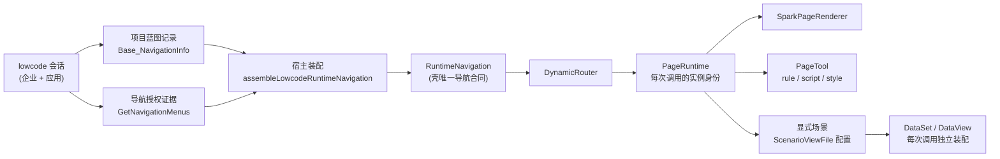
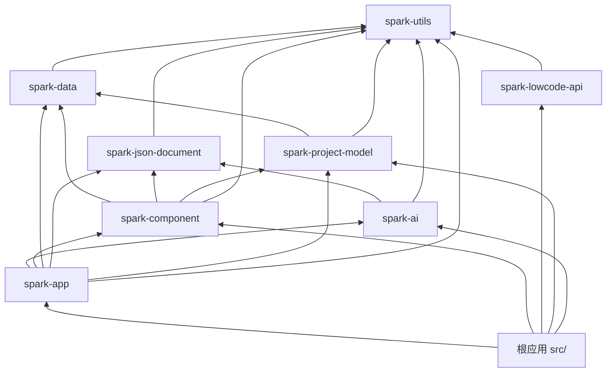

# SPARK AppWorks 系统架构总览

> 本文只写当前仍成立、能从源码核对的架构事实。细节以各包 README、源码 JSDoc 为准；与源码冲突时以源码为准。

## 定位与边界

AppWorks 是**纯前端**应用：浏览器经同源 `/api` 直连外部 lowcode-jdk17 网关，仓内没有任何服务端。

- 开发态：`vite.config.ts` 把 `/api` 代理到环境变量 `LOWCODE_GATEWAY_URL`；该变量缺失时 Vite 直接抛错拒绝启动，不做默认值兜底。
- 生产态：由部署侧反向代理提供同源 `/api`，前端不感知网关地址。
- 企业、应用、权限、数据空间、持久会话和 LLM 都在 lowcode 后端；前端只做界面、模型编辑、运行渲染和浏览器内 Agent 工具执行。
- 本仓不保存平台密钥，也不保存数据库副本。

## 一条主线



- **项目蓝图**的正式节点种类为 `module/page/embedded/service/content`，唯一种类表是 `spark-utils` 的 `PROJECT_BLUEPRINT_NODE_KINDS`。后端 `conType` 中 `Model/Navitem` 对应 `module/page`；未知值保留为草稿 `unknown`，不能通过正式策划完成校验。**运行菜单**只是蓝图经候选筛选与后端授权后的输出。
- 候选筛选：后端字段 `IsShowAtNav` 为 1 时，wire 层把记录标为 `runtimeNavigationCandidate`；宿主只保留"候选且授权树中存在同一 id"的节点。
- `PageTool` 仅持有 `rule.json`、`script.js`、`style.css` 三个工具文件。场景视图配置位于 `SysForm/<scenarioId>/pagedata.json`；运行数据依据该配置、正式模型和权限装配，工具不持有业务数据。

## 包分层与依赖方向



- 依赖无环、无上行。`spark-lowcode-api` 与 `spark-project-model` 互不依赖，两者只在宿主 `src/lowcode/` 汇合。
- `spark-component` 对 `spark-ai` 只有测试期依赖，运行时代码不引用它。
- 开发与测试时，所有 `@spark-appworks/*` 通过 Vite/Vitest alias 直接指向 `packages/*/src`，不依赖各包 `dist/`。
- `spark-ai` 只有三个公共入口：`.`、`./agent`、`./class-model`，不允许深路径引用。

| 包 | 职责 |
|---|---|
| `spark-utils` | 框架无关底座：`HttpClientBase`、`Logger`、Capability 原语，以及跨包共用的字面量 SSOT（蓝图节点 kind、权限展示三态、运行导航表面类型） |
| `spark-json-document` | JSON 值与路径、JSON Schema（Draft 2020-12）、不可变树编辑；JSON Schema 类型的唯一来源 |
| `spark-data` | 页面级数据引擎：`DataSet` → `DataTable` → `DataView`，关系与级联、树、聚合、计算列、权限快照、`SparkNodeTree` |
| `spark-project-model` | 项目蓝图、页面三文件、场景配置及页面调用生命周期，及其 IO 编排（`ProjectWorkspace`、`PageContentLoader`） |
| `spark-component` | 组件注册表、能力上下文树、`SparkPageRenderer`、页面动作与绑定、权限判定 |
| `spark-app` | 应用壳：启动、`DynamicRouter`、`RuntimeNavigation*` 合同、标签页、插件、主题 |
| `spark-lowcode-api` | lowcode 前端 API 客户端与 wire 合同；`LowcodeApi` 聚合 blueprint / catalog / dataSpace / design / application / realtime / platform / permission / session |
| `spark-ai` | 浏览器内 Agent 运行时、ClassModel 知识与工具、Agent Workflow 定义与激活 |

## 项目模型

`ProjectBlueprint` 是项目设计与编辑会话根；`ProjectBlueprintDesign` 索引蓝图节点和页面工具，`ProjectSession` 持有选中节点、活动工具与草稿。蓝图节点 `nodeId` 和工具 `pageId` 是不同身份，两个节点可指向同一工具。

正式蓝图 DTO 使用 `nodeId`、`parentNodeId`、`projectId`、`kind`、`capability`、可选 `navigation/dataSpace/prototype` 和 `source`；`children` 只用于树投影。正式 `kind` 不由导航地址、层级或 children 猜测。导航运行交付的 `itemKind` 是下游投影。

- `ProjectBlueprintNode` 表达蓝图节点。`PageTool` 表达三文件工具定义，并不继承蓝图节点；`openPageDesign(pageId)` 返回工具。
- `ProjectWorkspace` 持有 `ProjectBlueprint`，提交蓝图 CRUD、三文件 IO、快照操作、跨项目引用和显式场景配置 IO。`loadScenarioViews({scenarioId})` 返回独立的 `ScenarioViewFile`。
- `PageRuntime` 表达一次页面调用，持有唯一 `instanceId`、工具定义、显式 `scenarioIds` 和可选 `mainScenarioId`。每次调用独立装配 DataSet；销毁只释放本实例。运行数据不进入工具文件模型。
- 节点需求来自 `capability.description`。父级与本级描述通过 `readPlanningProjection()` 合成 `effectiveDescription`，消费方不另行拼接。
- `navigation.target` 指向实际工具目标，`dataSpace.scenarioId` 指向业务场景；场景 ID 不代表物理模型或工具身份。

工具工作内容使用裸文件名。快照列表来自后端真实文件名 `N__filename` 和 `lastModified`，编号只表示该文件的快照；发布引用读取 `source.VersionId` 的 rule/script/style 分段。创建候选号取同文件现有最大编号加一，经过上传最终文件名和字节回读确认；不据此推断 current。恢复把快照内容写回工作文件，不切换发布指针。

## 启动与路由

1. `src/main.ts` 做前置准备：清理损坏的本地存储键、注册内置插件（Element Plus、VXE Table）、构建 `config/navigation/vue-pages.json` 的页面注册表、与 lowcode 会话对账。
2. 调用 `SparkApp.start(...)`，宿主注入 `loadNavigation`（`readLowcodeRuntimeNavigation`）、`readPageFile`、`loadScenario` 和租户路径前缀 `/t/:tenantId/:projectId`。
3. `SparkApp.start` 依次：创建 Vue 应用与主题 → 安装 Spark 插件 → 注册内置 renderer → 动态导入 `virtual:spark-components` 注册业务扩展组件 → 创建 `PageContentLoader` 与 `DynamicRouter` → `bootstrap`。
4. 路由守卫在 `beforeMount` 中安装：
   - 未登录：访问 `/t/*` 或平台工作区路径一律回平台首页，非公开页也回平台首页。
   - 已登录：企业与会话不一致时改写为当前企业的同名路径；应用与会话不一致时切换到 URL 中的应用；非 `/t/` 路径导向当前租户首页（`about` 这类公开工具页除外）。
   - 守卫之后还会校验当前作用域路径是否在导航树内，不在则替换到项目首页。

路径语法是 `/t/{enterpriseShortName}/{projectId}/{pagePath}`，解析与构造只在 `src/services/tenant-scope.ts`。平台级导航由 `isPlatformNavigationEnabled` 控制，默认关闭。

## 运行导航装配

`readLowcodeRuntimeNavigation` 并行读取蓝图记录与授权证据，再由 `assembleLowcodeRuntimeNavigation` 产出 `RuntimeNavigation`：

- 节点 `itemKind` 的推导：有子节点为 `module`；目标以 `vue:` 开头为 `system-page`；外部链接为 `link`；没有目标为 `system-action`；其余为 `page`。
- 后端状态为 `maintenance` 的节点标记为禁用。
- 宿主把 `vue-pages.json` 中 `scope` 为 `app` 且未排除的工具页，收进名为"SPARK 工具"的模块，追加在业务节点之后。
- 没有应用上下文时，退回由 `vue-pages.json` 投影的应用目录导航。

`DynamicRouter` 随后按 `resolveNavNodeRuntimeTarget` 的结果注册路由：容器、跨项目引用、外部或 iframe 链接、动作命令、配置页路由。

## 页面渲染

`SparkPageRenderer` 接收已经确定身份的 `pageRuntime` 与不可变调用 `routeSnapshot`。加载顺序为：`beforeLoad` → `PageRuntime.load()` → `materialize()` → 应用三文件 → `afterLoad` → 下一 tick 执行 `__init__`。

1. 工具加载使用明确的发布引用读取三文件；调用的场景 ID 逐个通过宿主 `loadScenario` 装配。
2. 样式以 `instanceId` 加作用域；script 在本实例沙箱编译，`Render*` 函数组件只注册到本页组件注册表。
3. 通过 `PAGE_RUNTIME` 提供本次调用。脚本使用 `$page.getDataSet(scenarioId)` 或 `$page.resolveView(binding)` 获取明确场景的数据。
4. rule 经 `SparkNodeTree.fromPageChildren` → `buildPageChildren` → `SparkComponentRenderer` 递归渲染；绑定统一为 `#scenarioId@table@view`。只有调用明确声明主场景时才接受局部 `table@view`，不会选择首个场景兜底。
5. 每次重载或销毁使旧脚本、异步回执及定时器失效；脏运行数据阻止直接替换实例。

未注册的组件类型渲染提示卡片。页面脚本组件、数据和样式不注册到应用全局；两个实例即便工具 ID 与 Render 名称相同，也保持各自的状态和释放边界。字段权限沿用正式 DataView 快照。

## 组件注册与能力系统

- 内置 renderer 通过 `registerAllRenderers()` 同步注册；业务扩展组件由 Vite 插件扫描生成虚拟模块 `virtual:spark-components` 后注册；页面脚本也可注册 `Render*` 组件。扫描规则（匹配模式、排除项、同步/异步清单、体积阈值）定义在 `packages/vite-plugin-spark-catalog/src/scan-config.ts`，由 `vite.config.ts` 传给 `tools/vite-plugin-spark-components.ts`。
- 能力系统是父子链式的上下文树：`defineCapability` 定义键，`sparkProvide` 提供，`sparkConsume` 向上查找。找不到返回 `null` 是延迟绑定的常态；找到键但校验失败则抛错。
- 能力提供与消费必须在组件 `setup` 的同步阶段完成。

## 数据空间与权限

```text
数据空间设计 (dataSpace.design)  ─┐
当前用户权限 (permission.runtime) ─┼─> 宿主 src/lowcode/data-space/* ─> DataSet / DataView
运行查询 (dataSpace.runtime)      ─┘
```

- 平台数据定义与运行装配：`spark-lowcode-api` 读取设计与权限，宿主 `LowcodeDataSpaceAssembler` 负责投影成 `spark-data` 的 `DataSet`。前端过滤统一为 `DataViewFilter` 的公开树；公开过滤与 wire 字面量之间的转换仅在 SPARK API 的 `runtime/protocol/data-space-filter.ts`，assembler 不再提供过滤 mapper。
- 权限事实由后端最终给出：原始返回行带 `lingma_sys_params` 与 `lingma_sys_key`，每次查询由私有 `DataSpaceQueryContext` 持有基线，公开业务行剥离这两个系统字段。前端经 DataView 消费读写通道及动作状态，不按角色名推导授权。细节见 [PERMISSION_SYSTEM.md](PERMISSION_SYSTEM.md)。
- 写操作由原查询 owner 统一执行实际批量 CRUD 请求，回放私有凭据并核对后端回执；缺少有效 owner、执行域或正式字段身份时明确失败。

## AI

- Agent 在浏览器内运行：`AiAgentHost` → `AiAgentSession` → ToolLoop → `ClassModelRuntime`。LLM、Agent 配置和持久会话在 lowcode 后端；前端发起 turn、监听 SSE、执行已注册工具，再把结果回传后端继续对话。
- 宿主有两种 Host：全局共享的 `appAiAgent`（`src/services/ai/ai-turn-bridge.ts`），以及项目策划与页面设计每次运行创建的独立 Host（避免幂等 `ensure` 与热更新丢失编辑器引用）。两者最多 16 轮工具调用。
- pageDesign 使用 requestId 作为 Host 运行身份；本次请求持有独立编辑器，gate、交付回执和清理都按 requestId 定位。工具文件和显式 scenarioId 的场景配置分别保存，部分成功按实际回执保留。
- ClassModel 知识由 `.d.ts` 生成：`tsconfig.class-model-emit.json` 的源集内存 emit → `generated/dts-class-model/`（`manifest.json`、`files/**`、`semantic-gaps.json`）。浏览器经 Worker 按需加载，工具闭集为 `query`、`modelGuide`、`attributeGuide`、`actionGuide`、`model_script`、`human_question`、`agent_complete`。
- Agent Workflow 是双文件：`design.json`（设计稿，不执行）与 `definition.json`（发布态，含 `runtimeBinding`），位于 `config/agent-workflows/`。运行时消费 `runtimeBinding`，不是逐节点解释执行图。
- pageDesign 有两层闸门，不要混淆：
  - 策划放行：`page-design-gates.ts` 依次检查 `effectiveDescription` 非空、`implGate` 为 `open`、上游契约已满足，缺省全部按失败关闭。
  - 工具调用拦截：workflow 的 `gateRules` 与 `allowedOperations`，对 `model_script` 做文本级标记扫描，不是语义级安全边界。

## SSOT 与门禁

跨包共用的字面量与类型只在一个地方定义，由脚本守门：

| 事实 | 唯一来源 | 门禁 |
|---|---|---|
| 蓝图节点 kind、权限展示三态、导航表面类型 | `spark-utils` | `verify:project-blueprint-ssot` |
| `AjaxResult`、`SendCodeType/Scene`、`OrderType/WireFilterOperator/GroupFunType` | `backend-api-contracts/common.ts` 与 `spark-lowcode-api/src/contracts` 同形 | `verify:ajax-result-parity`、`verify:send-code-parity`、`verify:wire-query-parity` |
| lowcode 端点与消费者台账 | `backend-api-contracts/*-ledger.json`，由 `tools/lowcode-contracts/generate-ledgers.mjs` 生成 | `verify:lowcode-contracts` |
| JSON Schema 类型 | `spark-json-document` | 无专用脚本，靠包边界与评审 |
| 前端 `DataViewFilterOperator` / `SortDirection` / `AggregateType` | `spark-data` | `verify:wire-query-parity`（禁止台账把前端过滤名当后端 wire 名） |

`pnpm run verify:rules` 串联全部治理门禁。注意：文档门禁只检查文件名与链接，不检查文档里的类名与路径是否存在，这部分靠评审与本文这类总览定期对照源码。

## 继续阅读

- [SPARK_PAGE_CONFIG_ARCHITECTURE.md](SPARK_PAGE_CONFIG_ARCHITECTURE.md)：项目模型、节点与配置页内容模型。
- [DATAFLOW_ARCHITECTURE.md](DATAFLOW_ARCHITECTURE.md)：从项目节点到渲染运行时的数据流。
- [PLATFORM_TENANT_ROUTING.md](PLATFORM_TENANT_ROUTING.md)：企业、应用、蓝图与运行路由。
- [PERMISSION_SYSTEM.md](PERMISSION_SYSTEM.md)：权限快照、字段权限与动作权限。
- [../../packages/README.md](../../packages/README.md)：包索引与 SSOT 分层。
