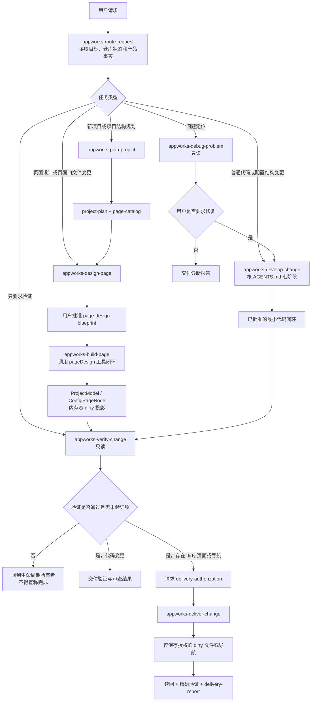
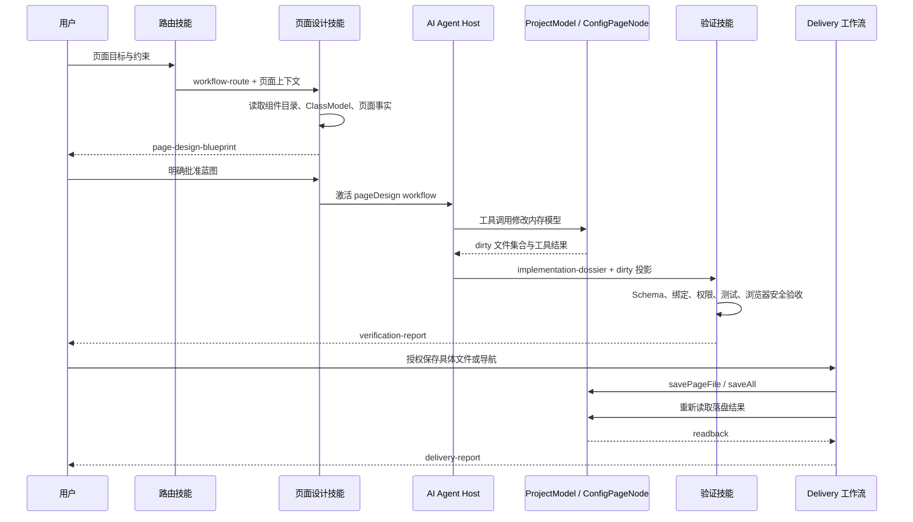
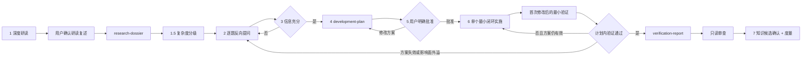
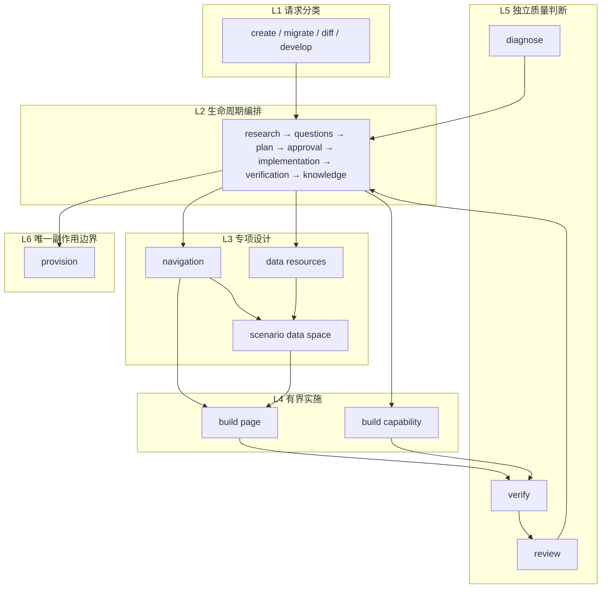
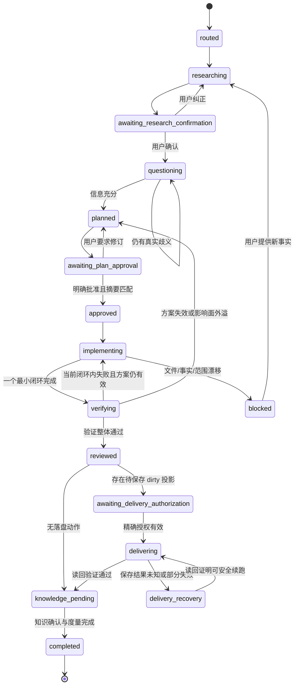
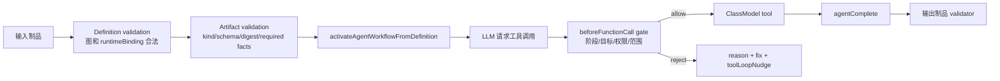
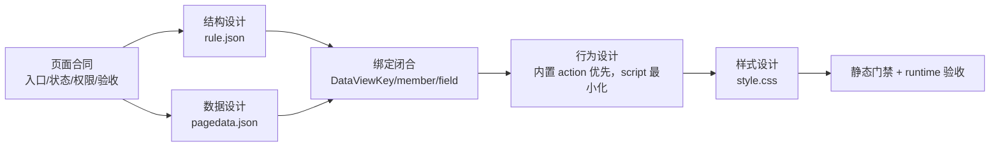
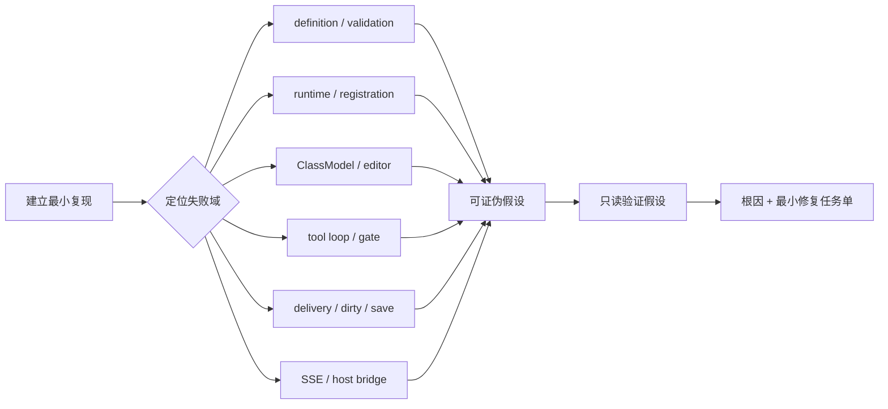
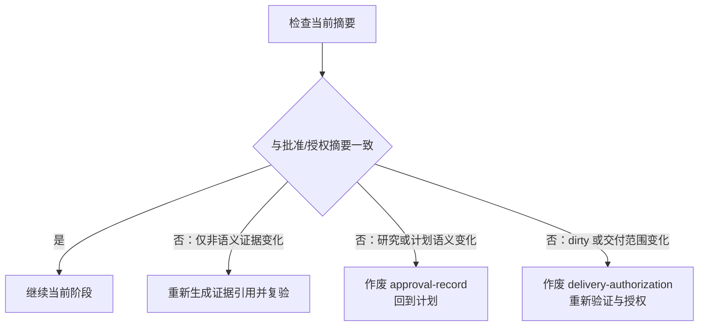
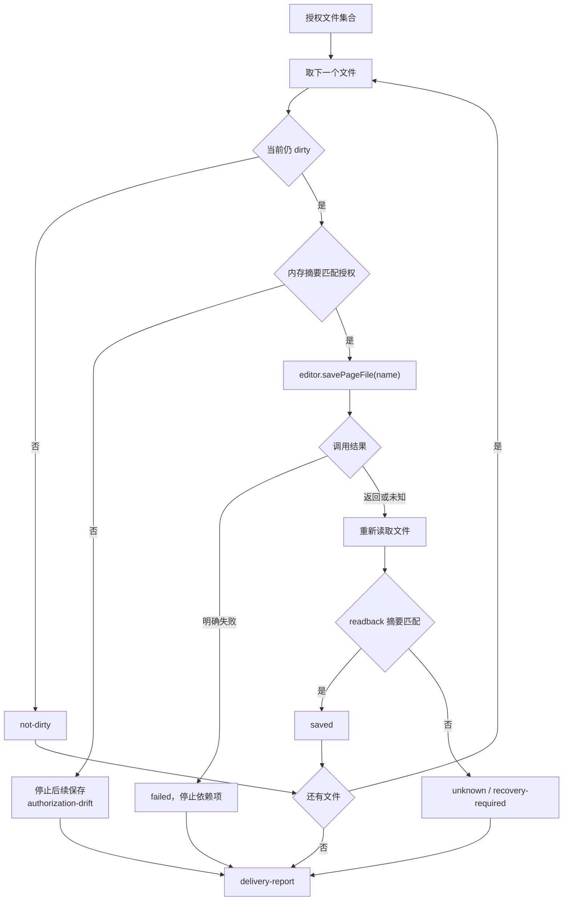

# SPARKProject 技能转换为 SPARK AppWorks AI 工作流方案

> 状态：方案草案（技能层已部分落地，见第 0 节；治理控制平面仍为草案）  
> 研究对象：`C:\Users\lgf22\Documents\SPARKProject-gitee-target\skills`（13 个技能；原写的 `Documents\SPARKProject\skills` 路径已不存在，本机 Codex 安装快照为 v5.5.0、14 个成员）  
> 目标仓库：`D:\SPARK_AppWorks`  
> 目标：复用 SPARKProject 的技能治理思想，把它转换为适合 AppWorks“项目模型 + 页面四文件 + 受约束 AI 运行时”的工作流；不直接复制 QYAPI 专属实现。

## 0. 落地现状（2026-10-05 核实）

本仓 `.cursor/skills/` 已随项目提交 6 个 Markdown 技能。它们是行为约束，不是第 8 节所述的可执行 workflow、registry 或 validator，完成度仍停留在第 37 节的 L1。

| 技能 | 对应本文规划 | 说明 |
| --- | --- | --- |
| `appworks-debug-problem` | 第 3 节 `appworks-debug-problem` | 只读诊断；失败域只列已核实的本仓路径 |
| `appworks-verify-change` | 第 3 节 `appworks-verify-change` | 五态归因；验证矩阵换成本仓 `verify:*` 命令 |
| `appworks-review-change` | 第 3 节原计划首期不独立的 `appworks-review-change` | 已独立发布，第 23 节第 6 项按此关闭 |
| `appworks-verify-before-claim` | 本文未规划 | 来自 Superpowers 6.4.2（MIT）的"先验证再宣称"，已按本仓改写 |
| `appworks-receive-review` | 本文未规划 | 来自 Superpowers 6.4.2 的评审接收规则，加了方案范围关卡 |
| `appworks-write-tests` | 本文未规划 | 来自 Superpowers 6.4.2 的测试质量规则，加了"方案批准才写测试"门禁 |

尚未落地：`appworks-route-request`、`appworks-plan-project`、`appworks-design-page`、`appworks-build-page`、`appworks-deliver-change`，以及迁移类技能。`appworks-develop-change` 仍由根 `AGENTS.md` 七阶段直接承担。技能目录的登记规则见 [DOCUMENT-GOVERNANCE.dm](DOCUMENT-GOVERNANCE.dm) 的 `ai_skills`。

### 已核实且与旧稿不符的事实（2026-10-05 对照源码）

下列三条已读源码确认。第 12.1 节、第 24 节的文件路径，以及第 17.4、25.4、26、36 节里指向现行代码的标识符，已按源码改正。第 5 节、第 17.3 节第 8 点、第 29.2 节仍是目标设计，行内已标明，不把它们写成现状。

- **文件已改名，不是消失。** 现行路径是 `src/services/page-design/page-design-agent-run-provider.ts` 与 `src/services/project-planning/project-planning-agent-run-provider.ts`。`createPageDesignDeliveryPort`、`saveFileNames` 仍在页面设计 provider 中。文中“Host Run”对应现行代码里的 agent-run。
- **操作域键是 `blueprint`，不是 `navigation`。** `PageDesignAllowedOperations` 的五个键是 `nodeTree`、`dataSet`、`script`、`style`、`blueprint`（`src/services/page-design/page-design-gates.ts`）。`navigation` 作为操作域键在该类型中不存在。
- **项目规划保存开关是 `saveBlueprintAfterRun`。** 默认 false，只有显式 `=== true` 才保存；交付物种类是 `project-blueprint`；是否 dirty 看 `editor.project.blueprintDirty`；保存调用 `saveAll()`。源码中没有 `saveNavigationAfterRun`。
- **页面交付的现状与第 29.2 节的目标算法不同。** Agent Run 交付固定 `mode: 'auto'`、`shouldSave: true`；未给出 `deliverySaveFileNames` 时保存全部 dirty 文件；`saveTargetPageFiles` 用 `Promise.all` 并行调用 `savePageFile`，没有逐文件摘要比对，也没有读回。`rollback` 只返回 `rolledBack` 状态，不把磁盘内容还原。因此“自动运行必须先有明确授权才保存”和“逐文件保存并读回”是目标设计，不是现行行为。
- 第 7 节的 `pnpm run verify:ai-host-run-transport-sse` 不在当前 `package.json` 脚本中。
- 第 12.1 节其余源码位置（`packages/spark-ai/src/agent/workflow/`、`src/services/workflow-designs.ts`）仍然存在。`readDirtyProjection`、`openPageDesign`、`planningReady`、`implGate`、`toolLoopNudge`、`gateRules`、`modelProjectionRef` 均能在源码中找到。
- 本节没有逐段核对的保存、读回描述，实施前仍须重读对应源码，不能凭本节外的段落当作现状。

## 1. 结论

SPARKProject 最值得迁入本仓的不是 13 个技能目录本身，而是以下五个机制：

1. **入口互斥路由**：先判断任务属于项目规划、页面设计、普通代码变更、诊断还是只读验证。
2. **结构化交接**：技能之间传递可校验制品，不传聊天摘要。
3. **计划批准与写入授权分离**：用户批准方案，不等于允许保存页面文件、导航或触发业务副作用。
4. **唯一写入所有者**：所有 AI 生成结果先进入模型内存态，只有 Delivery 工作流可以把已授权的 dirty 投影保存到仓库。
5. **验证与审查分离**：验证回答“是否满足验收标准”，审查回答“实现是否存在可行动缺陷”。

不建议原样迁入的部分：QYAPI 数据资源设计、签名 `approved-change-set`、Ed25519 trust store、mutation journal 和 provision 审计。这些属于 SPARKProject 的平台元数据写入边界，而本仓当前写入核心是 `ProjectModel / ConfigPageNode`、导航树与页面四文件。

## 2. 两仓语义映射

| SPARKProject 概念 | AppWorks 对应物 | 转换决策 |
| --- | --- | --- |
| `spark-create-project` | `projectPlanning` 工作流 | 保留“需求主导”的编排角色，输出 `ProjectModel` 项目规划与页面目录 |
| `spark-migrate-project` / `spark-diff-migrate-project` | 页面配置导入、旧配置迁移、模型收敛 | 合并为一个可选的 `appworks-migrate-project`，首期不作为默认入口 |
| 三个 QYAPI 设计技能 | 项目规划、页面结构、页面数据、权限与脚本设计 | 按 AppWorks 模型边界重组，不保留 QYAPI 资源名 |
| `spark-build-page` | `pageDesign` | 转换为四文件受约束编辑：`rule.json`、`pagedata.json`、`script.js`、`style.css` |
| `spark-build-capability` | 包能力或组件能力开发 | 转换为普通代码变更的实现分支，服从根 `AGENTS.md` 七阶段流程 |
| `spark-debug-problem` | 只读诊断 | 原则可直接复用：复现、证据、可证伪假设、根因、最小修复建议 |
| `spark-verify-change` | 本仓分层验证命令和 Host Run / 浏览器验收 | 替换验证矩阵，保留状态分类与基线归因 |
| `spark-review-change` | 只读变更审查 | 原则直接复用，不代替用户批准，不自动修复 |
| `spark-provision-qyapi-project` | AI Delivery / Host Run save | 改造为唯一落盘工作流，只保存授权范围内的 dirty 投影 |
| `approved-change-set` | `delivery-authorization` | 使用轻量授权制品；若未来引入外部平台写入，再升级为签名授权 |

## 3. 建议的目标技能集

首期使用 8 个技能，覆盖本仓现有能力，同时避免把 QYAPI 专属复杂度带进来。

| 技能 | 角色 | 核心输入 | 核心输出 | 是否写入 |
| --- | --- | --- | --- | --- |
| `appworks-route-request` | 路由 | 用户目标、仓库状态 | `workflow-route` | 否 |
| `appworks-plan-project` | 编排 | 需求证据、当前 `ProjectModel` | `project-plan`、`page-catalog` | 仅内存模型 |
| `appworks-design-page` | 设计 | 页面目标、组件目录、类模型知识 | `page-design-blueprint` | 否 |
| `appworks-build-page` | 实施 | 已批准页面蓝图、页面上下文 | `implementation-dossier`、dirty 四文件 | 仅内存模型 |
| `appworks-develop-change` | 编排 | 普通代码任务 | 根 `AGENTS.md` 七阶段制品 | 按批准计划修改本地代码 |
| `appworks-debug-problem` | 诊断 | 问题证据、运行日志 | `diagnostic-report` | 否 |
| `appworks-verify-change` | 验证 | 计划、实现、基线、影响面 | `verification-report` | 否，忽略的测试产物除外 |
| `appworks-deliver-change` | 执行 | 授权、dirty 投影、验证报告 | `delivery-report` | **唯一页面/导航落盘所有者** |

`review` 不必首期独立成宿主入口，可先作为 `verify` 后的只读子阶段；当审查模板和校验器成熟后，再拆为 `appworks-review-change`。

## 4. 顶层路由流程图



## 5. 页面设计闭环

该闭环应直接建立在本仓已经存在的 `pageDesign`、`ProjectWorkspace`、`ProjectModel.openPageDesign(pageId)` 和 Host Run provider 上，不新造平行编辑 API。



### 页面闭环硬门禁

- `pageDesign` 只能通过现有 workflow binding 和 editor/model API 修改页面，不允许 AI 直接绕过模型写四文件。
- `rule.json` 负责结构与动作；`pagedata.json` 负责 DataSet/DataView；`script.js` 只承载最小业务分支；`style.css` 只承载页面样式。
- 数据绑定统一使用 `dataViewKey + dataMember + dataField`，不得恢复旧的点号路径或 `pageData/$data` 旁路。
- AI 修改后先标记 dirty；DevSystem 默认由用户显式保存，自动 Host Run 只有拿到明确交付授权才可保存。（此条是目标设计，现状见第 0 节。）
- 授权必须精确到 `pageId`、文件名集合或导航范围；只授权 `pagedata.json` 时，不得顺带保存其他 dirty 文件。
- 业务数据提交、审批、通知、支付等副作用不属于页面文件交付授权，必须另行确认。

## 6. 普通代码变更闭环

`appworks-develop-change` 不重复定义流程，而是把本仓根 `AGENTS.md` 七阶段协议机器化。



### 机器化制品建议

| 制品 | 必须字段 |
| --- | --- |
| `workflow-route` | `taskKind`、`reason`、`owner`、`writeBoundary`、`requiredFacts` |
| `research-dossier` | 事实证据、调用链、影响面、用户确认引用、未知项 |
| `development-plan` | 目标、精确文件、最小闭环、兼容性、验证、风险、摘要 |
| `approval-record` | 计划摘要、范围摘要、用户原文、批准时间；任何摘要漂移立即失效 |
| `implementation-dossier` | 修改文件、闭环编号、最小验证证据、计划偏差 |
| `verification-report` | 每项命令、范围、状态、证据、基线归因、未验证项 |
| `delivery-authorization` | 目标项目、页面/导航范围、文件集合、允许动作、失效条件 |
| `delivery-report` | 实际保存项、跳过项、读回证据、失败项、剩余 dirty 状态 |

## 7. 验证选择矩阵

| 影响面 | 最小验证 | 扩展验证 |
| --- | --- | --- |
| 单个页面四文件 | 对应页面 Schema/绑定门禁 + focused Vitest | `pnpm run verify:page-design`；需要时运行页面 E2E |
| projectPlanning / 导航 | `pnpm run verify:project-planning` | `pnpm run verify:model-convergence`、导航相关测试 |
| `packages/spark-ai` | 包级 typecheck/lint/focused tests | `pnpm run verify:class-model`、AI business boundary |
| 公共包 API | 包级 typecheck/test + 消费者冒烟 | `pnpm run verify:arch`、`pnpm run verify:deps` |
| 跨包或架构变更 | focused tests + `pnpm run typecheck` | `pnpm run verify` 或 `pnpm run verify:dist` |
| Host Run / SSE | provider focused tests | `pnpm run verify:ai-host-run-transport-sse`、相应 smoke/E2E |
| 仅文档方案 | `pnpm run verify:docs` | Mermaid 人工预览、链接检查 |

验证状态沿用 SPARKProject 的五态语义：`passed`、`failed`、`not-run`、`pre-existing-failure`、`introduced-failure`。没有可比较的修改前基线时，不得把失败归类为 `pre-existing-failure` 或 `introduced-failure`。

## 8. 目录与运行时建议

```text
ai-workflows/
├── registry.json                  # 技能成员、角色、路由和交接合同
├── contracts/                    # JSON Schema 与共享状态词汇
├── appworks-route-request/
├── appworks-plan-project/
├── appworks-design-page/
├── appworks-build-page/
├── appworks-develop-change/
├── appworks-debug-problem/
├── appworks-verify-change/
└── appworks-deliver-change/
```

每个技能目录首期只需要：

- `SKILL.md`：用途、拒绝条件、步骤、交接；
- `templates/`：输入输出样例；
- `scripts/validate-*.mjs`：制品校验；
- `references/`：只放本技能需要的本仓事实导航，不复制产品契约正文。

运行时沿用 SPARKProject 的闭集思路，但绑定本仓 `spark-ai`：

```text
workflow_query
  → workflow_guide
  → human_question（缺产品事实或授权时）
  → workflow_validate
  → activatePageDesignAgentWorkflow / activateProjectPlanningAgentWorkflow
  → verify
  → delivery_authorize
  → delivery_save
  → agent_complete
```

`workflow_validate` 只校验制品，不得隐式实施或保存。`delivery_save` 是页面与导航落盘的唯一动作入口。

## 9. 分阶段落地计划

### P0：流程事实源与路由（建议先做）

1. 新增 `ai-workflows/registry.json`，登记 8 个技能、角色、输入输出和写入边界。
2. 定义 `workflow-route`、`verification-report`、`delivery-authorization`、`delivery-report` 四个最小 Schema。
3. 实现只读 `workflow_query / workflow_guide / workflow_validate`。
4. 用测试证明五类入口互斥，未知任务会请求补充事实而不是猜测。

### P1：接入现有 pageDesign / projectPlanning

1. `appworks-plan-project` 绑定 projectPlanning workflow。
2. `appworks-design-page / build-page` 绑定 pageDesign workflow 与 ClassModel 知识。
3. 从现有 Host Run provider 读取 dirty 投影，不新增平行保存 API。
4. 用 fixture 覆盖仅保存单文件、保存全部 dirty 文件、导航只标 dirty 三种场景。

### P2：统一验证与交付

1. 根据影响图选择本仓现有 verify 命令，生成五态 `verification-report`。
2. Delivery 校验 `pageId + 文件集合 + dirty 投影 + 授权` 一致性。
3. 保存后强制读回，报告实际保存、跳过和仍 dirty 的对象。
4. 浏览器验收默认只执行安全、无业务副作用的交互。

### P3：治理增强

1. 将根 `AGENTS.md` 的七阶段状态和摘要失效规则做成 validator。
2. 增加独立 `appworks-review-change`。
3. 只有出现远程平台元数据写入需求时，才评估签名授权、nonce、防重放和 append-only journal。

## 10. 验收标准

- 同一个请求只能路由到一个顶层生命周期所有者。
- 页面设计技能无法绕过 `ProjectModel / ConfigPageNode` 直接写四文件。
- 未批准蓝图不能进入实施；未通过验证不能进入页面/导航落盘。
- 页面/导航保存必须有精确 `delivery-authorization`，且保存范围不能大于授权范围。
- 所有跨技能交接均为可校验制品，不依赖完整聊天历史。
- 验证报告能区分未运行、既有失败与本轮引入失败。
- 普通代码变更继续完全服从根 `AGENTS.md` 七阶段协议。
- QYAPI 专属术语、资源模型和签名执行机制不进入首期 AppWorks 工作流。

## 11. 深化分析：SPARKProject 技能体系真正解决的问题

SPARKProject 的 13 个技能不是 13 份提示词，而是一套“变化控制系统”。它把一次 AI 任务拆成六个互不替代的责任层：



它解决的关键问题不是“AI 会不会写代码”，而是：

- **谁拥有当前任务**：避免创建、迁移、普通开发混用同一套假设。
- **谁有权决定事实**：需求、旧系统行为、当前模型读回分别在不同任务里占主证据。
- **谁有权写什么**：编排、设计、实施、验证、执行的权限不同。
- **如何证明交接没有变形**：输入输出通过带 `kind/schemaVersion/digest` 的制品连接。
- **失败后从哪里恢复**：恢复点是可验证制品与真实状态，不是模型对聊天记录的回忆。

因此，本仓转换不能只把 `spark-*` 改名成 `appworks-*`。必须同时转换五类合同：路由合同、状态合同、证据合同、写入合同、验收合同。

## 12. 本仓现状与目标工作流之间的真实差距

### 12.1 已经存在的能力

本仓并非从零建设。源码已经具备以下运行时基础：

| 已有能力 | 源码位置 | 可承接的技能机制 |
| --- | --- | --- |
| 可序列化工作流定义 | `packages/spark-ai/src/agent/workflow/agent-workflow-definition.ts` | 技能图、变量、能力、节点、连线与 runtime binding |
| 定义结构校验 | `agent-workflow-validation.ts` | 发布前与激活前的结构门禁 |
| 定义解释与激活 | `agent-workflow-runtime.ts` | 将 definition 解释为 `AiAgentRegistration` |
| ClassModel 知识投影 | `modelProjectionRef` + `knowledgeProviderFactory` | 用当前 DTS ClassModel 代替技能正文复制产品 API |
| 调用前门禁 | `beforeFunctionCall.gateRules` + `gateExecutor` | 写工具调用前检查状态、范围和授权 |
| 工具循环纠偏 | `toolLoopNudge` | 对无工具空转、重复调用等状态给出下一步提示 |
| 页面设计工作流绑定 | `page-design-agent-workflow-binding.ts` | 页面四文件的模型内编辑 |
| 项目规划工作流绑定 | `project-planning-agent-workflow-binding.ts` | 项目结构和导航规划 |
| 页面 Agent Run Delivery | `src/services/page-design/page-design-agent-run-provider.ts` | 按 dirty 集合和 `saveFileNames` 保存页面文件 |
| 项目规划 Agent Run Delivery | `src/services/project-planning/project-planning-agent-run-provider.ts` | `saveBlueprintAfterRun===true` 且 `blueprintDirty` 时 `saveAll()`，否则 skipped |
| 工作流设计文档 | `src/services/workflow-designs.ts` | 设计、发布、dirty/saved 状态与图布局 |

### 12.2 仍缺失的治理层

| 缺口 | 当前风险 | 需要新增的机制 |
| --- | --- | --- |
| 顶层任务路由没有统一制品 | 同一请求可能直接激活错误 workflow | `workflow-route` + 互斥路由 validator |
| 计划批准没有绑定摘要 | 用户批准后范围发生变化仍可能继续 | `approval-record` 绑定 plan/scope digest |
| 实施证据没有统一格式 | 无法判断工具调用是否覆盖批准闭环 | `implementation-dossier` |
| 验证结果没有五态统一模型 | “测试绿”可能被误报为整体完成 | `verification-report` + impact graph |
| Delivery 授权仍主要来自运行参数 | `saveFileNames` 说明保存范围，但没有独立授权语义 | `delivery-authorization` |
| 保存后读回未形成标准制品 | 难以跨阶段证明磁盘结果与内存结果一致 | `delivery-report` + readback digest |
| 失败恢复没有统一状态机 | Host Run 中断后可能重复执行或扩大保存 | resumable run ledger，首期可本地非签名 |
| 技能知识发现未闭集化 | 宿主可能通读全部文档或错选技能 | `workflow_query / workflow_guide / workflow_validate` |

关键判断：本仓已有“工作流执行内核”，缺的是“工作流治理控制平面”。新方案应把技能治理接到现有 definition/runtime/provider 上，不另建第二套 agent runtime。

## 13. 十三个源技能的逐项转换规则

| 源技能 | 保留的核心不变量 | AppWorks 化改造 | 目标归属 | 拒绝条件 |
| --- | --- | --- | --- | --- |
| `spark-create-project` | 需求是主证据；先形成产品合同再实施 | 输出 `ProjectModel` 规划、页面目录、页面入口模式和验收需求 | `appworks-plan-project` | 若旧实现行为必须逐项保真，路由到 migrate |
| `spark-migrate-project` | 源实现是主行为证据；首次迁移要形成不可变基线 | 盘点旧页面、路由、数据绑定、权限、脚本和后端依赖，转换为页面四文件与项目模型 | `appworks-migrate-project` | 已存在可信 S0/T0 基线时不得使用 |
| `spark-diff-migrate-project` | S0/S1/T0/T1 双差异；保护目标定制 | 比较源行为变化与目标配置变化，按行为原子裁决冲突 | `appworks-reconcile-migration` | 缺任一可重放基线时退回首次迁移 |
| `spark-develop-change` | 冻结架构下推进七阶段 | 直接绑定根 `AGENTS.md`，只处理本地代码/配置结构变更 | `appworks-develop-change` | 新项目、迁移、页面产品设计或外部元数据变更 |
| `spark-design-qyapi-navigation` | 每页唯一入口模式；path 与 component identity 分离 | 设计 `ProjectNode` 层级、页面/隐藏子页、路由 path、导航可见性 | `appworks-plan-project` 的导航阶段 | 不设计页面数据和页面内部结构 |
| `spark-design-qyapi-data-resources` | 先定义资源语义和页面消费者，再设计页面模型 | 转换为 DataSet/DataTable/DataView、CRUD/事务端点、字典和关系需求计划 | `appworks-design-page` 的数据需求阶段 | 不直接写 `pagedata.json`，不发明后端 API |
| `spark-design-qyapi-scenario-data-space` | 页面数据矩阵连接导航、资源与前端模型 | 输出 `page-data-binding-matrix`，绑定 DataViewKey、成员、字段、输入、依赖、保存策略 | `appworks-design-page` | 上游页面目标或数据资源未冻结 |
| `spark-build-page` | 单页或紧耦合页组的最小闭环 | 通过 pageDesign editor 修改四文件；禁止直接文件写入 | `appworks-build-page` | 蓝图、页面 ID、验收标准或授权范围缺失 |
| `spark-build-capability` | catalog owner、公共 API 与消费者闭环 | 用本仓 package owner、依赖方向和公开入口实施能力 | `appworks-develop-change` 的 capability 分支 | 需要改变页面产品语义或导航/数据模型设计 |
| `spark-debug-problem` | 默认只读；可证伪假设；输出最小修复任务 | 增加 Host Run、workflow definition、ClassModel、dirty/save、SSE 故障域 | `appworks-debug-problem` | 用户仅要求诊断时不得修改代码或保存页面 |
| `spark-verify-change` | 基于影响图选择验证；五态归因 | 映射本仓 typecheck、lint、Vitest、架构、ClassModel、页面与 Host Run 验证 | `appworks-verify-change` | 不得在验证中修复，不得用 focused test 冒充全量完成 |
| `spark-review-change` | findings-first；只报可到达、有证据的问题 | 检查模型旁路、权限、绑定、保存越权、公共 API、依赖和缺失负向测试 | `appworks-review-change` | 不批准计划、不自动修复、不重复验证报告 |
| `spark-provision-qyapi-project` | 唯一 live mutation owner；预检、执行、读回、恢复 | 改为页面/导航唯一 Delivery owner；保存范围由授权制品决定 | `appworks-deliver-change` | 无授权、授权漂移、dirty 集合漂移或验证未通过 |

## 14. 顶层路由决策表

路由不能只靠关键词，应按证据优先级顺序判定。第一个命中的强条件决定生命周期；无法唯一判定时输出 `needs-human-input`，不能猜默认值。

| 优先级 | 判定问题 | 条件 | 路由 |
| --- | --- | --- | --- |
| 1 | 用户是否只要求解释、审查、诊断或验证？ | 明确只读目标 | `debug` / `verify` / `review`，禁止写入 |
| 2 | 是否以现有外部实现为主行为证据？ | 是，且没有可信迁移基线 | `migrate` |
| 3 | 是否存在 S0/S1/T0/T1 可重放基线？ | 是，且目标是合并后续变化 | `reconcile-migration` |
| 4 | 是否要创建项目、页面目录或改变页面产品语义？ | 是 | `plan-project`，随后进入 page design |
| 5 | 是否只改变某个已存在页面的结构/数据/脚本/样式？ | 页面 ID、目标和上游契约已明确 | `design-page` → `build-page` |
| 6 | 是否只修改冻结架构下的本地代码？ | 不改项目模型、导航和页面产品合同 | `develop-change` |
| 7 | 是否要把 dirty 页面或导航落盘？ | 已有通过的验证报告和精确授权 | `deliver-change` |
| 8 | 信息是否足够唯一判定？ | 否 | `needs-human-input` |

### 路由冲突例

- “新增一个审批页面并实现”不是普通代码变更：先 `plan-project` 确定页面入口，再 `design-page/build-page`。
- “修复现有页面表格列宽”若只改 `style.css` 且页面合同不变，可进入 `build-page` 的简单闭环。
- “把旧系统用户管理迁进来”即使最终会写 Vue，也必须从 `migrate` 开始，因为旧系统行为是主证据。
- “验证 AI 页面编辑为何没保存”是 `debug`；用户明确要求修复后，依据根因重新路由到 `develop-change` 或 `build-page`。
- “保存刚刚生成的 pagedata.json”是 `deliver-change`，不能把前序页面设计批准当作保存授权。

## 15. 生命周期状态机

顶层生命周期与 `AgentWorkflowDefinition` 的图节点不是同一层。Definition 负责一个可执行业务工作流；生命周期状态机负责约束这些 workflow 何时可以被激活。



### 状态进入条件

| 状态 | 必备制品/证据 | 禁止动作 |
| --- | --- | --- |
| `routed` | 有效 `workflow-route` | 激活非 owner 工作流 |
| `researching` | 当前源码、调用方、测试、配置、知识文件 | 写任何生产文件 |
| `questioning` | 用户确认过的 `research-dossier` | 自问自答或跳过题数门禁 |
| `planned` | 信息充分、计划摘要稳定 | 实施 |
| `approved` | 摘要匹配的 `approval-record` | 扩大文件、API、数据结构或验证范围 |
| `implementing` | git/baseline 开工检查、批准闭环 | 并行散射式修改 |
| `verifying` | `implementation-dossier` | 修复代码、缩窄验收标准 |
| `reviewed` | passed 验证报告 + review 结果 | 用审查代替用户批准 |
| `delivering` | 有效 `delivery-authorization` | 保存授权外对象 |
| `delivery_recovery` | 保存尝试记录 + 当前磁盘读回 | 猜测成功、重复保存未知对象 |
| `completed` | 适用门禁均通过 | 宣称未验证范围已完成 |

### 审批失效规则

以下任一摘要变化，`approval-record` 立即失效并回到 `planned`：

- 目标或验收标准变化；
- 修改文件集合变化；
- 公共 API、依赖、数据结构变化；
- 页面 ID、四文件范围或导航范围变化；
- 验证策略变化；
- 当前源码与研究/计划所依据版本发生相关漂移。

## 16. 目标制品合同

### 16.1 通用 envelope

所有跨工作流制品使用统一外壳，以便 validator、运行记录和未来迁移复用：

```json
{
  "kind": "appworks.workflow-route",
  "schemaVersion": 1,
  "artifactId": "route-...",
  "createdAt": "ISO-8601",
  "producer": "appworks-route-request",
  "workspace": {
    "root": "D:/SPARK_AppWorks",
    "revision": "git commit or working-tree fingerprint"
  },
  "scopeDigest": "sha256:...",
  "payload": {}
}
```

`scopeDigest` 不是写入授权，只用于检测交接漂移。首期无需照搬 SPARKProject 的 Ed25519 信任链；远程或高风险副作用出现前，本地摘要 + 用户确认引用足够。

### 16.2 `workflow-route`

```json
{
  "taskKind": "design-page",
  "owner": "appworks-design-page",
  "evidenceMode": "requirements-primary",
  "writeBoundary": "model-memory-only",
  "requiredArtifacts": ["page-context", "acceptance-criteria"],
  "refusedAlternatives": [
    { "route": "develop-change", "reason": "page product contract is not frozen" }
  ],
  "unknowns": []
}
```

### 16.3 `page-design-blueprint`

必须至少包含：

- `projectKey/pageId/pageEntryMode`；
- 当前四文件摘要与 dirty 基线；
- 页面状态：loading、empty、error、permission-denied、readonly、editable；
- 组件树意图和允许的组件 type；
- DataSet/DataTable/DataView 结构；
- `dataViewKey/dataMember/dataField` 绑定矩阵；
- 事件、动作、保存策略和业务副作用边界；
- 权限输入与最终可见/可编辑/可执行期望；
- 每个四文件允许变化的 section；
- focused 验证和浏览器验收场景。

### 16.4 `implementation-dossier`

```json
{
  "kind": "appworks.implementation-dossier",
  "schemaVersion": 1,
  "cycleId": "...",
  "planDigest": "sha256:...",
  "closedLoopId": "page-data-binding",
  "changedArtifacts": [
    { "pageId": "...", "name": "pagedata.json", "state": "dirty", "digest": "sha256:..." }
  ],
  "toolCalls": [
    { "name": "...", "target": "...", "result": "succeeded" }
  ],
  "minimalVerification": [
    { "check": "binding-focused-test", "status": "passed", "evidenceRef": "..." }
  ],
  "deviations": []
}
```

### 16.5 `verification-report`

```json
{
  "kind": "appworks.verification-report",
  "schemaVersion": 1,
  "scopeDigest": "sha256:...",
  "overallStatus": "passed",
  "checks": [
    {
      "id": "page-design-focused",
      "command": "pnpm exec vitest run ...",
      "status": "passed",
      "baselineRef": null,
      "evidenceRef": "..."
    }
  ],
  "unverifiedItems": [],
  "safeToDeliver": true
}
```

只有 `overallStatus=passed`、`unverifiedItems=[]` 且报告 scope 与待交付 scope 一致时，才能请求交付授权。

### 16.6 `delivery-authorization`

```json
{
  "kind": "appworks.delivery-authorization",
  "schemaVersion": 1,
  "projectKey": "...",
  "pageId": "...",
  "allowedActions": ["save-page-files"],
  "allowedFiles": ["pagedata.json"],
  "expectedDirtyDigests": {
    "pagedata.json": "sha256:..."
  },
  "verificationReportDigest": "sha256:...",
  "userConfirmationRef": "exact user confirmation",
  "expiresAt": "ISO-8601"
}
```

授权在以下情况 fail closed：过期、pageId 不同、dirty 文件多出、目标摘要不同、验证报告变化、保存动作不在 allowlist。

### 16.7 `delivery-report`

必须区分：

- `saved`：已保存且读回摘要匹配；
- `skipped`：dirty 但不在授权范围；
- `not-dirty`：授权包含但当前无需保存；
- `failed`：明确失败；
- `unknown`：调用返回或进程状态不足以确认，必须进入读回恢复。

## 17. 运行时接线设计

### 17.1 不新增第二套技能执行器

每个可执行 AppWorks 技能发布为现有 `AgentWorkflowDefinition`：

| Definition 字段 | 技能治理用途 |
| --- | --- |
| `workflowId` | 稳定技能 ID |
| `variables` | 用户输入和上游制品引用 |
| `capabilities` | 对外声明可做与不可做的范围 |
| `graph.nodes` | 业务执行步骤，不承载顶层生命周期状态 |
| `runtimeBinding.registration` | alias/moduleId/businessId |
| `inputContract.paramsSchema` | 输入制品 Schema |
| `systemPrompt` | 当前技能局部规则，不复制根治理全文 |
| `modelProjectionRef` | 从 DTS ClassModel 获取当前模型事实 |
| `resolveInstance.editorSource` | 绑定 pageDesign 或 projectPlanning editor |
| `beforeFunctionCall.gateRules` | 工具调用前的阶段、目标与范围校验 |
| `executionToolNames` | 明确哪些工具算实质性执行 |
| `agentCompleteMethodName` | 统一完成检查 |

### 17.2 三层门禁



Definition 校验只证明工作流结构可解释；制品校验只证明输入形状与摘要一致；调用前门禁才决定当前工具动作是否允许。三者不能合并成一个“validate 成功”。

### 17.3 pageDesign 接线

1. `appworks-design-page` 读取页面事实并产出蓝图，不获得编辑器写能力。
2. 用户批准后，生命周期 owner 生成 `approval-record`。
3. `appworks-build-page` 通过现有 `activatePageDesignAgentWorkflow()` 激活 registration。
4. `resolveInstance` 从 Host Run 上下文取得隔离 editor。
5. `beforeFunctionCall` 校验 pageId、批准摘要、允许文件和当前闭环。
6. 工具调用只修改内存 `ConfigPageNode`，返回 dirty 投影。
7. `agentComplete` 必须检查蓝图内闭环完成，不执行保存。
8. Host Run provider 的 Delivery 在独立授权后调用 `savePageFile`。（此条是目标设计，现状见第 0 节。）

### 17.4 projectPlanning 接线

1. projectPlanning 输出页面目录和导航变更提案。
2. 导航更改先进入内存模型并标 dirty。
3. 现行字段是 `saveBlueprintAfterRun`，默认 false，只有显式 `=== true` 才保存。源码中没有 `saveNavigationAfterRun`。
4. 只有交付授权允许保存项目蓝图时，才可把 `saveBlueprintAfterRun` 设为 true。
5. 保存后重新读取导航投影，确认节点 identity、父子层级、排序、path、hidden/page 语义。

## 18. 页面工作流的四个内部设计面

上一版把页面设计当成单一步骤，实际应拆成四个顺序面，且每个面有独立完成条件。



### 18.1 页面合同面

- 页面是菜单页、路由页、隐藏子页还是嵌套页；
- 直接 URL 和导航进入行为；
- 用户角色、页面模式和权限态；
- loading/empty/error/readonly/editable 等状态；
- 是否允许保存业务数据以及需不需要额外授权。

### 18.2 结构面 `rule.json`

- 每个组件 type 必须来自组件目录；
- 容器、字段、工具栏、动作形成一棵可验证树；
- 优先内置声明式 action，不为可表达动作新增 `script.js`；
- 组件属性必须落在当前 catalog/类型契约内。

### 18.3 数据面 `pagedata.json`

- DataSet、DataTable、DataView、关系、依赖和默认加载；
- 读取成员通过 `dataViewKey + dataMember + dataField`；
- 编辑态、staged changes、逐视图保存或 transaction 保存；
- API/模型缺失时 fail-fast，不允许用静态假数据掩盖。

### 18.4 行为与样式面

- `script.js` 只保留配置系统无法表达的最小业务分支；
- 不在脚本里重新实现 DataSet、权限或路由算法；
- `style.css` 不改变业务语义，不通过隐藏元素绕过权限；
- 修改脚本或样式也必须回到对应页面状态做浏览器验收。

## 19. 失败域与恢复决策

| 失败域 | 典型现象 | 证据 | 恢复动作 |
| --- | --- | --- | --- |
| 路由错误 | page design 被当作普通代码变更 | `workflow-route` 与输入事实冲突 | 作废 route，重新分类 |
| Definition 无效 | workflow 激活前报结构错误 | validation issues | 返回工作流设计 owner 修复，不进入运行时 |
| ClassModel 漂移 | 工具或成员不存在 | manifest/version、tool error | 刷新知识投影并重新研究，禁止猜 API |
| 调用前门禁拒绝 | 工具目标超出 pageId/文件范围 | gate reason/fix | 请求新批准或收窄调用 |
| 工具循环空转 | 重复计划、不调用工具、重复失败 | tool loop ledger | 通过 nudge 指向缺失事实或下一个合法动作 |
| 最小验证失败 | 单个闭环 focused test 红 | command/evidence | 仅在当前批准闭环内修复并复验 |
| 方案失效 | 需要新文件/API/数据结构 | plan diff | 停止实施，回到提问/计划 |
| 保存明确失败 | provider 返回 error | delivery result | 不扩大保存；保留 dirty；报告失败 |
| 保存结果未知 | SSE 断开、超时、进程中断 | 无终态但可能已写 | 只读读取磁盘与模型摘要，禁止盲目重放 |
| 部分保存 | 某些文件已保存，其他仍 dirty | per-file readback | 保留成功项，只对仍 dirty 且仍获授权项续跑 |
| 用户并发修改 | 当前摘要与授权摘要不一致 | digest mismatch | fail closed，重新研究和授权 |

首期恢复账本可以是 ignored 本地 JSON，记录 `runId、workflowId、scopeDigest、attempt、toolCalls、deliveryItems、readback`。它不等同于 SPARKProject 的高安全 mutation journal，但必须能防止“状态未知时整批重跑”。

## 20. 验证影响图算法

验证技能不维护静态命令清单，而是先从变更制品构造影响图，再选择命令：

```text
changed artifact
  → owning model/package
  → public contracts
  → direct consumers
  → runtime boundary
  → delivery mode
  → risk tags
  → required checks
```

示例：

| 变更 | 影响图展开 | 必须检查 |
| --- | --- | --- |
| `pagedata.json` DataView 绑定 | ConfigPageNode → Renderer → component binding → DataSet | pages config、binding focused test、pageDesign verify、浏览器状态 |
| pageDesign workflow binding | workflow definition → runtime interpreter → registration → editor → tool loop | definition validation、binding tests、AI business boundaries、Host Run provider tests |
| 公共 `spark-ai` 类型 | package export → app binding → tests → generated model | package typecheck、消费者 tests、class-model verify、architecture |
| projectPlanning 导航 | ProjectModel → navigation projection → router/sidebar → save/readback | project-planning verify、navigation tests、model convergence、直接 URL |

归因规则：

- 修改前没有同命令、同范围、同错误签名的证据时，只能标 `failed`；
- 只有可比较基线证明修改前已失败，才标 `pre-existing-failure`；
- 只有修改后新增或错误签名发生对应变化，才标 `introduced-failure`；
- 任一适用检查 `not-run`，整体状态不得是 `passed`。

## 21. 建议的 registry 结构

```json
{
  "schemaVersion": 1,
  "name": "spark-appworks-ai-workflows",
  "lifecycleOwnerByRoute": {
    "plan-project": "appworks-plan-project",
    "migrate": "appworks-migrate-project",
    "reconcile-migration": "appworks-reconcile-migration",
    "design-page": "appworks-design-page",
    "develop-change": "appworks-develop-change",
    "debug": "appworks-debug-problem",
    "verify": "appworks-verify-change",
    "review": "appworks-review-change",
    "deliver": "appworks-deliver-change"
  },
  "writeOwners": {
    "code": "approved implementation workflow",
    "page-files": "appworks-deliver-change",
    "navigation": "appworks-deliver-change",
    "business-state": null
  },
  "artifactContracts": {},
  "members": []
}
```

`business-state: null` 表示 AI 工作流默认没有业务数据提交权。未来即使增加业务动作技能，也必须使用不同授权合同，不能复用页面文件保存授权。

## 22. 可实施任务分解

下面不是立即编码许可，而是后续进入根 `AGENTS.md` 七阶段时可采用的最小闭环拆分。

| 闭环 | 修改范围建议 | 产出 | 最小验证 |
| --- | --- | --- | --- |
| W1 路由合同 | 新 registry、route Schema、validator、fixtures | 五类首期路由可判定 | validator tests |
| W2 生命周期合同 | development cycle、plan/approval digest validator | 批准漂移 fail closed | artifact tests |
| W3 页面蓝图 | blueprint Schema、binding matrix validator | 页面四设计面可校验 | blueprint fixtures |
| W4 build-page 门禁 | pageDesign binding 的 artifact/gate 接入 | 未批准或越界工具调用被拒绝 | binding tests |
| W5 验证报告 | impact selector、五态 report validator | 验证结果结构化 | selector/report tests |
| W6 交付授权 | delivery authorization validator | 精确到页面与文件 | auth tests |
| W7 Delivery 读回 | provider 接入授权、per-file readback | 保存/跳过/未知可区分 | provider tests |
| W8 projectPlanning | 导航授权、保存与读回 | 导航落盘闭环 | planning provider tests |
| W9 闭集工具 | query/guide/validate/nextActions | 宿主无需通读全部技能 | tool loop tests |
| W10 E2E | Host Run fixture + 中断恢复场景 | 端到端证据 | smoke/E2E |

推荐顺序是 W1 → W2 → W3 → W4 → W5 → W6 → W7，再扩展 W8–W10。W6 不能早于 W5，因为交付授权必须绑定通过的验证报告；W7 不能早于 W6，否则仍然只是“带文件列表的保存参数”，不是治理后的交付。

## 23. 方案边界与待确认决策

以下决策不能仅凭 SPARKProject 经验替本仓做最终选择，实施前需要用户确认：

1. 技能源码目录使用 `ai-workflows/`，还是沿用上游名称 `skills/`。
2. 首期是否包含 migration/diff 两个入口；若不包含，路由器应明确返回“暂不支持”，不能降级成 develop。
3. `approval-record` 和 `delivery-authorization` 是持久化到 ignored 本地目录，还是只存在 Host Run 会话。
4. 用户手动 DevSystem 保存是否也需要 delivery authorization；建议仅 AI 自动保存强制，手动 UI 保存保留现有交互。
5. 验证报告证据存放位置与保留周期。
6. `appworks-review-change` 首期独立发布，还是作为 lifecycle owner 的只读阶段。
7. 哪些浏览器动作被定义为默认安全动作，哪些必须二次确认。

在这些决策确认前，可以实现只读路由、制品 Schema 和 validator；不应先改 Host Run 保存行为。

## 24. 研究依据

### SPARKProject

- `skills/README.md`：13 技能角色、四入口路由、闭集工具链。
- `skills/spark-skillset.json`：成员、委派图、交接合同、唯一 live mutation owner。
- `docs/spark-skill-governance.md`：事实源优先级、批准分层、结构化交接、执行边界。
- `skills/*/SKILL.md`：各技能职责、拒绝条件、失败恢复与输出制品。
- `docs/spark-ai-programming-skillset-v5-plan.md`：技能套件演进方案。

### SPARK AppWorks

- `AGENTS.md`：七阶段 AI 编码流程和代码生成硬门禁。
- `docs/SPARK_APPWORKS_PROJECT_DEEP_DIVE_ZH.md`：项目模型、AI 生产线、dirty/save 边界。
- `docs/architecture/DATAFLOW_ARCHITECTURE.md`：pageDesign 工具写入与显式保存链路。
- `packages/spark-ai/README.md`：通用 AI runtime 与业务 workflow binding。
- `src/services/page-design/page-design-agent-run-provider.ts`：页面四文件 Delivery 现状。
- `src/services/project-planning/project-planning-agent-run-provider.ts`：项目规划蓝图保存策略（`saveBlueprintAfterRun`）。
- `package.json`：本仓验证命令事实源。

## 25. 每个目标技能的节点级规格

本节把目标技能从“角色说明”细化为可发布的 workflow definition 规格。每个技能都必须明确：触发条件、必需输入、只读步骤、执行步骤、调用前门禁、完成判定、输出制品和失败去向。

### 25.1 `appworks-route-request`

**定位**：所有非平凡 AI 请求的唯一入口。它只分类，不研究全部源码、不修改状态、不代替生命周期 owner。

| 项目 | 规格 |
| --- | --- |
| 输入 | 用户原始目标、cwd、当前 git 状态摘要、显式只读/写入要求、可选已有制品引用 |
| 只读工具 | workspace catalog/AGENTS 读取、文件存在性检查、route artifact 查询 |
| 节点 | `normalize-request` → `detect-readonly-intent` → `detect-evidence-mode` → `detect-mutation-domain` → `resolve-owner` → `validate-route` |
| 门禁 | 不能唯一判定时禁止选择最接近的技能，输出缺失事实 |
| 输出 | `workflow-route` |
| 完成条件 | owner 唯一；每个被拒绝候选有可解释理由；写入边界明确 |
| 失败转移 | `needs-human-input`，列出决定路由所需的最少问题 |

路由器不应该读完整业务文件。它只读取足以区分生命周期的“鉴别证据”，例如是否有外部源项目、是否存在迁移基线、页面 ID 是否已存在、是否要求只读诊断。

### 25.2 `appworks-plan-project`

**定位**：需求主导的项目与页面目录规划。它只规划 `ProjectModel` 语义，不进入页面四文件实现。

| 项目 | 规格 |
| --- | --- |
| 输入 | `workflow-route`、需求正文/附件引用、当前项目规划投影、当前导航投影 |
| 模型根 | `ProjectModel` |
| 节点 | `read-current-project` → `normalize-requirements` → `derive-invariants` → `design-page-catalog` → `design-navigation` → `validate-planning` |
| 允许工具域 | project attributes、navigation tree；不允许 `openPageDesign` 和四文件工具 |
| 门禁 | requirement 非空；projectId 匹配；禁止调用页面设计 marker；页面节点至少一个 |
| 输出 | `project-plan`、`page-catalog`、`navigation-plan`、`acceptance-catalog` |
| 完成条件 | 所有页面有唯一 entry mode；层级、path、hidden、description、implGate 语义完整 |
| Delivery | 默认只标 navigation dirty；自动保存必须另有 `delivery-authorization` |

与当前 `projectPlanning` 的关系：复用 `resolveProjectPlanningRunInput`、`createProjectPlanningSystemPrompt`、`evaluateProjectPlanningBeforeFunctionCall` 和 `ProjectModel` editor，不复制其逻辑到新 skill 文本。

### 25.3 `appworks-design-page`

**定位**：把已经存在的页面规划转换成不带写入动作的页面蓝图。

| 项目 | 规格 |
| --- | --- |
| 输入 | `page-catalog` 单页条目、planning projection、当前四文件只读摘要、组件 catalog、DTS ClassModel、验收需求 |
| 只读节点 | `read-planning` → `read-current-page` → `resolve-components` → `design-states` → `design-data-model` → `design-bindings` → `design-actions` → `design-file-scope` |
| 门禁 | `effectiveDescription` 非空；页面 ID 精确匹配；上游产品语义无未知项 |
| 输出 | `page-design-blueprint` |
| 完成条件 | 四设计面闭合；所有绑定可追溯；每个状态有数据和 UI 期望；文件变化范围精确 |
| 明确非输出 | dirty 文件、工具调用、保存授权 |

设计阶段若发现后端 API、字典、权限或保存语义不存在，必须把它列为 blocker 或 capability dependency，不得在蓝图中虚构接口。

### 25.4 `appworks-build-page`

**定位**：消费已批准的页面蓝图，通过现有 ClassModel 工具完成一个最小页面闭环。

| 项目 | 规格 |
| --- | --- |
| 输入 | `development-cycle`、`page-design-blueprint`、`approval-record`、当前 page readback |
| 模型根 | 当前实现使用 `ProjectModel`，实例由 pageId 对应的 `ProjectWorkspace` 解析 |
| 执行节点 | `preflight` → `open-page` → `apply-one-closed-loop` → `read-dirty-projection` → `minimal-verify` → `complete` |
| 门禁 | planningReady；`implGate=open`；plan digest 匹配；pageId 匹配；当前操作域已放行 |
| 工具域 | nodeTree、dataSet、script、style、blueprint 五域中的批准子集 |
| 输出 | `implementation-dossier`、dirty projection reference |
| 完成条件 | 本轮只完成一个 `closedLoopId`；首次实质修改后已有最小验证；无计划偏差 |
| 明确非动作 | 不保存页面文件、不自动打开新范围、不修改公共代码 |

当前 `PageDesignAllowedOperations` 已提供五域开关：`nodeTree`、`dataSet`、`script`、`style`、`blueprint`（`src/services/page-design/page-design-gates.ts`）。新治理层应直接把批准蓝图的 file/operation scope 编译成这组开关，而不是增加另一组同义权限字段。

### 25.5 `appworks-develop-change`

**定位**：根 `AGENTS.md` 七阶段的机器化生命周期 owner。

| 项目 | 规格 |
| --- | --- |
| 输入 | `workflow-route(taskKind=develop-change)`、用户目标 |
| 节点 | `research` → `confirm-research` → `classify-complexity` → `question-loop` → `plan` → `approve` → `implement-loop` → `verify` → `review` → `knowledge` |
| 门禁 | 每个阶段只接受上一阶段有效制品；plan/scope 摘要漂移即退回计划 |
| 委派 | build capability、debug、verify、review；不委派 page/product design |
| 输出 | delivery handoff、知识候选、度量项 |
| 拒绝 | 项目/页面产品语义、迁移基线、导航或页面模型需要重新设计 |

### 25.6 `appworks-debug-problem`

**定位**：只读诊断，按故障域收集可重放证据。



诊断输出必须包含：复现前提、实际结果、预期结果、第一处偏离、根因证据、排除的假设、受影响边界和建议重新路由。`changedFiles=[]`、`deliveryActions=[]` 是诊断模式的强制约束。

### 25.7 `appworks-verify-change`

**定位**：阶段 6 的唯一质量出口。

| 项目 | 规格 |
| --- | --- |
| 输入 | 有效计划和批准、实现 dossier、修改前基线、验收标准 |
| 节点 | `build-impact-graph` → `select-checks` → `run-focused` → `run-owner-gates` → `run-consumer-gates` → `attribute-failures` → `validate-report` |
| 门禁 | 验证只读；不能在运行中编辑源码或改变验收标准 |
| 输出 | `verification-report` |
| 完成条件 | 每个适用检查都有五态之一；无隐藏的 not-run；overall 计算可复现 |
| 失败转移 | 当前闭环失败回 implementation；方案或影响面失效回 lifecycle owner |

### 25.8 `appworks-review-change`

**定位**：验证之后的独立只读审查。

按以下优先级审查：业务正确性 → 权限/敏感数据/副作用 → 页面绑定和数据流 → 模型或 API 旁路 → 包依赖和公共出口 → 回归和负向测试。每条 finding 必须具有紧凑位置、可到达路径、直接证据、影响和最小修复方向；禁止用格式或命名偏好填充报告。

### 25.9 `appworks-deliver-change`

**定位**：页面文件和导航的唯一自动落盘 owner。

| 项目 | 规格 |
| --- | --- |
| 输入 | `delivery-authorization`、passed `verification-report`、当前 dirty projection |
| 节点 | `verify-authorization` → `compare-dirty-state` → `save-authorized-items` → `readback` → `classify-items` → `emit-report` |
| 门禁 | 授权未过期；scope/digest 匹配；验证 scope 一致；动作和文件在 allowlist |
| 输出 | `delivery-report`、remaining dirty projection |
| 恢复 | 状态未知时只读 readback；只重试已证明未保存且授权仍有效的项 |
| 拒绝 | 业务数据提交、外部通知、审批、支付等副作用 |

## 26. pageDesign 操作域到四文件的编译规则

`allowedOperations` 与 `deliverySaveFileNames` 是两个不同阶段的边界：前者控制“内存模型允许怎么改”，后者控制“哪些 dirty 文件允许落盘”。二者不能互相推导授权。

| 蓝图变化 | `allowedOperations` | 可能 dirty 文件 | 可申请的 `deliverySaveFileNames` |
| --- | --- | --- | --- |
| 仅数据模型、DataView 或保存策略 | `dataSet=true`，其余 false | `pagedata.json` | 仅 `pagedata.json` |
| 仅组件树、字段或工具栏 | `nodeTree=true`，其余 false | `rule.json` | 仅 `rule.json` |
| 仅页面业务脚本 | `script=true`，其余 false | `script.js` | 仅 `script.js` |
| 仅页面样式 | `style=true`，其余 false | `style.css` | 仅 `style.css` |
| 页面结构与数据绑定闭环 | `nodeTree=true,dataSet=true` | `rule.json`,`pagedata.json` | 验证通过后分别授权 |
| 页面内部调整需要改项目蓝图 | 加 `blueprint=true` | 页面文件 + 项目蓝图 | 页面与蓝图必须是两个授权 action |

编译器必须遵守：

1. 未在蓝图中声明的域一律为 false，而不是 undefined。
2. `model_script` 中出现未放行操作 marker 时，由现有 gate fail-fast 拒绝。
3. dirty 文件多于蓝图预计范围时停止，不自动扩大 `deliverySaveFileNames`。
4. 实施允许修改不代表交付允许保存；两阶段分别校验。
5. `dataSet-only` 模式沿用当前专用 prompt/nudge，禁止工具循环漂移到 node tree、script 或 style。

## 27. 路由器算法与解释输出

建议使用规则决策而不是 LLM 自由分类。伪代码如下：

```ts
function route(request: RoutingFacts): WorkflowRoute {
  if (request.intent === 'diagnose') return readonlyRoute('debug')
  if (request.intent === 'verify') return readonlyRoute('verify')
  if (request.intent === 'review') return readonlyRoute('review')

  if (request.externalSourceIsBehaviorAuthority) {
    if (request.hasTrustedFourWayBaseline) return routeTo('reconcile-migration')
    return routeTo('migrate')
  }

  if (request.changesProjectStructure || request.changesPageProductContract) {
    return routeTo('plan-project')
  }

  if (request.targetsExistingPageFiles) {
    if (!request.pageId || !request.acceptanceCriteria) return needsFacts(['pageId', 'acceptanceCriteria'])
    return routeTo('design-page')
  }

  if (request.requestsPageOrNavigationSave) return routeTo('deliver')
  if (request.localContractsFrozen) return routeTo('develop-change')
  return needsFacts(minimalDiscriminatingQuestions(request))
}
```

实际实现不能直接使用匿名自由结构 `RoutingFacts`；应定义具名合同。上述代码只表达判定顺序。

路由输出必须解释：

- 为什么选中 owner；
- 哪个事实是决定性证据；
- 为什么排除最相近的其他 owner；
- 当前允许的写入边界；
- 下一步需要加载哪些制品，不能只输出技能名。

## 28. 摘要、指纹与漂移检测

### 28.1 摘要对象

| 摘要 | 输入 | 用途 |
| --- | --- | --- |
| `researchDigest` | 研究事实、相关文件指纹、用户确认引用 | 检测计划是否仍基于确认后的研究 |
| `planDigest` | 目标、文件、闭环、API、依赖、数据结构、验证 | 绑定用户计划批准 |
| `scopeDigest` | 项目/pageId/文件/operation domain | 绑定实施、验证和交付范围 |
| `dirtyDigest` | dirty 文件名 + 每个内存内容摘要 | 防止授权后内容变化 |
| `verificationDigest` | scope + checks + statuses + evidence refs | 绑定交付授权 |
| `readbackDigest` | 磁盘或服务端重新读取内容 | 证明交付结果 |

### 28.2 Canonical 化要求

- 对象键递归排序；
- 数组仅在语义无序的字段排序，有序步骤、文件执行顺序不得排序；
- 路径统一 `/` 且转绝对或 workspace-relative 采用一种固定策略；
- 排除时间戳、显示标题等非授权语义字段；
- 明确区分字段缺失、空数组和 `null`；
- 摘要算法由一个 owner 实现，Schema、模板和技能正文不得复制实现。

### 28.3 漂移响应



## 29. Delivery 精确算法

### 29.1 预检

1. 验证 authorization envelope、到期时间和用户确认引用。
2. 加载 verification report，确认 `overallStatus=passed`、无未验证项。
3. 比较 verification scope digest 与 authorization scope digest。
4. 读取当前 `ProjectWorkspace.project.readDirtyProjection()`。
5. 对授权文件计算当前内存摘要，与 `expectedDirtyDigests` 比较。
6. 检查是否存在授权外新增 dirty 文件；存在时保留但不保存，并在报告标 `skipped`。
7. 绑定本次 `deliveryAttemptId`，再进入保存。

### 29.2 执行

页面文件按文件粒度执行，不使用“保存全部”替代精确授权（此段是目标设计，现状见第 0 节）：



### 29.3 当前 provider 的演进点

当前 `createPageDesignDeliveryPort` 已能：

- 读取 dirty 文件集合；
- 用 `saveFileNames` 求交集；
- 保存目标文件；
- 返回 `AiDeliveryArtifact`；
- 在失败时把 delivery 结果附加到 error。

治理增强不应重写这条链，而应在它前后增加：

- 前置 authorization validator；
- 每文件 expected digest；
- 保存后独立 readback；
- `unknown/recovery-required` 状态；
- attempt 记录；
- authorization 外 dirty 文件的显式 `skipped` 报告。

`rollback()` 不能假装磁盘写入是事务。若已保存某个文件，不应自动用旧内容覆盖；恢复必须基于真实 readback 和新的明确授权。

## 30. `verification-report` 的计算规则

整体状态禁止由模型自由填写，应由 validator 从 checks 和 required check IDs 推导：

```text
存在 introduced-failure 或 failed      → failed
否则存在 required not-run              → partial
否则存在 pre-existing-failure          → partial
否则所有 required checks passed        → passed
否则                                   → invalid report
```

每个 check 需要以下字段：

| 字段 | 约束 |
| --- | --- |
| `id` | 在 impact selector 生成的 required/optional 集合中 |
| `scope` | package、pageId、文件或 runtime boundary |
| `command` | 实际执行命令；人工验收用 `manual:*` 标识 |
| `startedAt/finishedAt` | 用于识别超时和旧证据，不参与 scope 摘要 |
| `exitCode` | 命令检查必填 |
| `status` | 五态枚举 |
| `baselineRef` | pre-existing/introduced 必填 |
| `evidenceRef` | 日志摘要、测试报告或人工观察制品 |
| `attribution` | 失败归因说明，不能只写“可能” |

## 31. 工作流 definition 设计约束

### 31.1 图结构

- 每个 definition 恰好一个 start 和一个 output；
- 业务节点只表达运行时可执行步骤，不复制顶层七阶段状态机；
- 分支条件必须可由输入/节点输出计算，不依赖自然语言猜测；
- 失败边明确指向 `blocked` 输出或可重试节点；
- 不在 definition 中嵌入函数、class 实例、APP 状态或凭据；
- `source.designId` 与 `workflowId` 保持一致，发布定义来自设计文档。

### 31.2 runtime binding

- `registration.alias` 与业务 Host 入口一致；
- `moduleId/businessId` 使用稳定业务 ID，不使用页面标题；
- `inputContract.identityField` 对 pageDesign 必须能解析 pageId；
- `modelProjectionRef.rootClassName` 必须和实际 module class 一致；
- `executableRef` 只指向公开、可构造的 owner；
- `editorSource` 必须在 app binding registry 登记；
- 所有 mutation workflow 必须声明 `beforeFunctionCall`；
- `executionToolNames` 必须列全实质性工具，避免把执行误判成纯计划；
- `agentCompleteMethodName` 应返回 boolean-or-reason，失败理由可进入 nudge。

### 31.3 prompt 内容边界

系统提示只放：当前技能目标、输入制品摘要、允许工具域、完成条件和拒绝条件。以下内容不能复制进 prompt：

- 根 `AGENTS.md` 全文；
- ClassModel API 清单；
- 组件完整 catalog；
- DataSet、权限或路由算法实现；
- 已由 gate/validator 强制的规则长文。

这些事实分别由治理入口、DTS ClassModel、catalog 和代码门禁提供，避免提示词与源码漂移。

## 32. 闭集工具协议

建议只暴露五个治理工具：

| 工具 | 输入 | 输出 | 是否执行业务动作 |
| --- | --- | --- | --- |
| `workflow_query` | keyword/task facts | 候选 workflow 摘要 | 否 |
| `workflow_guide` | workflowId | 输入、输出、边界、nextActions | 否 |
| `workflow_validate` | workflowId、artifactPath、artifactKind | 校验结果 | 否 |
| `workflow_status` | cycleId/runId | 当前状态、有效制品、阻塞项 | 否 |
| `workflow_invoke` | workflowId、mode、artifact refs | 仅签发 execution charter 或激活只读运行 | 视 mode；不能隐式 Delivery |

执行响应统一 envelope：

```json
{
  "ok": true,
  "tool": "workflow_validate",
  "result": {},
  "nextActions": [
    {
      "tool": "workflow_invoke",
      "when": "artifact valid and user approval present",
      "args": {}
    }
  ],
  "humanQuestion": null
}
```

`nextActions` 是机器可执行建议，不是授权。涉及实现、保存或业务副作用时，即使 next action 存在，也必须满足对应 approval/authorization gate。

## 33. 建议的精确目录清单

为避免单目录超过本仓 AI 编码标准的文件数门禁，按领域分层：

```text
ai-workflows/
├── README.md
├── registry.json
├── contracts/
│   ├── lifecycle/
│   │   ├── development-cycle.schema.json
│   │   ├── research-dossier.schema.json
│   │   ├── development-plan.schema.json
│   │   └── approval-record.schema.json
│   ├── page/
│   │   ├── page-design-blueprint.schema.json
│   │   ├── page-data-binding-matrix.schema.json
│   │   └── implementation-dossier.schema.json
│   ├── quality/
│   │   ├── diagnostic-report.schema.json
│   │   ├── verification-report.schema.json
│   │   └── review-report.schema.json
│   └── delivery/
│       ├── delivery-authorization.schema.json
│       └── delivery-report.schema.json
├── governance/
│   ├── artifact-canonicalizer.ts
│   ├── artifact-validator.ts
│   ├── lifecycle-state-machine.ts
│   └── registry-reader.ts
├── routing/
│   ├── request-router.ts
│   ├── routing-facts.ts
│   └── routing-validator.ts
├── page/
│   ├── design/
│   ├── build/
│   └── delivery/
├── quality/
│   ├── debug/
│   ├── verify/
│   └── review/
└── tools/
    ├── workflow-query.ts
    ├── workflow-guide.ts
    ├── workflow-validate.ts
    ├── workflow-status.ts
    └── workflow-invoke.ts
```

这是逻辑目标结构，不是已批准的实施文件清单。正式实施时必须按 W1–W10 每轮只落一个最小闭环，且先检查目录文件/子目录数量硬门禁。

## 34. 分层测试矩阵

### 34.1 路由测试

| 用例 | 预期 |
| --- | --- |
| 明确只读诊断 | route=debug，writeBoundary=none |
| 外部旧项目、无基线 | route=migrate |
| S0/S1/T0/T1 完整 | route=reconcile-migration |
| 新增页面产品语义 | route=plan-project |
| 已有页面单文件调整 | route=design-page |
| 冻结契约下包代码变更 | route=develop-change |
| 信息同时符合两个 owner | needs-human-input，不任选其一 |

### 34.2 摘要和批准测试

- plan 字段顺序变化但语义相同，digest 不变；
- target file 增加，plan digest 改变，旧 approval 失效；
- 验证命令变化，旧 approval 失效；
- 时间戳变化不影响 scope digest；
- pageId 或 allowed operation 变化使 delivery authorization 失效。

### 34.3 pageDesign 门禁测试

- `effectiveDescription` 为空时拒绝；
- `implGate=closed` 时拒绝；
- editor pageId 与 run pageId 不同拒绝；
- dataSet-only 模式调用 nodeTree marker 拒绝；
- 蓝图只允许 `pagedata.json`，产生 `rule.json` dirty 时停止；
- 首次实质修改后未产生最小验证证据，禁止 complete。

### 34.4 Delivery 测试

- dirty=`pagedata.json`，授权同文件：保存并读回成功；
- dirty 两文件，只授权一个：一个 saved、一个 skipped；
- 授权后内存内容变化：authorization-drift，零保存；
- 保存调用抛错但磁盘已写：readback 匹配后分类 saved-with-call-error 或 recovery-resolved；
- 保存返回成功但读回不匹配：unknown/recovery-required；
- 第一个文件成功、第二个失败：保留第一个，不自动回滚覆盖；
- 授权过期：零保存；
- 验证报告 partial：零保存。

### 34.5 验证报告测试

- required checks 全 passed → overall passed；
- 一个 required not-run → partial；
- 一个 pre-existing-failure → partial；
- failed/introduced-failure → failed；
- pre-existing 没 baselineRef → report invalid；
- overall 手填 passed 但存在 not-run → validator 拒绝。

## 35. 端到端样例：只修改 `pagedata.json`

```mermaid
sequenceDiagram
    participant U as 用户
    participant R as Router
    participant D as Design Page
    participant L as Lifecycle
    participant B as Build Page
    participant G as Gate
    participant M as ProjectModel
    participant V as Verify
    participant X as Delivery

    U->>R: 调整已有页面 DataView，不改结构
    R-->>L: route=design-page, write=model-memory-only
    L->>D: pageId + planning projection + current files
    D-->>U: blueprint(fileScope=[pagedata.json], operation=[dataSet])
    U->>L: 批准 blueprint 摘要
    L->>B: approval-record + blueprint
    B->>G: 请求 editDataSet
    G->>G: planningReady && implGate=open && dataSet=true
    G-->>B: allow
    B->>M: 修改内存 DataSet/DataView
    M-->>B: dirty=[pagedata.json]
    B->>V: implementation-dossier
    V-->>L: passed verification-report
    L-->>U: 展示精确保存影响
    U->>X: 授权 pageId + pagedata.json + dirtyDigest
    X->>M: 再读 dirty 并比对摘要
    X->>M: savePageFile(pagedata.json)
    X->>M: readback pagedata.json
    M-->>X: digest matches
    X-->>U: saved pagedata.json; remainingDirty=[]
```

任一时点出现 `rule.json` dirty，都不能继续交付。生命周期 owner 应判断它是工具越界、既有 dirty 还是用户并发修改，并据此回到 build、research 或重新授权。

## 36. 端到端样例：projectPlanning 产生导航但不自动保存

1. 用户提供需求或 Word 附件引用。
2. projectPlanning 从附件正文和当前 `ProjectModel` 形成页面目录。
3. 工具只操作 navigation，禁止 `openPageDesign` 和四文件 API。
4. 运行完成后现行状态是 `editor.project.blueprintDirty`，不是 `navigationDirty`。
5. 现行 Agent Run 只有 `saveBlueprintAfterRun===true` 才调用 `saveAll()`；默认 false，蓝图不落盘。目标设计仍要求单独的交付授权，见第 0 节。
6. 用户审阅页面目录、父子层级、path、hidden 和 description。
7. 只读验证通过后，用户单独批准导航保存。
8. Delivery 调用项目 editor 保存并重新读取导航树。
9. 读回逐项验证节点 identity、parent、order、path、nodeKind 和 implGate。
10. 页面实现仍需逐页进入 `design-page/build-page`，projectPlanning 完成不等于页面完成。

## 37. 方案完成度分级

为避免“有流程图就算落地”，建议按以下等级评估：

| 等级 | 达成条件 | 当前状态 |
| --- | --- | --- |
| L0 文档映射 | 有源技能到目标技能的概念映射 | 已具备 |
| L1 可判定 | 有互斥路由表、状态机和拒绝条件 | 本方案已定义 |
| L2 可校验 | 关键制品有 Schema、digest 和 validator | 待实现 |
| L3 可执行 | definition 能通过现有 runtime 激活并受 gate 约束 | 部分基础已存在，待接治理制品 |
| L4 可恢复 | Delivery 有 per-item readback、unknown 状态和续跑证据 | 待实现 |
| L5 可审计 | 每次运行可从 route 重放到 delivery report | 待实现 |

本方案的直接目标是把设计推进到 L1，并为 L2–L4 给出足够精确的合同和任务边界；它本身不声称这些能力已经存在。
