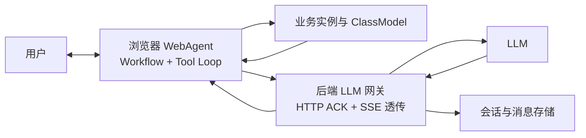
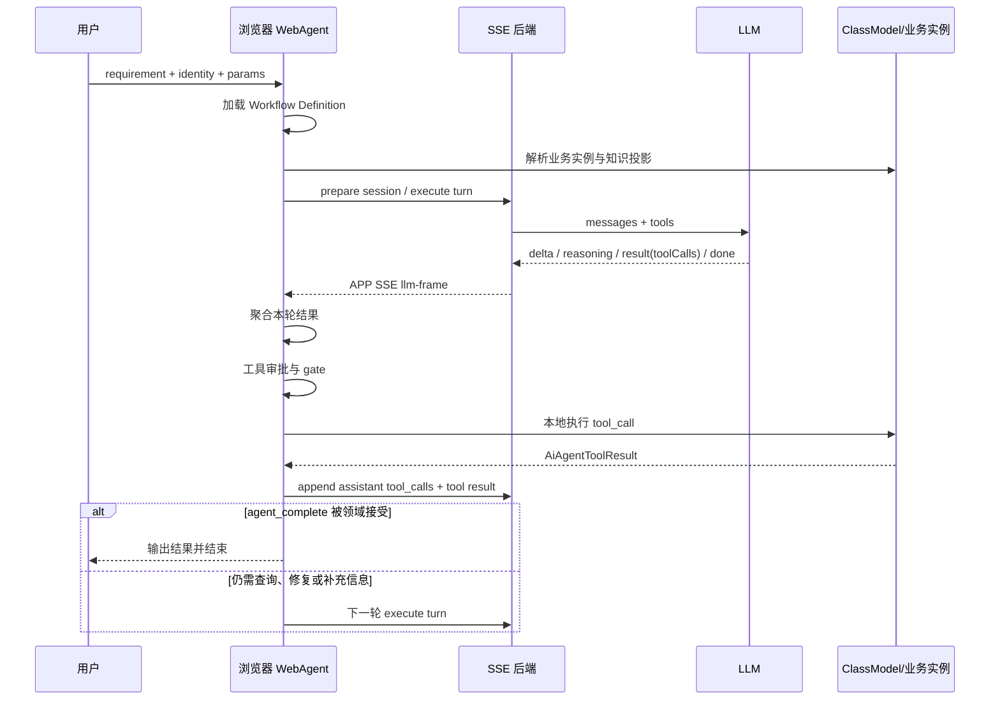

# WebAgent AI Workflow 架构说明

> 状态：架构理念稿  
> 核心命题：**Workflow 替代 Blueprint；Workflow is the Agent。**  
> 适用范围：浏览器 WebAgent、LLM SSE 传输、ClassModel 工具运行时、AI 会话持久化。

## 1. 文档目的

本文定义 WebAgent 的 AI Workflow 理念、运行边界、交互协议和储存方式，并澄清它与传统 Agent Blueprint、后端工作流引擎和节点编排系统的区别。

WebAgent 的基本关系是：

```text
用户 <=> 浏览器 WebAgent <=> SSE 后端 <=> LLM
                         |
                         +=> ClassModel / 浏览器业务能力
```

在这个体系中：

- 浏览器中的 WebAgent 是 Agent 主体和运行时；
- AI Workflow 是 Agent 的完整、可执行定义；
- LLM 是可替换的无状态推理能力；
- 后端是 LLM 网关、SSE 通道和会话持久化服务；
- ClassModel 是 WebAgent 向 LLM 提供业务知识与可执行能力的边界；
- 不使用后端 Node 调度，也不以 Node、Line、DAG 作为 Workflow 的核心语义。

## 2. 核心理念

### 2.1 Workflow 替代 Blueprint

传统 Agent Blueprint 通常由以下静态材料组成：

```text
角色 + Prompt + Skills + Tools + Rules
```

它能够描述 Agent 应当怎样工作，但通常不能完整约束真实业务执行。WebAgent 的 AI Workflow 将这些材料与运行契约合并：

```text
AI Workflow
= Agent 目标
+ 输入契约
+ 系统指令
+ 业务知识投影
+ 工具闭集
+ 工具循环规则
+ 权限门禁
+ 会话状态规则
+ 完成动作
+ 输出与验证契约
```

因此，WebAgent 内部不再建立独立的 `Blueprint` 领域对象，也不维护 `Blueprint -> Workflow` 的二次转换和双重版本体系。

外部产品中的 Blueprint 可以作为导入格式或市场术语，但导入后必须成为 WebAgent 的 AI Workflow；运行时只认识 Workflow。

### 2.2 Workflow is the Agent

WebAgent 中不需要一个位于 Workflow 之上的常驻 Agent 配置对象：

```text
Workflow Definition = Agent Definition
Workflow Session    = Agent Instance
Tool Loop           = Agent Execution
```

一个 Workflow 完整决定：

- Agent 接受什么输入；
- 如何为 LLM 构造上下文；
- LLM 能看到哪些业务知识；
- LLM 可以调用哪些工具；
- 工具调用由谁执行；
- 哪些调用需要审批或门禁；
- 如何把工具结果继续交给 LLM；
- 什么业务事实代表任务完成。

### 2.3 LLM 不是 Agent

LLM 只负责在当前上下文中推理并产生文本或 `tool_call`。它不负责：

- 持久化 Workflow；
- 保存权威会话状态；
- 直接拥有业务实例；
- 决定工具是否获准执行；
- 判断业务修改是否真正生效；
- 调度后端工作流节点。

更换 OpenAI、Claude、DeepSeek、通义千问或本地模型，只是更换推理提供方，不改变 Workflow 的业务语义。

## 3. 总体架构



### 3.1 浏览器 WebAgent

浏览器负责：

- 加载已发布 Workflow Definition；
- 解析用户输入和业务实例标识；
- 构造 system prompt、messages 和 tools；
- 加载 ClassModel 知识投影；
- 发起 LLM turn；
- 消费 SSE `llm-frame`；
- 聚合正文、reasoning 和 `toolCalls`；
- 执行本地 Tool Loop；
- 运行工具审批与业务门禁；
- 将 assistant `tool_calls` 与 tool result 追加到会话；
- 调用领域完成动作并决定是否收尾。

### 3.2 后端

后端 AI 职责保持窄边界：

1. 调用 LLM；
2. 提供 APP 公共 SSE 通信；
3. 持久化 AI 会话记录；
4. 提供 AI 会话查询。

后端还必须承担模型密钥保护、鉴权、租户隔离、额度控制和基础审计，但不执行 WebAgent 的业务 Tool Loop，不调度 Workflow Node，也不持有浏览器业务实例。

### 3.3 ClassModel

ClassModel 负责将真实业务对象投影为 LLM 可理解、WebAgent 可控制的知识与工具契约：

```text
DTS / JSDoc / Schema
  -> ClassModelDocument
  -> Knowledge Guide
  -> Tool Schema
  -> model_script
  -> 当前业务实例
```

LLM 不直接访问任意 JavaScript 对象或任意后端 API，而是通过受控工具闭集理解并操作业务模型。

## 4. AI Workflow 的领域定义

### 4.1 Workflow 不是 Graph

AI Workflow 表达的是一个持续的 Agent Tool Loop 协议，而不是：

```text
Node A -> Node B -> Node C
```

它的真实执行形态是：

```text
构造上下文
  -> 请求 LLM
  -> 接收 tool_call
  -> WebAgent 本地执行工具
  -> 追加 tool result
  -> 再次请求 LLM
  -> agent_complete
  -> 领域验证
  -> 完成或继续修复
```

因此，目标模型不需要以下核心对象：

- Workflow Node；
- Workflow Line；
- Node Run；
- DAG Scheduler；
- Node 间输入输出投影；
- 后端流程游标。

如果需要表达“先查询知识、再执行、最后完成”，应通过工具闭集、Tool Loop 状态、nudge、gate 和完成协议表达，而不是拆成多个后端调度节点。

### 4.2 Workflow Definition 建议结构

```json
{
  "kind": "agent.workflow",
  "version": 1,
  "workflowId": "agent.workflow.projectPlanning",
  "source": {
    "designId": "agent.workflow.projectPlanning",
    "designVersion": 3
  },
  "workflow": {
    "metadata": {},
    "inputContract": {},
    "instructions": {},
    "businessContext": {},
    "knowledge": {},
    "toolLoop": {},
    "toolPolicy": {},
    "completion": {},
    "outputContract": {}
  },
  "x_spark": {}
}
```

#### metadata

描述 Workflow 的稳定身份，不承载执行状态：

```json
{
  "title": "Project Planning",
  "description": "根据需求和导航输入完成项目策划",
  "tags": ["project", "planning"]
}
```

#### inputContract

规定 WebAgent 如何从调用输入中识别业务实例、用户消息和结构化参数：

```json
{
  "identityField": "projectScopeKey",
  "messageField": "requirement",
  "paramsSchema": {}
}
```

输入应区分：

- `identity`：当前业务实例；
- `message`：用户自然语言目标；
- `parameters`：结构化调用参数；
- `attachments`：文件或外部资料引用；
- `context`：WebAgent 从当前页面和业务实例自动投影的上下文。

#### instructions

定义提供给 LLM 的稳定行为说明：

```json
{
  "systemPrompt": "...",
  "readonlySteps": [],
  "conditionalHints": []
}
```

它只描述任务规则，不复制 ClassModel 方法目录，不把运行状态写死进 Prompt。

#### businessContext

定义如何定位业务模型和当前实例：

```json
{
  "modelProjectionRef": {
    "kind": "dts-class-model",
    "rootClassName": "ProjectModel",
    "manifestUrlRef": "dts-class-model"
  },
  "executableRef": {
    "kind": "js-module",
    "moduleSpecifier": "@spark-appworks/spark-project-model",
    "exportName": "ProjectModel"
  },
  "resolveInstance": {
    "editorSource": "projectPlanning",
    "identityField": "projectScopeKey"
  }
}
```

#### knowledge

规定 LLM 可探索的模型边界，而不是一次性注入全量知识：

```json
{
  "rootClassName": "ProjectModel",
  "allowedActions": [],
  "readableAttributes": []
}
```

知识应按 `model_query -> guide -> model_script` 渐进加载，避免将完整 manifest 塞进单轮上下文。

#### toolLoop

定义浏览器 Tool Loop 的运行规则：

```json
{
  "executionToolNames": ["model_script"],
  "maxTurns": 20,
  "maxToolCallsPerTurn": 1,
  "nudges": {
    "plan_without_tool": "...",
    "execution_phase": "...",
    "model_script_retry": "..."
  }
}
```

#### toolPolicy

定义工具白名单与调用前门禁：

```json
{
  "allowedTools": [
    "model_query",
    "model_class_guide",
    "model_attribute_guide",
    "model_action_guide",
    "model_script",
    "human_question",
    "agent_complete"
  ],
  "gateRules": [],
  "forbiddenScriptMarkers": []
}
```

#### completion

任务完成必须成为领域动作，而不是 LLM 自然语言声明：

```json
{
  "toolName": "agent_complete",
  "methodName": "completeProjectPlanning",
  "returnContract": "boolean-or-reason"
}
```

完成动作返回失败时，WebAgent 将 `checks` 和修复提示交回 LLM，继续 Tool Loop。

#### outputContract

定义最终可交付结果，而不是保存模型的任意正文：

```json
{
  "schema": {},
  "includeSummary": true,
  "includeBusinessResult": true
}
```

## 5. 端到端运行协议



### 5.1 SSE 帧

APP 公共 SSE 通过 `llm-frame` 传输模型结果：

| 帧类型 | 含义 |
|---|---|
| `delta` | 助手正文增量 |
| `reasoning` | 推理内容增量 |
| `result` | 本轮最终正文、reasoning 和 `toolCalls` |
| `error` | 本轮失败 |
| `done` | 流结束 |

浏览器按 `sessionId + turnId` 过滤并聚合帧。SSE 只是传输，不是 Workflow 调度协议。

### 5.2 工具生产线

当前工具生产线遵守：

- 每轮最多一个真实 `tool_call`；
- 工具回合的 assistant 正文应为空；
- 写在正文中的伪工具调用不执行，而是触发 nudge；
- 工具在浏览器本地执行；
- 工具结果追加到后端会话后再进入下一轮；
- 收尾必须使用 `agent_complete`。

### 5.3 七工具闭集

| 工具 | 职责 |
|---|---|
| `model_query` | 查询可达 ClassModel 知识 |
| `model_class_guide` | 读取类级指南 |
| `model_attribute_guide` | 读取属性契约 |
| `model_action_guide` | 读取动作签名与约束 |
| `model_script` | 在当前业务实例上执行受控脚本 |
| `human_question` | 请求缺失业务事实 |
| `agent_complete` | 请求领域完成校验 |

未知工具和未知参数必须 fail-fast，不提供静默兼容分支。

## 6. 状态与储存

### 6.1 储存原则

1. Design 可编辑，Definition 发布后不可变；
2. Session 固定引用一个 Definition 版本；
3. 会话历史保存在后端，浏览器保存当前运行态；
4. 业务状态属于业务实例，不复制进 AI 会话作为第二事实源；
5. SSE 帧是瞬时传输数据，不是权威存储；
6. 工具调用和工具结果必须成对落入会话历史；
7. 模型密钥只在后端保存。

### 6.2 Workflow Design

设计态保存编辑器需要但运行时不需要的信息，例如草稿状态、校验问题和表单状态。目标架构不再保存 Graph、Node 位置或 Line。

```text
agent_workflow_design
├─ id
├─ tenant_id
├─ workflow_id
├─ design_version
├─ revision
├─ status
├─ document_json
├─ validation_json
├─ created_at
└─ updated_at
```

`revision` 用于乐观锁，避免多人编辑相互覆盖。

### 6.3 Workflow Definition

发布态是浏览器 WebAgent 的唯一执行事实源：

```text
agent_workflow_definition
├─ id
├─ tenant_id
├─ workflow_id
├─ definition_version
├─ source_design_id
├─ source_revision
├─ schema_version
├─ content_hash
├─ definition_json
├─ status
└─ published_at
```

发布后不原地修改。任何行为、工具或契约变化都产生新版本。

### 6.4 Session 与消息

后端保存模型会话，以支持完整上下文、断线恢复和审计：

```text
agent_session
├─ session_id
├─ tenant_id
├─ workflow_id
├─ workflow_version
├─ business_identity_json
├─ status
├─ created_at
└─ updated_at
```

```text
agent_message
├─ id
├─ session_id
├─ sequence
├─ role
├─ content_json
├─ turn_id
├─ model_info_json
└─ created_at
```

消息角色至少包含 `user`、`assistant` 和 `tool`。assistant 的 `tool_calls` 与对应 tool result 必须保持协议完整。

### 6.5 浏览器运行态

浏览器只需要维护当前执行需要的临时状态：

```text
workflow definition snapshot
current session / turn / stream identity
accumulated SSE frame
pending tool call
tool approval state
tool loop phase
completion state
abort / timeout controller
```

页面刷新后是否恢复由产品策略决定：

- 不要求恢复：仅保存在内存；
- 要求同设备恢复：使用 IndexedDB 保存最小快照；
- 要求跨设备恢复：从后端会话历史重建，并重新解析业务实例；
- 业务修改结果始终从真实业务模型读取，不从浏览器快照恢复。

## 7. 安全边界

### 7.1 浏览器门禁

浏览器 WebAgent 负责业务级安全：

- Workflow 工具白名单；
- ClassModel action 白名单；
- `beforeFunctionCall` gate；
- 写操作人工审批；
- 当前业务实例绑定；
- script marker 禁止项；
- 完成动作校验。

### 7.2 后端底线

即使后端以透传为主，也必须保留不可绕过的基础保护：

- 身份认证与租户隔离；
- LLM API Key 隔离；
- 模型和 endpoint 白名单；
- 请求体、上下文和输出大小限制；
- 超时、并发、速率与费用限制；
- session 访问控制；
- 请求和错误审计。

浏览器门禁保护业务，后端门禁保护基础设施。二者职责不同，不互相替代。

## 8. 与传统 Blueprint 的比较

| 维度 | 传统 Blueprint | WebAgent AI Workflow |
|---|---|---|
| 核心形态 | 静态 Agent 配方 | 可执行交互协议 |
| Agent 角色 | Prompt 描述 | Workflow metadata + instructions |
| 知识 | 文件或长上下文 | ClassModel 渐进投影 |
| 工具 | 工具列表 | 工具闭集 + schema + gate |
| 执行者 | 模型或通用 Agent Runtime | 浏览器 WebAgent |
| 状态 | 通常依赖聊天历史 | session + browser runtime + business state |
| 完成 | 模型自然语言判断 | `agent_complete` + 领域方法 |
| 验证 | 通常是建议 | 业务模型强制验证 |
| 模型绑定 | 经常绑定具体厂商 | LLM 可替换 |
| 运行编排 | Prompt 内隐式步骤 | 连续 Tool Loop |

WebAgent AI Workflow 的优势不是多一份配置，而是把 Agent 从“提示词组合”提升为“有业务能力边界和完成契约的运行协议”。

## 9. 当前实现与目标模型

### 9.1 已符合目标理念的部分

当前仓库已经具备：

- 浏览器 `AiAgentHost` 与 Tool Loop；
- 后端 LLM 调用、SSE 和会话持久化；
- `llm-frame` 中性传输帧；
- ClassModel 七工具闭集；
- `model_script` 本地业务实例执行；
- `beforeFunctionCall` 门禁与工具审批；
- `agent_complete` 领域完成动作；
- `design.json -> definition.json -> activate` 发布激活链路。

### 9.2 仍带有 Node/Graph 语义的部分

当前 `AgentWorkflowDefinition` 仍包含：

```text
graph
nodes
lines
AgentWorkflowBusinessNodeData
AgentWorkflowNodeRuntimeBinding
```

现有 projectPlanning/pageDesign 定义也通过 `start -> business node -> output` 包装实际只有一个连续 Tool Loop 的运行过程。

这可以被视为当前序列化协议的过渡形态，不应反向定义 WebAgent 的产品理念。目标模型应将单一业务 Workflow 的运行契约提升到 Workflow 顶层，逐步移除无实际调度价值的 Node/Line 包装。

## 10. 演进原则

### 10.1 保持一个 SSOT

WebAgent 内部只保留 `AgentWorkflowDefinition`，不新增：

```text
AgentBlueprint
BlueprintVersion
BlueprintRun
```

### 10.2 先稳定运行契约，再迁移序列化结构

迁移时应保持以下运行行为不变：

- input contract；
- Workflow 激活；
- 业务实例解析；
- 知识按需加载；
- Tool Loop；
- 工具 gate；
- SSE turn；
- session append；
- `agent_complete`。

### 10.3 不把后端升级为 Workflow Engine

移除 Node/Graph 后，不应在 Java 后端重新实现调度器。后端仍然只提供 LLM、SSE、会话和查询能力。

### 10.4 不用 Prompt 替代契约

下列内容必须保持结构化：

- 输入 Schema；
- 工具 Schema；
- 工具白名单；
- 门禁规则；
- 业务实例定位；
- 完成动作；
- 输出契约。

Prompt 只表达自然语言目标和行为提示。

## 11. 最终定义

WebAgent AI Workflow 的正式定义可以概括为：

> **AI Workflow 是浏览器 WebAgent 驱动 LLM 完成一个业务目标所需的完整、可版本化、可执行交互协议。它统一表达 Agent 的目标、输入、指令、知识、工具、权限、工具循环、完成条件和输出契约，替代传统静态 Blueprint。浏览器 WebAgent 是运行时，后端是 LLM/SSE/会话网关，LLM 是可替换的推理引擎，ClassModel 是可验证的业务能力边界。**

最终运行关系只有：

```text
AI Workflow Design
        -> 发布与验证
AI Workflow Definition
        -> 浏览器加载
WebAgent Tool Loop
        <=> SSE 后端
        <=> LLM
        <=> ClassModel / 当前业务实例
```

这套模型的关键不是可视化节点，而是：

```text
Workflow is the Agent.
Browser is the Runtime.
LLM is the Reasoner.
ClassModel is the Capability Boundary.
SSE Backend is the Gateway.
```

## 12. 当前事实源

- `packages/spark-lowcode-api/README.md`：lowcode 前端 API、会话和 SSE 接入边界；
- `packages/spark-ai/docs/transport-and-session-zh-cn.md`：浏览器 Tool Loop、HTTP/SSE 和会话追加协议；
- `packages/spark-ai/docs/native-runtime-and-agent-flow-zh-cn.md`：ClassModel、Tool Loop、`model_script` 和业务实例执行链；
- `packages/spark-ai/src/agent/tool-loop/README.md`：工具生产线约束；
- `packages/spark-ai/src/agent/workflow/agent-workflow-definition.ts`：当前 Workflow Definition 类型契约；
- `config/agent-workflows/`：当前受版本管理的 Workflow Design/Definition 配置。
