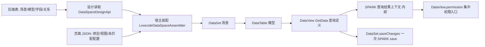

状态：superseded

## 方案前提变更（2026-10-06）

用户明确要求：本仓一个页面也必须能使用多个数据空间，与 sparkproject 统一。因此，本文以单一 `PageDataSpaceBinding` / `PAGE_DATASET` 为页面入口的实施顺序已失效，不能据本文继续编码。已有 Copilot 成果与历史验证记录保留，不回滚。

替代方案主题：页面多数据空间整合；当前研读记录见 [页面多数据空间研读](research-page-multi-data-space.md)，前端合同草案见 [页面多数据空间整合方案](plan-page-multi-data-space-integration.md)。草案已纳入用户确认的 `#数据集@表@视图`，页面集合、JSON 容纳层及公共入口待人工审核；完整实施计划仍须补齐 API 移植和后端保存闭环。原 P3—P8 仍是必须覆盖的任务清单，不能因本次修订删减。

此前另两项已获人工确认，继续有效：运行身份只读，绑定变化时先明确保存/放弃未保存修改，再重建整页运行数据；pagedata 保留现有结构，绑定表的 columns 是设计显示快照，运行定义必须从后端取得并检查冲突。后者保留的是每份 DataSet 的内部结构，不据此拒绝新增页面多数据空间的容纳层。

本文下方历史回滚描述中的 `git checkout --` 不得对含有先前成果的脏文件直接执行。任何后续回滚只能撤销本轮精确补丁或恢复本轮前逐文件快照；检测到并行修改时先停止，保留双方内容。

## 接手复查门（2026-10-06）

用户要求先审核 Copilot 接手成果，再继续。已完成当前工作树复查，详见 [交接复查报告](research-dataset-handoff-review.md)。本节优先于下文历史“已完成并验证”的整体验收表述；这些历史记录保留，不等于目标闭环已通过。

- 本轮重新通过 typecheck、lint、verify:ai-codegen、verify:class-model，以及 spark-data 413 项、根定向 51 项和 lowcode-platform-api 12 项测试；详见报告中的证明边界，不叠加成独立用例数。
- 仍需处理：F1 未迁移页面的引用失效、F2 class 声明身份与闭包实际路由分离、F3 仅模型绑定时仍序列化行、F4 嵌套权限字段未清理、F5 构造入口不验证场景身份。
- F6 `getCurrentUser` 删除另行处理：后端接口仍存在，生成面仍暴露已删方法；当前改动保持原样，不混进 DataSet 修复。
- P3 不直接开工。先修订身份及页面切换的精确方案供人工审核，再按最小闭环修正 P1/P2，之后继续原 SPARK 查询/保存/权限接入。当前模型默认 `default` 视图不是只能拥有一个视图的领域限制。
- 表＋JSON 的设计保存和后端页面文件结构仍属于完整目标；下文 R9b 的“本期只读”是历史代选记录，不视为用户已同意删减目标。

## 授权与代选的审核结论（2026-10-06）

用户要求「按计划自动推进」并两次下达「Start implementation」。据此按推荐项代选下列结论，仅作用于已批准的阶段，用户随时可推翻；未列出的审核项仍需单独批准。

| 项 | 代选结论 | 效力范围 |
|---|---|---|
| R3 | 接受 P1 的序列化变化；旧页面仅在再次保存时变化 | P1 |
| R9 | 新文件只放新建子目录，不在超限目录平铺 | 全部阶段 |
| R1 / R2 / R5 / R8 / R9b | 采用推荐项（路线 B、事务保守、只读、叠加层白名单），P2 起的阶段开工时再确认 | P2 起 |
| R7 / R11 | 不代选：写后端文件、写真实数据均不执行 | P6a / P8 |
| R12 | 不代选：早前误改 `getCurrentUser` 的改动原样保留、不混入本任务 | 全部阶段 |

当前已批准实施的阶段：**P1**。

> 赋能层记录，不是产品事实源。本文含方案与证据。证据均来自 2026-10-06 本会话直接读码、`git grep`、运行命令；未访问线上接口、未连数据库、未写后端文件。
> 基线：本仓 HEAD `a7f2cf2e1`（分支 `feat/agent-workflow-node-contract`）；参考仓 `E:/r/sparkproject` HEAD `842dec4f1`（工作树有 UI 层未提交修改，与本任务无关，只读）；后端 `E:/lowcode-jdk17` HEAD `37770101`（干净，Java 不改）。
> 前置研读：`notes/research-dataset-data-space-integration.md`、`notes/research-dataset-frontend-contract.md`（含已确认的 8 项决定）。

## 硬约束（2026-10-06 用户追加，优先于下文所有阶段条款）

1. **不向后兼容**：新契约上线即替换旧契约。禁止保留旧字段/旧形状的读取分支、别名、双写、开关、`deprecated` 过渡层；旧形态一律在解析处显式拒绝。旧页面靠 P7 迁移预览一次性迁移，不靠运行时兜底。
2. **不搞薄包转发**：新增 class 必须自己持有状态与规则；不得出现只把调用原样转给另一个对象/函数的包装层、同义重导出、仅改名的 re-export。
3. **SSOT**：每个事实只有一个来源。身份只来自 `DataSet.scenarioId` / `DataTable.modelBinding`；权限只来自 `DataView.permission`；保存只走一条 SPARK 保存路径；模型/字段定义只来自后端表。新路径落地的同一闭环内删除被取代的旧路径与其测试，不并存。
4. 实施含义：P2b 直接替换装配器的「按资源建表」逻辑而不留旧分支；P4 切换后删除所有对 `lingma_sys_*` 的读取点；P5 起 SPARK 绑定数据只有一种保存模式，若 `perView`/`transaction` 在切换后无消费者则一并删除；P3 路线 B 的新 class 不得包装 `DataSpaceRuntimeApi` 而不增加规则，与其重复的旧逻辑须被替换。

## 任务目标

在保持本仓主框架（DataSet / DataTable / DataView、spark-component 渲染、ProjectWorkspace 四文件）不变的前提下，接入 sparkproject 的数据空间：

- sparkproject 的场景 → 本仓 `DataSet`；模型 → `DataTable`；SPARK 查询上下文 → `DataView` 内部状态，经 `DataView` 作为 `DataSource` 消费。
- 用户补充的输入语义：GetData 参数 → `DataView` 查询定义。场景及模型身份由所属 `DataSet` / `DataTable` 提供；查询定义与返回的结果上下文分开管理，不新增独立 DataSource class。
- 数据权限完全按 sparkproject 语义，前端不另建授权规则。
- 持久化采用「后端表 + JSON」：正式场景/模型/字段/关系以后端表为真源；页面绑定、视图、未匹配配置以 JSON 为真源。
- 不修改 Java；在后端建立与本仓一致的页面文件结构（经现有文件接口）。

## 复杂度

复杂。横跨 `spark-data`、`spark-component`、`spark-project-model`、`spark-lowcode-api`、宿主 `src/lowcode`，涉及数据模型、权限消费、持久化与迁移。

## 已确认的决定（来自研读文件，不重复提问）

| # | 决定 |
|---|---|
| 0 | 三类骨架不变，由 DataView 承接 DataSource 与原 SPARK 上下文，不新增独立 DataSource class |
| 1 | 页面内 `tableName` 保持稳定，显式绑定后端模型 ID 与查询用 Name |
| 2 | 存在未保存修改时，拒绝刷新/筛选/级联查询替换当前结果 |
| 3 | 同模型多视图一起保存时拒绝，要求调用方明确选一个视图 |
| 4 | 原 SPARK 上下文仅作 DataView 内部状态，经集中权限入口消费 |
| 5 | 按页面生成迁移预览，人工审核后逐页切换 |
| 6 | 查询失败保留上次成功数据，标旧结果并暂停编辑，成功后恢复 |
| 7 | 同场景跨模型统一调用一次 SPARK save；要求事务保证时显式报不支持（见 R5，证据有新增） |
| 8 | 表＋JSON：正式定义以表为真源，页面绑定/视图/未匹配配置以 JSON 为真源 |
| 9 | 将必要的原查询/保存/权限实现收进本仓既有 API 包，替换对应旧路径，并验证与参考仓一致；此决定取代 R1 的待选路线描述 |
| 10 | GetData 参数的语义归属为 DataView；不是把 SPARK 返回的 queryContext 改称查询参数 |

### 当前工作树复核与本轮边界（2026-10-06）

本轮已核对 `git status`、身份与装配源码 diff：工作树确有 P1/P2 相关改动。下文实施记录中的测试结果是既有记录，本轮未重跑，不据此声称整合完成。顶部“仅 P1 已批准”与下文 P2 实施记录存在记录不一致，保留原记录，不能据此推定 P3 及后续均已批准。本轮仅修订契约与方案，不覆盖或回退现有代码。

GetData 查询定义由 DataView 统一持有：过滤、排序、字段投影、分页、模型输入参数及树查询意图。当前 `_buildRemoteViewConfig` / `loadFromServer` 已提供主要输入，但宿主 `runtimeQuery` 只转换过滤、排序、分页；逐视图投影、输入参数及树查询仍需补齐契约映射。P3/P4 必须用参数对照测试证明接线，不能把“查询能返回行”当作这些能力已完成。

## 逐项验证记录

状态：已核实＝本会话读码/运行确认；已修正＝研读文件中的说法与源码有出入；新发现＝研读文件未记录；未验证＝缺环境或未运行。

### A. 本仓现状

| # | 主张 | 证据 | 状态 |
|---|---|---|---|
| A1 | `DataView implements DataSource`；`DATA_SOURCE` 实例类型为 DataView | `data-view.ts:219`、`types.ts:1107`、`capability-keys.ts:220` | 已核实 |
| A2 | 查询输入 `queryContext` 写入 `loadParams.context`；权限快照经 `ingestPermissionSnapshot` 登记 | `data-view.ts:259`、`:1363`、`:1377`、`:1583` | 已修正（研读写 `:1337`，实为 `:1363`；`DataPermissionSnapshotInput` 在 `types.ts:1604`，非 `:1584`） |
| A3 | （2026-10-06 已被 P2b 取代）原装配按物理资源建 Table、`modelId` 作 viewId，同资源多模型合并；现为一模型一表、`tableName=modelId`、单一 `default` 视图，旧分支已删除 | 原 `tables[resource.resourceId]`；现 `lowcode-data-space-assembler.ts` `modelTable()` | 已核实并已替换 |
| A4 | 装配出的 Table 只配置了 `api.list`，没有任何 create/update/delete/save 端点 | `lowcode-data-space-assembler.ts` `modelTable()` 的 `api: { list }` | 新发现：绑定页面当前没有保存通路；失败形态未运行验证 |
| A5 | 数据空间设计/运行的 `prepareMutation` 只形成命令，全仓无执行方 | 全仓搜索，仅出现在定义与测试中 | 已核实 |
| A6 | 权限当前由 `PermissionChecker` 直接读行上的 `lingma_sys_params`；`permissionMode` 形参被忽略；绑定路径的 `allowAdd` 来自平台权限快照与查询响应合并 | `PermissionChecker.ts`、`lowcode-permission-to-data-permission.ts` | 已核实 |
| A7 | 绑定页面运行态不以 `pagedata.json` 为真源；绑定由蓝图节点三字段构成，单页单 `modelId`，但装载的是整个数据空间 | `lowcode-data-space-runtime.ts` 头注释；`config-page.ts:34-45`；`knowledge/page-design.md` 最后一条 | 新发现：与决定 8 有冲突，见 R8 |
| A8 | 页面文件网关只注入 `readPageFile`；`saveFileContent` 是可选能力，缺失时报「当前平台未提供受治理的页面文件保存能力」 | `lowcode-runtime.ts:394`、`page-file-api.ts:13-30` | 已核实 |
| A9 | 前端所有请求不带 `X-AppId` | 在 `src`、`packages` 搜索无命中 | 已核实 |
| A10 | `LowcodeDesignFileUpload` 固定 `isReplace:false`（追加版本）；设计读取的 FileInfo 为 `isReplace:true` | `lowcode-design-file-upload.ts:41`、`lowcode-design-api.ts:41` | 已核实 |
| A11 | `DataSet.saveChanges` 已有 `perView`（默认）与 `transaction`（自定义事务端点）两种模式 | `dataset.ts:1353-1360`、`:1444`（`saveChangesInTransaction`）、`:1555` | 新发现：决定 7 需与现有 `transaction` 模式并存或收窄，见 R5 |
| A12 | `DataSpaceRuntimeApi` 已自实现一套接近 SPARK 的信任模型：行强制携带 `lingma_sys_params`/`lingma_sys_key`，mutation 需 preimage，删除需 `d`，可写字段为 `r∪e` | `data-space-runtime-api.ts:140-250`、`data-space-runtime-mutation.ts` | 新发现：路线 B 有现成基础，见 R1 |
| A13 | 现有运行请求把模型 Name、MetaName、字段全量放进请求体 | `data-space-runtime-api.ts` `queryPayload()` | 已核实；SPARK 路线只传场景与模型 Name，后端解析（见 B） |

### B. 参考仓与后端

| # | 主张 | 证据 | 状态 |
|---|---|---|---|
| B1 | 查询上下文以对象为键存于 WeakMap，scope 变化后断言失败 | `spark-api/src/resource/query-context.ts:16`、`:88-94` | 已核实 |
| B2 | 每个资源最多保留 16 个查询基线；保存前选择或补查基线 | `data-space-model-api.ts:332`、`:529-555` | 已核实 |
| B3 | 批量保存不允许跨场景，且同批 `metaName` 不得重复 | `data-space-model-api.ts:693-700` | 已核实 |
| B4 | 保存最终为一次 POST，路径解码后为 `/DataOperation/BatchTableOperateRequestByCRUD`，请求体是各表分组展平 | `protocol/executor.ts:956-970`、`kernel/wire-contract.ts:21` | 已核实 |
| B5 | 后端批量保存接口对数据表增删改使用 `TransactionManager.start/commit/rollback`，系统表放在提交之后处理，操作日志在提交后写入 | `BasicFunServiceImpl.java:824-888`（`BatchOperateTableByCRUD`） | 新发现：研读写「没有事务证据」，源码显示数据表部分有程序化事务；仍未验证是否跨库、系统表之后的失败如何呈现 |
| B6 | 权限五集合语义：必填=`r`，可写=`r∪e`，隐藏=`h`，脱敏=`m`，可删=`d`，可编辑行=`r+e` 非空 | 参考 `protocol/permissions.ts:97-231`；本仓 `PermissionChecker.ts` | 已核实：字段/行级核心语义等价 |
| B7 | 差异项：参考仓公共行去除 `lingma_sys_key`/`lingma_sys_params`；有 rowKey 唯一性与 scope 校验；动作状态为 hidden/disabled/enabled；缺 auth 有四种策略。本仓行上保留这两个字段且被序列化，缺 auth 一律隐藏 | `permissions.ts:73-80`、`query-permission.ts:67-130`、`PermissionChecker.ts` | 已核实 |
| B8 | 后端文件服务：文本读取 10 MiB、只接受 `text/*`、`application/json`、`application/xml`；空内容拒绝；`isReplace=false` 且同名时生成唯一名；`isReplace=true` 直接 `Files.write` 覆盖，无备份（方法注释称有备份，代码没有）；自动创建目录；设计目录前缀 `DesignFilePaths_<所有者>` | `FileServiceImpl.java:103`、`:160-162`、`:918-1010`、`:365-368` | 已核实 |
| B9 | `GetUserInfo` 在后端仍存在；端点台账生成器漏扫长注解接口（窗口 1800 字符，实测距离 1851、2837） | `LoginController.java:224`、`generate-ledgers.mjs` | 已核实（此项属另一任务，见 R12） |
| B10 | 参考包 `@spark-template/spark-api` 为私有包，依赖 5 个 workspace 包，154 个源文件约 3 万行；本任务相关子集（protocol、resource、space、public 部分、kernel 部分）约 0.8–0.9 万行 | `package.json`；逐目录行数统计 | 已核实（子集边界为估算） |

### C. 差异复现与基线测试

| # | 项目 | 结果 | 状态 |
|---|---|---|---|
| C1 | DataView 自动选择配置：`false` 保存时省略，重新加载变 `true` | 本会话复现，输出 `saved:{}`、`reloaded:{a:true,s:true}`；代码依据 `data-view.ts:2361-2362`、默认值 `:447-449` | 已核实（持久化保真不通过） |
| C2 | 远端类型表序列化会带出查询行与 `lingma_sys_params` | 本会话复现，两项均为 true；`DataView.toJson` 无条件序列化 `rows`（`data-view.ts:2348-2349`） | 已核实 |
| C3 | 页面夹具覆盖面 | `backend-api-contracts/characterization-fixtures/pages-config` 下 27 个 `pagedata.json`；42 张表无 `resourceType`，1 张 `static-data`；36 个视图在无 `resourceType` 的表上带 `rows`。本地数据判定谓词已在 `data-view.ts:458-462`（`_shouldApplyStaticLocalFilter`）（`static-data` 或「无 `api.list` 且有行」） | 已核实：序列化修复必须以该谓词判定，不能只看 `resourceType` |
| C4 | 本仓现有相关测试 | 6+2+3+3 组共 66 项通过 | 已核实（当前工作树含不相关的未提交改动，见 R12） |
| C5 | 参考仓现有测试 | query-context-scope 2、query-permission 33、data-space-model-api+query-scenario-models 74，共 109 项通过 | 已核实 |

### D. 仍未验证（无环境或需另行批准的探针）

1. 一个数据空间的 `formKey`（`X-FormKey`）与 `dataSpaceId` 是否恒等；SPARK 的 `scenarioId` 在线上等于哪个（见 R2）。
2. `script.js` 在部署环境下的真实 MIME，文本读取接口能否读回（见 R7）。
3. `TransactionManager` 是否覆盖多库；系统表在提交后的失败如何回报（见 R5）。
4. 参考仓设计图 JSON 经画布加载—编辑—保存后，扩展键是否被保留（研读结论：保存时由画布重建，未证明无损）。
5. 后端元数据表（`Base_DataSet` 等）的真实物理 schema；Java POJO 不等于物理表。
6. `X-AppId` 注入后读/写/列目录三者是否一致落在同一设计所有者目录。
7. 空文件与单换行内容的往返语义。
8. A4 所述保存通路缺失时的运行态失败形态。

## 目标结构与层次（候选，名称待 R9 审核）



- 新增公共成员（候选，未批准）：`DataSet.scenarioId`、`DataTable.modelBinding{modelId,modelName}`、`DataView.permission`、`DataView.isResultStale`。其余沿用现有 `loadFromServer/refresh/saveChanges`。
- 新增文件只放进新建子目录：`packages/spark-data/src` 顶层已有 13 个源文件（上限 10），`packages/spark-data/src/tests` 已有 28 个（上限 10），不得继续平铺。
- 禁止 `export *`、禁止平级 interface/type 大平层、函数不超过 3 个位置参数（`AGENTS.md` 第 2 章）。

## 分阶段方案（每阶段一个最小闭环，批准后逐个实施并立即验证）

### P0　人工审核门（无代码）

审核本文第「人工审核清单」全部项，尤其 R1、R5、R8。审核通过前不写任何代码。

### P1　序列化保真修复（spark-data，独立、风险最低，可先做）

- 目标：C1、C2 两项差异转为通过。
- 影响文件：
  - `packages/spark-data/src/data-view.ts`：`autoCurrentFirst`/`autoSelectFirst` 增加「显式配置」标记（先例：`autoLoadConfigured`，`:456`、`:2282`）；`applyViewConfig`（`:2277-2278`）与 `toJson`（`:2348-2378`）显式写出 `false`；`rows` 仅在本地数据判定谓词为真时序列化，并剔除 `lingma_sys_*`。
  - `packages/spark-data/src/data-table.ts`：`toJson`（`:299-320`）保持行为，核对其与视图序列化一致。
  - 新增测试放入新子目录（例如 `packages/spark-data/src/tests/serialization/`，目录名待 R9）。
- 验证：
  - C1、C2 探针改写为测试，先红后绿。
  - 27 个页面夹具逐个 `fromJson → toJson → fromJson`，断言幂等，且本地数据行不丢（C3）。
  - `pnpm run typecheck`、`pnpm run lint`、`pnpm run verify:ai-codegen`、`pnpm --filter @spark-appworks/spark-data run test:run`。
- 审核点：R3（会改变既有页面落盘内容）。

**P1 实施记录（2026-10-06，已完成并验证）**

- 改动：`packages/spark-data/src/data-view.ts`——`toJson` 显式写出 `autoCurrentFirst`/`autoSelectFirst`；新增私有 `_holdsRemoteRows()`（`resourceType` 已声明且非 `static-data`，或存在 `api.list`）为真时不序列化行；新增 `withoutPermissionWireFields()` 对所有视图剔除 `lingma_sys_params`/`lingma_sys_key`。
- 新增测试：`packages/spark-data/src/tests/serialization/view-config-roundtrip.test.ts`（5 项；2026-10-06 复核时发现初版只写入 4 项，第 5 项「带 `api.list` 的表按远端处理」后补，已通过）、`tests/page/page-data-serialization-roundtrip.test.ts`（夹具往返，含 1 项覆盖检查、1 项旧版清单检查、24 个夹具）。
- 验证：新测试 33 项通过；`spark-data` 29 文件 407 项、根目录 172 文件 1322 项通过；`typecheck`、`lint`、`verify:ai-codegen`（938 个文件）退出码均为 0。探针 C1、C2 均已转绿。
- 新发现（未在 P1 内处理，待你决定）：
  1. 3 个旧版夹具（`cascade-demo`、`dataset-demo`、`smart-load`）的 `viewCascades` 形状当前被 `DataSet.fromJson` 拒绝，`parsePageData` 同样失败。测试用显式清单固定这 3 个，清单变化即失败。
  2. 把 `toJson()` 返回的对象直接再传给 `fromJson`，会被主键追踪写入内部 `_pk`；经 JSON 文本往返（真实落盘路径）则一次到不动点。测试按落盘路径写。
- 未做：未改任何 spark-component/宿主文件；公共 class 成员无变化，故未重新生成类模型。

### P2　身份契约（spark-data + 宿主装配）

- 目标：模型→DataTable；页面 `tableName` 稳定；显式场景与模型绑定。
- 影响文件（均已存在）：
  - `packages/spark-data/src/dataset.ts`（`scenarioId`）、`data-table.ts`（`modelBinding`）、`metadata.ts`、`types.ts`、`index.ts`（显式导出）。
  - `src/lowcode/data-space/lowcode-data-space-assembler.ts`（已改：按模型建表，删除按资源分组与 `queryContext` 路由）、`lowcode-frontend-model-adapter.ts`（已改：不再按资源去重，删除 `resources`、`viewId`、`queryContext`、`resource-readback-mismatch`）、`lowcode-model-relation-adapter.ts`（已改：关系按 `modelId` 表身份，视图固定 `default`）。
  - 旧行为测试需要改写：`packages/spark-data/src/tests/data-table-responsibilities.test.ts`、`tests/auth-nav/data-space/lowcode-frontend-model-adapter.test.ts`（见 R10）。
- 关键设计：`tableName` 的取值规则（R2）；`DataViewKey` 语法 `tableName@viewId` 与跨作用域写法不变；同物理资源的不同模型成为两张 DataTable，每张可多个 DataView。
- **修订（2026-10-06）**：
  - R2 不再依赖「`formKey` 是否等于 `dataSpaceId`」的线上事实：`DataSet.scenarioId` 直接存绑定里给定的 `formKey`（线上 `x-FormKey` 头），`dataSpaceId` 另存，不做相等假设；日后核实结果不同也无需改结构。
  - 需改写的 3 条旧行为断言（R10，逐条审核后再改）：`packages/spark-data/src/tests/data-table-responsibilities.test.ts:41`（一个稳定资源由一个 DataTable 承载并拥有多个 modelId DataView）；`tests/auth-nav/data-space/lowcode-frontend-model-adapter.test.ts:61`（按资源去重、每个 modelId 一个 DataView）；`tests/auth-nav/lowcode-data-space-runtime.test.ts:174`（装配资源表、模型视图、关系与权限快照）。
  - 第 3 条中的页面 `tableName`：绑定页面由装配器生成，取值规则待 P2 开工时确认（沿用旧资源表名 / 由模型 Name 派生）。
  - 旧页面规则里的 `tableName@viewId` 引用不在 P2 内改，仍由 P7 迁移预览逐页处理。
**P2a 实施记录（2026-10-06，已完成并验证）**

- 改动：`types.ts`（`TableModelBinding`、`TableSemanticMetadata.modelBinding`、`DataSetMetadata.scenarioId`）、`metadata.ts`（`normalizeModelBinding`/`normalizeScenarioId`，非法值显式抛错）、`data-table.ts`（`modelBinding` 字段、`toJson`/`fromJson`）、`dataset.ts`（`scenarioId`：配置、字段、`replaceFromJson` 清除、`toJson`）、`index.ts`（显式导出 `TableModelBinding`）。
- 新增测试：`packages/spark-data/src/tests/identity/scenario-model-identity.test.ts`（5 项，先红 3 项后全绿）。
- 验证：`spark-data` 30 文件 413 项、根目录 173 文件 1328 项通过；`typecheck`、`lint`、`verify:ai-codegen`、`verify:class-model` 退出码 0；类模型生成物仅保留 `data-table`/`dataset`/`types` 三份相关差异，其余漂移与无关未跟踪文件已清除。
- 尚未做（P2b）：装配器改为按模型建表，并改写 R10 的 3 条旧断言。

**P2b 实施记录（2026-10-06，已完成并验证）**

- 取值决定（可在 R2 复审）：`tableName = modelId`（不另存别名）；`DataSet.scenarioId = formKey`；表内单一 `default` 视图（常量 `LOWCODE_MODEL_VIEW_ID`）；`modelBinding.modelName` 取模型 Name。
- 删除的旧逻辑：按资源去重与分组、`resources` 结果字段、`resource-readback-mismatch` 诊断、`viewId=modelId`、适配器/视图上的 `queryContext` 及装配器的 `queryContext()`/`resolveBinding`、装配时丢失模型静默跳过（改为显式抛错）。
- 改写的 R10 断言：`data-table-responsibilities.test.ts`（一模型一表，多视图为同一模型的字段投影）、`lowcode-frontend-model-adapter.test.ts`（不再去重）、`lowcode-data-space-runtime.test.ts`（模型表身份、`scenarioId`/`modelBinding`、无 `RESOURCE-*` 表；新增「同资源双模型互不串用」）、`lowcode-model-relation-adapter.test.ts` 夹具。
- 同步清理：`knowledge/page-design.md` 新增身份规则；计划 A3 与两份研读文件中「按资源建表」的描述标注为已取代。
- 验证：`typecheck`、`lint`、`verify:ai-codegen`、`verify:class-model` 退出码 0；`spark-data` 413 项、根目录 1329 项通过。
- 遗留（按用户最新语义修正）：spark-data 通用的 `DataView.queryContext` / `DataViewQueryContext` 仍是查询输入，并有消费者。P2 删除的是旧身份路由；P3/P4 不得因与 SPARK 结果上下文同名而删除 DataView 查询定义职责。输入参数的具体收束与字段变化需列入精确契约审核。

- 验证：同源不同模型形成两张表且视图/权限互不串用；`data-view-key`、`data-view-resolver` 现有 24 项不退化；旧 `tableName@viewId` 引用在切换后不再有运行时兜底，解析失败即显式报错，由 P7 迁移预览在切换前逐页改写。

### P3　查询上下文与权限内核（spark-lowcode-api，路线见 R1）

- 目标：获得与 sparkproject 一致的「查询结果上下文 + 权限入口 + 保存基线」。
- 路线已由第 9 项确定：把必要的原查询、保存、权限实现收进既有 `spark-lowcode-api` 的数据空间领域，替换对应旧路径。保留参考实现的上下文身份、scope、行键唯一性、缺权限策略、字段读写独立性与保存基线选择规则；不把通过一组相似测试作为重新实现全部规则的替代。目录及 class 的精确拆分仍须列出影响文件后审核；不移植整个私有包，不新增薄转发层。
- 保真保证：以参考仓测试向量作为验收。把 `query-permission`（33）、`query-context-scope`（2）、`data-space-model-api`/`query-scenario-models`（74）中适用的用例逐条对照本仓实现，输出「通过/差异/不适用」清单，差异逐条经人工裁决，不静默放过。
- 请求体：由 DataSet 场景身份、DataTable 模型 Name 和 DataView 查询定义组合，经原 SPARK 语义生成 GetData 请求；后端负责解析正式模型定义。投影、排序、分页、输入参数、树与聚合须逐项对照 `SparkQueryOptions`，不支持的输入显式报错，不静默丢弃；真实行为仍须按 D5/R11 验证。
- 验证：包内 `vitest` 全绿；`verify:class-model`（公共 class 变化后需重新生成类模型并只保留相关差异）；`pnpm run verify:ai-codegen`。

### P4　DataView 承接与权限消费统一（spark-data + spark-component）

- 目标：决定 0、2、4、6、10 的落地；明确 DataView 的查询定义与结果消费两种职责。
- 查询定义不变量：存在未保存修改时，在 `setPage`、`setPageSize`、`setSort`、`setFilter` 等修改输入之前拒绝操作；级联触发同样受控。普通请求失败后，保留结果对应的成功查询信息并标 stale，不把新输入展示成旧结果的来源。
- spark-data：`data-view.ts` 增加内部结果上下文、`permission`、`isResultStale`；在 `loadFromServer`（`:1356-1377`）对 SPARK 绑定表走新登记链；未保存修改时在领域方法内拒绝刷新/筛选/级联替换；失败保留旧结果并标 stale，stale 期间拒绝编辑、新增、删除、提交；非 SPARK 表保持现有路径。
- spark-component 消费者统一改读 `DataView.permission`（现有读取点，已列清）：
  `permission/PermissionChecker.ts`、`PermissionResolver.ts`、`FieldRenderHelper.ts`、`usePermission.ts`、`components/containers/data-views/view-runtime-state.ts`、`RendererList.vue`、`RendererTree.vue`、`RendererVirtualCard.vue`、`containers/runtime/container-form-detail.ts`、`containers/support/scopeFactories.ts`、`containers/layout/RendererButton.vue`、`RendererLink.vue`、`useActionButtonRuntime.ts`、`SparkComponentRenderer.vue`、`components/support/beforeRender.ts`、`page/actions/executor-helpers.ts:539`、`page/context/buildPageContext.ts`、`runtime/script-context-types.ts`，以及 spark-data 的 `script-types.ts`。
- 约束：SPARK 绑定数据不得被 `permissionMode: none` 放行；页面业务条件只能收窄。
- 验证：`runtime-permission-snapshot.test.ts` 与组件权限相关测试按新契约改写；同一份查询结果在本仓与参考仓得到相同动作与字段状态（对照 P3 向量）。
- 审核点：R4、R10。

### P5　保存桥（spark-data + 宿主装配）

- 目标：决定 3、7 的落地，并补上 A4 缺失的保存通路。
- 影响文件：`dataset.ts`（`saveChanges`，切换后 SPARK 绑定数据只有一种保存路径，现有 `perView`/`transaction` 若无消费者则删除，不共存）、`data-view.ts`（`saveChanges(ids)`）、`lowcode-data-space-assembler.ts`（为绑定表接通保存）、P3 的保存基线类。
- 关键规则：整批发送前校验——同模型多个待提交视图则整批拒绝并保留全部修改；跨场景拒绝；同批 `metaName` 不重复；回执缺失或不完整报告为「需核对」，不清空编辑、不自动重发；不把 `prepareMutation` 命令当作已持久化证据。
- 事务措辞按 R5 裁决。
- 验证：传输层 mock 的单元测试（成功、部分失败、取消、缺回执）；真实后端写入矩阵归 P8/R11，未经批准不对真实业务数据写入。

### P6　持久化：表＋JSON

分三个子闭环，各自单独审核：

- **P6a 页面文件保存网关**：在 `src/lowcode/lowcode-runtime.ts` 的 `createLowcodeProjectGateways`（`:390-394`）补 `saveFileContent`，经 `/api/File/uploadFileByStr`（`isReplace:true`）写页面四文件。需解决：应用身份注入（A9）、空内容约定（后端拒绝空内容，`BlueprintWorkspace.vue:98` 已有「空串转换行」先例）、`script.js` 的 MIME 读回（D2）、写后回读比对。覆盖写无备份（B8），失败恢复由调用方保留旧内容并报告。不改 Java、不碰版本语义（`{version}__` 快照仍为后续事项）。
- **P6b 页面 JSON 叠加层**：决定 8 要求绑定/视图/未匹配配置以 JSON 为真源。与现行规则「绑定页面不以 `pagedata.json` 为运行真源」冲突（A7），需先裁决叠加边界（见 R8）：叠加层只可携带视图级配置与未匹配配置，不得携带模型定义、查询行、权限结果。
- **P6c 正式定义写回**：把设计器对场景/模型/字段/关系的修改写回后端表。目前只有 `prepareMutation` 而无执行方（A5）。是否纳入本期见 R9b；若纳入，需另出方案，并以参考仓 `data-space-design.ts` 为对照。

### P7　迁移预览与逐页切换（决定 5）

- 产物：只读报告，逐页列出原资源/模型/View → 新模型/Table/View 的对应、页面规则与脚本中的引用变更、无法唯一判定的项、动态引用人工核查项。不按物理表同名推断模型身份。
- 切换前保留该页原四文件与绑定快照；单页验收通过后才推进下一页。
- 形态（脚本/应用内页面）待 R6 裁决。

### P8　验收与收尾

- 真实后端验收矩阵（R11）：查询、权限矩阵、增改删、拒绝路径、部分失败、写后回读、跨应用/租户/会话切换后旧上下文被拒、同模型多视图串用检查。
- 文档与知识：更新 `knowledge/page-design.md` 的绑定规则、修正 `knowledge/monorepo-dependencies.md` 对 `GetUserInfo` 的错误描述（若 R12 选择保留相关结论）、追加 `notes/ai-code-metrics.md`；公共 class 变更后重新生成并仅保留相关的 `generated/dts-class-model`；`pnpm run verify:rules`、根 `typecheck`、`lint`、`test:run`。

## 人工审核清单

标「必审」的项在批准前必须有明确答复；其余可随阶段审核。

| 编号 | 必审 | 审核内容 | 选项与我的倾向 |
|---|---|---|---|
| R1 | 已确认 | SPARK 能力获取路线 | 第 9 项已选择：必要原实现收进既有 API 包，替换旧路径并验证一致性；不重复请求选路线。具体文件、原实现映射和验证向量仍需在 P3 开工前完整列明 |
| R2 | 是 | 身份映射 | `scenarioId` 对应 `formKey` 还是 `dataSpaceId`（D1 未验证，需真实数据确认）；页面稳定 `tableName` 的取值规则（沿用旧表名 / 由模型 Name 派生 / 由迁移预览逐页指定） |
| R3 | 是 | 序列化行为变更 | P1 会改变既有页面落盘内容：自动选择 `false` 将被显式写出，远端表不再写出行与权限字段。是否接受，以及旧页面是否在下次保存时才变化 |
| R4 | 是 | 权限消费切换 | 公共行去除 `lingma_sys_*` 后，所有读取这两个字段的消费者必须改走 `DataView.permission`；`permissionMode: none` 对 SPARK 绑定数据不再放行。确认影响面（约 35 个文件命中）与是否分批切换 |
| R5 | 是 | 事务语义 | B5 显示数据表批量保存有程序化事务，但系统表在提交后处理、跨库未验证。选项：①保持决定 7，要求事务保证时一律报不支持（最保守）；②对「仅数据表」声明有事务，经 P8 真实验证后放开；③与现有 `transaction` 模式并存。倾向①，待验证后再议② |
| R6 | 否 | 迁移预览形态 | 脚本输出文件报告，或应用内页面；切换流程是否需要签核记录 |
| R7 | 是 | 写后端文件 | P6a 会向后端设计目录写页面四文件：是否允许；应用身份（`X-AppId`）注入方式；空内容用单换行是否接受；覆盖写无备份是否可接受 |
| R8 | 是 | JSON 叠加与现行规则冲突 | 决定 8 要求 JSON 为绑定/视图/未匹配配置的真源，而 `knowledge/page-design.md` 与 `SparkPageRenderer` 规定绑定页不以 `pagedata.json` 为运行真源。倾向：叠加层只含视图级与未匹配配置，模型/权限/数据一律来自表与 SPARK；并同步修订该规则。需确认叠加层允许的字段白名单 |
| R9 | 否 | 命名与目录 | 新增 class、子目录、测试目录名；是否同意在 `spark-data/src`、`spark-data/src/tests` 超限目录之外只新建子目录 |
| R9b | 是 | 范围 | 设计器对正式定义的修改是否在本期写回后端表（P6c）；倾向本期只读取，写回另立方案 |
| R10 | 是 | 旧行为测试 | 需反转或改写与目标相冲突的现有断言（资源→Table 合并、行上权限字段）。逐条列出后审核，不静默改动 |
| R11 | 是 | 真实环境 | 需要可只读/可写的测试租户与数据空间、允许的真实写入范围；没有则 P8 只能停在 mock 验证，不得宣称整合完成 |
| R13 | 否 | 旧版夹具 | 3 个旧 `viewCascades` 夹具被解析器拒绝（符合不向后兼容）。测试以显式清单固定「恰好这 3 个被拒」，清单变化即失败。是否保留这些后端实录夹具，或在迁移后删除，待审 |
| R14 | 否 | `_pk` 泄漏 | 把 `toJson()` 对象直接传给 `fromJson` 会写入内部 `_pk`；真实落盘路径（JSON 文本）不受影响。是否把它当缺陷修复（SSOT：序列化结果不应含内部追踪键）待审 |
| R12 | 是 | 工作树遗留 | 本会话早前在 `spark-lowcode-api` 误删 `getCurrentUser` 等（`lowcode-platform-api.ts`、`.test.ts`、`index.ts`、三个生成物、`appworks-consumer-ledger.json`），其前提已被证伪。是否回退、是否保留其中的测试载体切换。与本任务无关，但会混入本任务的 diff，建议在 P1 开工前处理 |

## 兼容性

- 影响所有已保存的页面：`DataView.toJson` 输出变化（P1）、表身份变化（P2）、权限消费者变化（P4）。
- 不做向后兼容：旧表身份、行上权限字段、旧引用写法在对应阶段直接失效，不留兼容层（见「硬约束」）。
- 静态数据表本就不属于 SPARK 绑定，不受影响；这不是兼容层，而是范围外。
- 破坏性变更集中在：公共行字段、`DataSet.saveChanges` 的 SPARK 单一保存路径、`DataSource` 消费面的权限入口、表身份与旧引用。

## 验证计划

每个批准的闭环开工前：`git status`、`pnpm run typecheck` 基线。每个闭环完成后：对应包测试 → `pnpm run typecheck` → `pnpm run lint` → `pnpm run verify:ai-codegen`。公共 class 变化的闭环另加 `pnpm run generate:class-model-surface`（只保留相关差异）与 `pnpm run verify:class-model`。收尾：`pnpm run test:run`、`pnpm run test:packages:run`、`pnpm run verify:rules`。

已有基线命令（本会话已通过）：

```text
pnpm exec vitest run tests/auth-nav/lowcode-data-space-runtime.test.ts tests/auth-nav/data-space/lowcode-frontend-model-adapter.test.ts tests/auth-nav/data-space/lowcode-model-relation-adapter.test.ts tests/dev/dev-dataset-designer-projection.test.ts packages/spark-data/src/tests/dataset-request-orchestration.test.ts packages/spark-data/src/tests/permission/runtime-permission-snapshot.test.ts
pnpm --filter @spark-appworks/spark-lowcode-api run test:run -- src/platform/data-space/design/data-space-design-api.test.ts src/platform/data-space/runtime/data-space-runtime-api.test.ts
pnpm exec vitest run packages/spark-data/src/tests/data-table-responsibilities.test.ts packages/spark-data/src/tests/data-view-key.test.ts packages/spark-data/src/tests/data-view-resolver.test.ts
pnpm --filter @spark-appworks/spark-lowcode-api run test:run -- src/design/lowcode-design-api.test.ts src/design/lowcode-design-file-upload.test.ts src/platform/project-blueprint/project-blueprint-file-version.test.ts
# 在 E:/r/sparkproject/packages/data/spark-api：
pnpm exec vitest run tests/query-context-scope.test.ts --pool=threads --maxWorkers=1
pnpm exec vitest run tests/query-permission.test.ts --pool=threads --maxWorkers=1
pnpm exec vitest run tests/data-space-model-api.test.ts tests/query-scenario-models.test.ts --pool=threads --maxWorkers=1
```

人工验证场景：P8 真实后端矩阵（R11）；迁移预览逐页签核（R6）。

## 风险项

| 风险 | 缓解 |
|---|---|
| 收进原实现时因适配传输/状态而偏离语义 | P3 同时保留原实现来源映射与逐项测试向量，差异人工裁决；不能仅凭少量绿色测试宣称与参考仓一致 |
| 序列化修复改变既有页面内容 | 27 个夹具幂等往返；R3 审核；旧页面仅在再次保存时变化 |
| 事务语义被误报 | 严守 R5；只在真实验证后放宽表述 |
| 覆盖写无备份、无跨文件事务 | 写前保留旧内容、写后回读比对、失败即报告；不做静默重试 |
| 权限消费切换漏改某个消费者 | 以 R4 列出的清单逐个核对；对公共行不再含 `lingma_sys_*` 增加全仓搜索断言 |
| 叠加 JSON 与表定义冲突 | R8 白名单；冲突时以表为准并报告 |
| 没有真实环境 | 明确停在 mock 验证，不宣称完成 |
| 工作树已有不相关改动混入 diff | R12 先处理 |
| 参考仓有未提交修改，基线会漂移 | 方案以当前 HEAD 为准；实施前重新核对 |

## 回滚策略

每个闭环独立，失败时停止并保留验证输出，按文件 `git checkout --` 恢复到闭环起点，回报后由你决定是回到提问阶段还是修订方案；不在未回滚时开启新路径。涉及后端文件写入的 P6a 另需先备份旧内容，再写入。

## 范围外（明确不做）

不改 Java；不移植参考仓 UI/渲染/运行框架；不建独立 DataSource class；不用页面 JSON 或前端另建授权规则；不用公开查询降级替代场景权限；不做 `{version}__` 页面版本方案；不 commit / push / 建分支；不对真实业务数据写入（除非 R11 明确批准范围）。

## 待你补充

1. 仅对尚未确认且影响下个实施闭环的审核项逐一确认；R1 已由第 9 项解决，已在对话中确定的身份、事务、持久化及迁移原则不重复提问。后端文件/真实数据写入仍需具体范围批准。
2. 可用于验证的测试租户、数据空间、应用标识与账号（不要在对话里发送密码，登录请在本机完成）。
