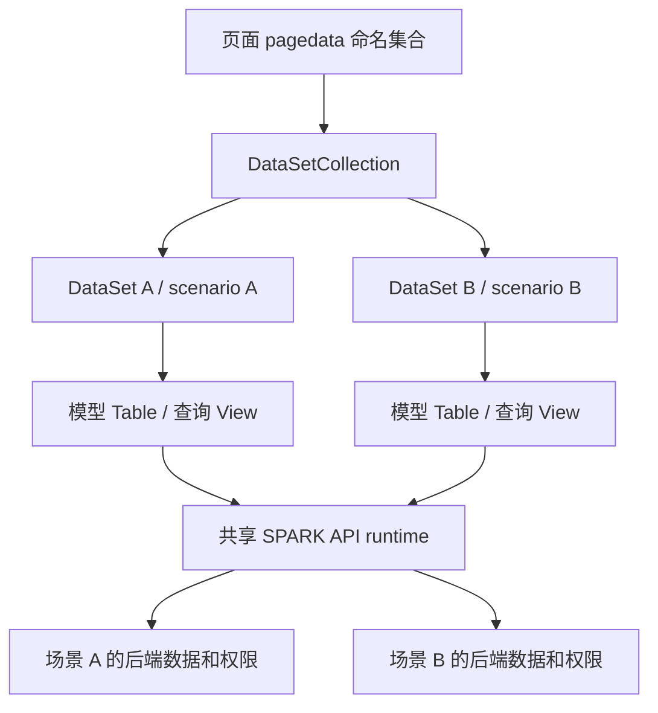

状态：draft

# 页面与运行时多数据空间整合

## 任务目标

保持本仓主框架，以同一个运行时支撑一个页面的多个数据空间；每个空间中的模型可来自多种数据源，使用原 SPARK 查询、权限与保存语义，完成后端表＋页面 JSON 的设计、运行、编辑、保存闭环。

本版提交的是**前端合同修订与全任务分解**，不是开工申请。寻址和单个 DataSet 的语义已经确认；页面集合的公共面和 JSON 容纳层待人工审核。后续各阶段仍需完整研读其影响文件、补齐精确改动/验证计划并获得实施批准。不得把本版称为已完成的完整实施计划。

取代 `plan-dataset-data-space-integration.md` 的单空间实施前提；保留该文历史记录及 `research-dataset-handoff-review.md` 的 F1—F8 发现。工作树已有成果不回退、不覆盖。

## 已确认约束

1. 一个 DataSet 对应一个场景；DataTable 对应模型，不限于物理表模型；DataView 对应 GetData 查询定义并承接 DataSource 消费面。原 SPARK 结果上下文只在内部持有。数据空间可组织数据库表、数据库视图、字典、接口、JSON、逻辑视图等来源，实际可用分支以当前后端为准，不能以本仓适配器的现有限制收窄目标。
2. 同一宿主 runtime 支持多个场景；每次调用显式带场景身份。不新增全局 currentScenarioId，不从菜单/第一个数据空间推断。
3. 页面按 `#dataSetName@tableName@viewId` 定位；二段键仅在已明确绑定一个 DataSet 的局部上下文中使用。
4. dataSetName 和 tableName 是页面内稳定名称；后端模型由 ID＋查询用 Name 显式绑定。模型改名不自动改变页面键。
5. 数据层的场景/模型运行身份只读。绑定变化时，先明确保存/放弃未保存修改，再重建整页运行数据，旧请求及权限失效。应用、租户在请求时由宿主与请求层处理，不进入数据层身份或配置。
6. 查询有脏数据时拒绝替换；普通失败保留上次成功数据、标 stale、暂停编辑，成功查询后恢复。
7. 同场景跨模型一次 SPARK save；同模型多视图同批保存拒绝；要求事务保证显式报不支持。跨场景一次 save 按原实现拒绝，不偷偷拆成多次并返回一个“成功”。前端按原模型身份提交修改；后端负责按模型的 addApi / updateApi / deleteApi 定义处理写入，不由前端根据查询来源类型判定或改写保存路径。
8. 表＋JSON 是配置持久化方案：正式场景、模型、字段定义由后端表负责；JSON 保存页面绑定、视图和未匹配的设计配置。它不规定业务数据只能来自数据库表或 JSON。绑定 DataTable 的 columns 是模型输出的设计显示快照，运行按后端正式定义重建并校验差异；不能要求所有来源都存在物理表字段目录。
9. 必要原查询/保存/权限实现收进本仓现有 API 包，替换对应旧路径并验证一致；不导入参考仓整套宿主。
10. 不改 Java；迁移先生成预览、人工审核、逐页切换；真实后端文件/业务数据写入须另有具体范围批准；不 commit、push 或建分支。

## 当前事实与必须补齐的边界

| 事实 | 对方案的影响 |
|---|---|
| SPARK 资源身份为 scenarioId＋metaName，API 内部缓存键还包含执行 scope | 场景/模型身份来自数据层；应用/租户及相应缓存隔离由请求/API 层管理，不转成 DataSet/Table/View 字段 |
| 参考正式定义读取区分 designScenarioId 与业务 dataSpaceId | 查询设计表的授权场景不能被当成业务场景；旧页面三字段必须经迁移核对，不机械改名 |
| 本仓 PageDataSetFile、PAGE_DATASET、脚本、装载器均为单 DataSet | 不能只把 PageDataSpaceBinding 改成数组；读写、脚本、组件、设计器须共同改合同 |
| `#scope` 目前被解析但不参与选集 | 必须修改所有 key/member/capability/diagnostic 入口，不能仅改 parser |
| destroy 后迟到查询仍回填 | 运行集合释放须带请求代次/上下文失效，不仅调用现有 destroy |
| 页面 hook 当前借用 PageNode 数据而不销毁 | 设计集合与运行集合的所有权须区分，不能破坏编辑/撤销历史 |
| 当前 renderer.crudTool 指向装配后的运行 DataSet | 设计工具必须继续定位页面文件内明确选中的 DataSet，不能修改只读运行身份 |
| 当前 design.read 拒绝非数据库来源，适配器混同多种来源类型 | 正式模型读取必须覆盖多来源；不能只增加页面集合后宣称数据空间整合完成 |

源码和复现证据见 `research-page-multi-data-space.md`。参考应用存在跨场景 save 被 mock 接受的用法，本方案按 API 的真实拒绝契约验收，不照抄该错误用法。

## 数据层与请求层的职责（用户已确认）

应用、租户是请求时的上下文，由现有宿主和请求层提供、校验；不放进 DataSet、DataTable、DataView 的配置、身份、查询条件或页面 JSON，也不要求组件逐次传入。数据层保持「场景＋模型＋视图查询定义」的合同。

原 SPARK API 的私有请求 scope、认证信息和缓存隔离继续归请求/API 层内部处理；数据层不读取、比较或管理应用/租户。应用、租户或登录切换导致的请求失效由宿主与请求层负责，数据对象仅遵循通用的结果登记、失效和销毁规则，不判断失效原因。页面寻址中的 `#dataSetName` 只是页面内数据集名称，与请求 scope 无关。

## 多来源模型与操作能力（用户纠正后补充）

`DataSet` 对应组织多个模型的数据空间，不对应某一张物理表，也不按数据源种类划分。`DataTable` 是本仓承接模型的 class，不代表物理表；`DataView` 是该模型的一次查询定义和结果消费对象，不代表数据库视图。模型 Name、来源类型与页面内 tableName 必须分别表达；物理来源名只在模型确有物理来源时使用，不能成为所有模型的必填身份。保留模型的正式来源类型，不把接口、JSON、文件统一标成 third-party-api，也不把“数据库视图”与“视图”合并。

当前后端 `BasicFunServiceImpl.GetData` 的实际分派：

| 正式来源 Type | 已查到的 GetData 路径 | 前端合同要求 |
|---|---|---|
| 数据库表 | GetTableData / GetSelfRefData | 模型输出与物理字段区分；有真实权限及稳定主键才允许对应编辑操作 |
| 数据库视图 | GetTableData / GetSelfRefData | 与逻辑视图保留不同类型；编辑按原 SPARK 权限，写入目标由后端处理 |
| 字典 | DictService.GetDictData | 保留字典查询语义；后端 allowAdd=false；不自行把原公共字典能力改成另一套前端权限 |
| 接口 | DataInterfaceService.GetApiData | 输入参数、调用方式与结果形状须保真；不能把任意对象/二进制结果伪装成可编辑行 |
| JSON | JsonDataService.GetJsonData | 区分业务 JSON 来源和页面 pagedata 配置；查询结果不因来源为 JSON 就落进页面配置文件 |
| 视图 | ViewDataService.getViewData | 保留逻辑视图的正式定义与输出；不是数据库视图的别名 |
| 文件 | 实体注释/本仓枚举存在，但当前 GetData switch 无对应分支 | 继续核查参考文件能力及实际入口；不改 Java、不伪装接口、不声称 GetData 已支持；未匹配的设计配置可保留在 JSON 并显式标出运行能力缺口 |

同一 DataSet 可以同时包含数据库表模型、接口模型、JSON 模型和逻辑视图模型，仍由场景＋模型 Name 定位，不按来源类型拆成多个 DataSet。页面有多个空间与空间内有多个来源是两个独立维度。前端统一面向模型输出与 DataView 消费；GetData 的来源分派由后端完成。

用户已明确写入目标属于后端职责：后端直接按模型中的 `addApi / updateApi / deleteApi` 定义处理。前端不解析这些定义、不选择储存表、不重映射目标模型或字段、不新增公开 crudTargets，也不因查询来源不是数据库表而拒绝保存。DataView 集中入口继续消费原 SPARK 权限，按原场景和模型身份提交修改，并处理后端回执或错误。源码中局部 CRUD 路径的类型约束只作为后端实现证据，不提升为前端统一限制；本方案不增加 Java 修改或后端路由实施任务。

字段和行身份也不能套物理表前提：非数据库来源使用正式模型输出字段和已验证的行键；缺稳定键的查询结果不能伪造业务主键。非表格接口结果如何在既有消费面保真呈现，仍是完整方案需补齐的合同项。不得用未经核对的物理目录来阻止所有非数据库模型装载；后端写入目标不属于前端待设计合同。

## 前端合同候选：命名集合，不改变三类职责

建议新增一个有状态的 `DataSetCollection`，负责命名登记、所有权、整个集合生命周期和集合 JSON。它**不继承 DataSet、不实现单场景 DataSetContract、不提供跨场景 saveChanges**。

建议归属 `packages/spark-data/src/core/data-set/collection.ts`；类型与 class 在同一领域文件，不另建一排 interface/helper/registry。包公共面只增加集合 class 和确有跨文件消费者的集合元数据类型，仍显式 export。

| 对象/入口 | 拟定职责 |
|---|---|
| DataSetCollection | 以 dataSetName 持有 DataSet；拒绝重名、键与名称不一致、未知名称；管理全页替换/释放，提供 fromJson/toJson/getDataSet |
| DataSet | 保持 tables、关系、视图级联和同场景保存职责；只读运行 scenarioId，不接收多个 scenarioId |
| DataTable | 承接任意受支持来源的模型；保持稳定 tableName、内部只读 modelBinding 和正式来源信息；多 DataView 查询同一模型 |
| DataView | 拥有查询输入、结果、编辑状态；通过所属 Table/Set 提供模型/场景身份；不复制可覆盖的场景参数 |
| PAGE_DATASET | 候选继续复用现有 capability key，但页面载荷统一改为 DataSetCollection；不增设全局注册表，不并存两份页面真源 |
| 页面脚本 | 候选公开 `$dataSets.getDataSet(name)`；删除页面级“默认空间”的假设。通过已选 DataSet 调原 getView/saveChanges |
| 组件/动作 | 页面完整键必须选集成功后再取 Table/View；局部二段键只消费明确传入/所属的 DataSet |
| 设计器/AI 工具 | 明确选 dataSetName 后使用原 DataSetCrudTool；编辑命令不得自动操作集合第一项 |

页面范围的集合只用于持有与寻址；应用/租户由请求层提供，权限由后端决定并通过原 SPARK API 结果消费。多个页面可拥有各自集合，不把同名 dataSetName 注册到全局。

### 寻址不变量

- `#采购@Orders@list` 与 `#销售@Orders@list` 必须得到不同的目标视图，即使两个空间的模型 Name、表名、行主键相同。
- 未登记的数据集、非法完整键、明确键指向不存在的表/视图必须显式报告；不回退到父数据源、不搜索其他数据集、不选第一个同名表。
- `Orders@list` 只有在调用方已经明确持有目标 DataSet 时有效；页面根只有集合时即使只有一个数据集也不隐式选择。
- getDataViewIdentity 必须包含页面内 dataSetName；不能继续把不同数据集都压成 Orders.list，也不向该身份加入应用/租户。
- `#` 本次明确为当前页面集合中的数据集名，不承诺跨页面全局查找。历史跨页字符串进入迁移预览，由人工判定真实意图。
- 权限消费必须使用解析所得 DataView 的权限入口，不能取父容器另一空间的权限来判断当前行。

### JSON 容纳层候选

仍使用现有四文件 `rule.json / pagedata.json / script.js / style.css`。`pagedata.json` 的根保存命名集合，集合内每项保留现有 DataSetMetadata 的结构。

以下只为合成说明，不是实际场景或准备写入的页面：

```json
{
  "dataSets": {
    "采购": {
      "dataSetName": "采购",
      "scenarioId": "SCENE-A",
      "tables": {
        "Orders": {
          "tableName": "Orders",
          "modelBinding": { "modelId": "MODEL-A", "modelName": "orders" },
          "columns": [{ "name": "id", "type": "string", "isPrimaryKey": true }],
          "views": {
            "default": { "autoCurrentFirst": false, "autoSelectFirst": false },
            "list": { "page": 1, "pageSize": 20 }
          }
        }
      }
    },
    "筛选": {
      "dataSetName": "筛选",
      "tables": {
        "Conditions": {
          "tableName": "Conditions",
          "resourceType": "static-data",
          "columns": [{ "name": "keyword", "type": "string" }],
          "views": { "default": { "rows": [{ "keyword": "" }] } }
        }
      }
    }
  }
}
```

结构规则：集合键与 dataSetName 必须一致；无 scenarioId 的本地筛选/静态 DataSet 不走 SPARK；有 modelBinding 却没有有效 scenarioId 必须拒绝；`static-data + modelBinding` 为互斥配置。所有绑定表的运行 rows、权限、原上下文、请求状态和编辑 patch 均不落盘；本地静态 rows 可保留，按框架识别的 children 子行清理权限协议字段，不递归误删任意业务 JSON。

后端模型改名、字段删除或类型/主键变化，生成冲突清单；不在运行加载时悄悄覆盖页面设计快照并落盘。未匹配配置须列明可持久化字段和归属，不能用任意 JSON 修改授权或覆盖正式定义。

旧单 DataSet JSON 通过离线预览转换为集合形态，人工审核后逐页切换；新运行解析器不保留旧形态 fallback。相应脚本和规则一起迁移，不能只套一层 dataSets 后宣称完成。

## 运行装载与失效



1. 读取页面集合配置，验证名称、显式场景与模型绑定；页面导航身份不充当所有空间的运行身份。
2. 按各 DataSet 的场景读取正式定义并检查模型归属；模型 ID 定位记录、正式 Name 用于查询；columns 只作差异比较的设计快照。
3. 组装全部 DataSet/Table/View，保留页面局部名称与命名视图；全部准备就绪后再替换当前运行集合。装载失败不得发布半个集合，也不得让临时成功实例泄漏。
4. 设计集合由 PageDataSetFile 持有；运行集合由页面持有。页面卸载/绑定重建销毁运行集合，设计实例继续保留其编辑历史。
5. 重建前遍历所有 DataView 检查 editing patch、dirty、pending create/delete。存在修改先拒绝替换，由调用方明确保存或放弃；不能只检查当前空间或当前视图。
6. 释放时失效整个页面代次及所有旧视图请求代次。迟到成功或失败不得恢复旧行、权限、错误态或触发旧页面初始化。新集合加载成功前的临时对象也必须释放。
7. 宿主与请求层处理应用/租户/登录切换，按原 SPARK API 语义阻止旧请求上下文继续使用，并负责通知或释放其拥有的页面运行实例；DataSet/Table/View 不订阅、读取或比较这些身份。普通网络错误和外部失效仍分别走各自通用生命周期规则。

独立查询失败仍按 DataView 的 stale 规则，不把一个空间的网络失败改写成另一空间的查询结果。并发相同查询是否复用原结果对象遵循原 SPARK 实现；前端各视图编辑状态独立，不通过 JSON clone 伪造上下文。

F 的请求适配需保留原 SPARK API 对普通 token 轮换与重新登录的区分，由宿主和请求/API 层内部完成传输及缓存隔离。不能为此给数据 class 增加应用、租户、会话字段或 scope 注入入口。原实现的静态依赖定位和传输差异已补入 `research-page-multi-data-space.md`；它是待细化的源码依据，不等于移植范围已全量研读。

## 保存与关系边界

- 继续由明确选中的 DataSet.saveChanges 编排同场景请求；批量发出前校验同模型多视图和数据输入有效性。跨场景选择整体拒绝且零写入；应用/租户等请求上下文校验归请求层。
- SPARK save 使用原模型身份与修改数据。前端不读取 addApi / updateApi / deleteApi 来分流，不按查询来源类型增加保存禁用规则；由后端处理目标与字段映射，前端按原 SPARK 语义消费权限和回执。
- 页面若业务上要依次保存两个空间，调用方须显式编排并分别显示结果；不增加隐含“全页事务”。失败、缺回执保留待核对状态，不自动重发。
- 后端模型关系仍按各空间正式定义。多空间持有本身不等于后端支持跨空间 join。
- 现有 DataSet 内 viewCascades/聚合保持所属空间；跨空间查询参数传递须显式定位来源 DataView，并遵守脏保护和双方权限。是否新增页面级级联配置以及对应图生命周期，属于完整方案尚需补齐的合同项，不能把另一空间的表偷偷塞进同一个 DataSet。

## 影响范围与后续逐项闭环

以下为当前源码定位后的清单。A1—A3 是已有发现的局部修复候选；A4 涉及多来源合同，B—G 涉及新的集合合同，必须先完成合同审核及各阶段完整研读。文件清单是研读/计划范围，不授权一次性修改全部文件。

| 闭环 | 精确到当前可定位的文件 | 修改目标 / 最小验证 |
|---|---|---|
| A1 身份入口不变量（F5） | `packages/spark-data/src/metadata.ts`、`dataset.ts`、`tests/identity/scenario-model-identity.test.ts` | 构造/fromJson/replaceFromJson 同一校验；非法输入不破坏原实例；运行身份封存方案另属 B |
| A2 绑定表不落盘行（F3） | `packages/spark-data/src/data-view.ts`、`metadata.ts`、`tests/serialization/view-config-roundtrip.test.ts` | modelBinding-only 也判为远端；static+binding 拒绝；本地静态行保真 |
| A3 子行权限清理（F4） | `packages/spark-data/src/data-view.ts`、`tests/serialization/view-config-roundtrip.test.ts` | 只沿框架 children 子行遍历；三层子行无令牌、业务 JSON 不损坏、原对象不被序列化过程改写 |
| A4 多来源模型读取与类型保真（F8） | `packages/spark-lowcode-api/src/platform/data-space/data-space.ts`、`packages/spark-lowcode-api/src/platform/data-space/data-space-resource-type-wire.ts`、`packages/spark-lowcode-api/src/platform/data-space/design/data-space-design-api.ts`、`src/lowcode/data-space/lowcode-frontend-model-adapter.ts`、`packages/spark-lowcode-api/src/platform/data-space/design/data-space-design-api.test.ts`、`tests/auth-nav/data-space/lowcode-frontend-model-adapter.test.ts` | 取消所有模型都必须解析物理资源目录的前提；区分数据库视图/逻辑视图，保留接口/JSON/文件各自语义。精确类型与字段合同先补齐并审核，不直接将枚举加值视为完成 |
| B1 命名集合与寻址 | 新 `packages/spark-data/src/core/data-set/collection.ts`；现有 `core/data-view-key.ts`、`index.ts`、`spark-data.ts`、`tests/data-view-key.test.ts`、`tests/data-view-resolver.test.ts`；新 `tests/identity/data-set-collection.test.ts` | 同表名多空间正确选集；未知空间不 fallback；完整身份不碰撞；集合往返、名称冲突、局部二段键 |
| B2 运行只读身份与失效（F2/F7） | `packages/spark-data/src/dataset.ts`、`data-table.ts`、`data-view.ts`、`types.ts`；现有身份测试；新 `tests/identity/runtime-lifecycle.test.ts` | 同一已封存实例不能换场景/模型；设计编辑仍可创建替代实例；迟到响应不得回填。封存入口的精确成员及结构修改限制须先审核 |
| C 页面文件集合 | `packages/spark-project-model/src/page/content/dataset-file.ts`、`page-file.ts`、`compile-files.ts`、`canonicalize-page-data.ts`、`config-page.ts`、`project/project-model.ts`、`index.ts` | PageDataSetFile 持有集合；editDataSet 明确名称；全文件 undo/redo；序列化每一份配置；移除旧单实例隐式解析 |
| D1 页面装载与所有权 | `packages/spark-component/src/page/renderer/SparkPageRenderer.vue`、`usePageDataSet.ts`；`packages/spark-app/src/start.ts`、`router/dynamic.ts`；`src/main.ts`；`src/lowcode/data-space/lowcode-data-space-runtime.ts`、`lowcode-data-space-assembler.ts`、`lowcode-model-relation-adapter.ts` | 宿主读取页面集合配置、按场景装配；成功后整体发布；过期/失败临时对象释放；保留设计集合。回调精确参数随 C 合同一次改齐 |
| D2 组件/脚本/动作 | `packages/spark-component/src/core/capability-keys.ts`、`page/context/buildPageContext.ts`、`page/context/types.ts`、`runtime/script-context-types.ts`、`page/actions/action-types.ts`、`action-executor.ts`、`action-data.ts`、`executor-helpers.ts`、`components/shared-types.ts`、`components/containers/data-views/view-data-source.ts`、`RendererTree/RendererTree.vue`、`components/containers/layout/RendererButton.vue`、`components/fields/options/useFieldOptions.ts`、`components/display/useDisplayDataSource.ts`；`packages/spark-data/src/script-types.ts` | 所有消费入口选择同一 DataView；未知空间明确失败；options/display 权限取目标视图；动作先选目标 DataSet；脚本不再猜默认空间 |
| E 设计器与 AI 编辑 | `src/views/app/dev-system/DevDataSetDesigner.vue`、`src/services/page-design/page-design-agent-workflow-binding.ts`、`src/services/project-model-artifacts/rule-editor.ts`；C 的 ProjectModel 入口 | 显式选择数据集；表/视图工具仍复用；生成规则与脚本带完整键；设计对象不指向运行集合 |
| F 原 SPARK API 接入 | `packages/spark-lowcode-api/src/platform/data-space/runtime/data-space-runtime-api.ts`、`data-space-runtime-mutation.ts`；原 `resource/query-context.ts`、`public/query-permission.ts`、`space/data-space-model-api.ts`、`protocol` 依赖链 | 必须继续列出原实现→目标文件一一映射；应用/租户和私有 scope 在宿主与请求/API 层接线，数据 class 不新增相应字段或入口。当前不得直接开工或仅重写相近规则；多场景并发、缓存、基线与拒绝路径列入验收 |
| G 表＋JSON 保存与逐页迁移 | `src/lowcode/lowcode-runtime.ts` 的页面保存网关；C 的四文件模型；原计划 P6/P7 的正式定义写回与迁移预览 | 完整目标保留。还需列出设计写回执行路径、后端目标目录/页面清单、覆盖前快照和回读；不改 Java，不把 prepareMutation 当已保存 |

目录缩写说明：表内以 `packages/spark-data/src/` 开头的同格后续路径相对该目录；D2 的 `RendererTree/RendererTree.vue` 相对 `packages/spark-component/src/components/containers/data-views/`。新测试放既有 identity/serialization 子目录，不向超限测试根目录平铺。真正改动前再核对当前文件及目录数量，发现范围扩张修订本计划。

`src/views/app/RFormCompareDemo.vue`、`CustomRTableDemo.vue` 和现有测试 helpers 直接提供 PAGE_DATASET，也在影响反查清单中；切换 capability 载荷时必须明确迁移这些提供方，不能用临时类型断言绕过。类模型生成物与公共导出/消费者测试按最终公共面同步；不顺手改 getCurrentUser 独立任务。

## 验证计划

每个批准的最小闭环：保存本轮前快照与工作树差异 → `pnpm run typecheck` 基线必须通过 → 增加直接复现的最小用例并观察预期失败 → 单点实现后立即运行该用例 → typecheck / lint / 相应包检查。未通过不得扩散改动。

已存在可复用的命令：

```text
pnpm run typecheck
pnpm run lint
pnpm --filter @spark-appworks/spark-data run test:run -- --reporter=dot
pnpm exec vitest run tests/page/page-data-serialization-roundtrip.test.ts tests/page/spark-page-renderer-binding.test.ts tests/auth-nav/lowcode-data-space-runtime.test.ts tests/data-view/use-container-data-source.test.ts --reporter=dot
pnpm run verify:ai-codegen
pnpm run verify:class-model
```

新增测试命令随对应阶段完整计划固定。公共面变化后需重新生成类模型，并逐份审查相关差异；仅 verify:class-model 绿色不能证明生成面新鲜。全任务结束再跑根/包级测试、完整规则、构建及浏览器验收；本轮不虚报这些已执行。

必须包含的行为矩阵：

| 场景 | 预期 |
|---|---|
| 同 runtime 同时查询 A/B 的同名模型，同名表、同主键，故意乱序返回 | 各视图数据/权限/编辑基线不串用；每次请求带自己场景 |
| 同一空间混合数据库表、数据库视图、字典、接口、JSON、逻辑视图 | 前端按同一空间中的各模型身份查询，后端按真实来源分派；非数据库模型不被统一物理目录预检查挡住，来源类型往返不失真 |
| 模型查询来源与后端写入目标不同 | 前端仍按原场景和模型身份提交，不读取操作目标定义、不重映射字段、不按来源类型拒绝；消费后端权限与回执 |
| 非表格接口结果、无稳定行键、声明文件来源但入口缺失 | 显式暴露真实形状/能力缺口，不伪造行和主键，不转换来源来绕过 |
| 查询 `#B@Orders@list`，仅 A 存在 | 缺 B 诊断；不返回 A，不触发 A 请求 |
| 视图结果来自 B，组件父容器来自 A | 使用 B 权限；不按 A 权限隐藏/放开 B 字段 |
| 一页多个 DataSet 中任意一个有脏修改后重建 | 整页替换前拒绝，原编辑保留；明确保存/放弃后才替换 |
| 集合已销毁、请求随后成功或失败；装载被下一代取代 | 旧行/权限/错误不复活，临时集合释放 |
| 单空间多个模型保存 | 一次 SPARK save；同模型多视图冲突整批拒绝 |
| A/B 混入同一保存请求 | I/O 前拒绝，零写入，不偷偷分组 |
| JSON → 编辑某数据集 → undo/redo → 保存 → reload | 其他数据集不被覆盖；稳定名称及 false 配置保留；远端结果/权限不落盘 |
| 旧页面一资源映射多个模型，脚本动态拼键 | 预览列冲突，未人工指定前不可切换；无模型猜测 |
| 应用/租户/会话变化（请求层验收） | 宿主与请求/API 层使用当前请求身份、拒绝旧上下文并隔离缓存；数据 class 不读取或比较这些身份 |
| 数据对象与页面 JSON 的边界 | DataSet/Table/View 及其配置只表达场景/模型/查询，不新增应用、租户、认证或请求 scope 字段；请求层在发送时提供相应上下文 |

真实后端验收仍需明确测试空间和写入对象；内存 mock 通过不等于后端持久化或权限矩阵通过。

## 兼容性与迁移

新合同替换页面单 DataSet 根结构、单绑定装载回调、默认空间脚本入口。DataSet/Table/View 的领域职责与框架渲染、能力系统、ProjectWorkspace 四文件架构保留。

迁移报告必须按页列出：原四文件与绑定指纹、每份目标 dataSetName/scenarioId、旧表/视图→新绑定、完整键改写、脚本静态和动态引用、columns 与正式定义差异、未匹配配置及不能自动转换项。审核报告后源文件或模型发生变化则报告失效，重新生成。不得把“新 JSON 能解析”当成人工审核已通过。

## 风险项与恢复

- 影响不仅在 UI：PageDataSetFile、AI 编辑工具、动作保存和序列化都需要显式选集。遗漏其中一个入口会重新引入默认空间。
- 多空间重复模型名很常见；数据层按场景与模型区分，不能只按模型名称去重。应用/租户相关缓存隔离留在请求/API 层内部。
- 本仓当前大量未提交成果；禁止 `git checkout --`、整树 reset/stash 覆盖他人改动。只撤销本轮精确补丁或恢复已核验本轮前快照；发生并行修改停止并保留双方内容。
- 后端覆盖文件没有已证实的跨文件事务或备份；具体写入前生成可审核快照和恢复步骤，成功必须回读比对。
- 运行身份封存不能误伤设计器 undo/redo；设计集合与运行集合的测试必须同时覆盖。

## 当前审核点与断点

待人工审核的具体合同：

1. 用一个 DataSetCollection 持有页面的命名 DataSet，复用现有 capability 机制；不继承单场景 DataSet。
2. pagedata 根为 dataSets 集合，每项保留原 DataSetMetadata；四文件数量不变。
3. 页面脚本与设计编辑均显式选 dataSetName；不保留“默认/第一个空间”的隐式入口。

以上通过仅锁定前端集合合同。用户补充的多来源目标已纳入本稿，非表格结果合同尚需补齐；addApi / updateApi / deleteApi 的写入目标处理已明确归后端，不列为前端设计或实施事项。完整实施计划仍须补齐：A4 多来源模型与输出合同、B2 封存 API、F 的原实现移植文件图、跨空间参数依赖合同、G 的正式定义保存执行方和后端写入/回读步骤，然后再提交实施审核。当前生产源码和测试源码未改，未部署、未写后端。
