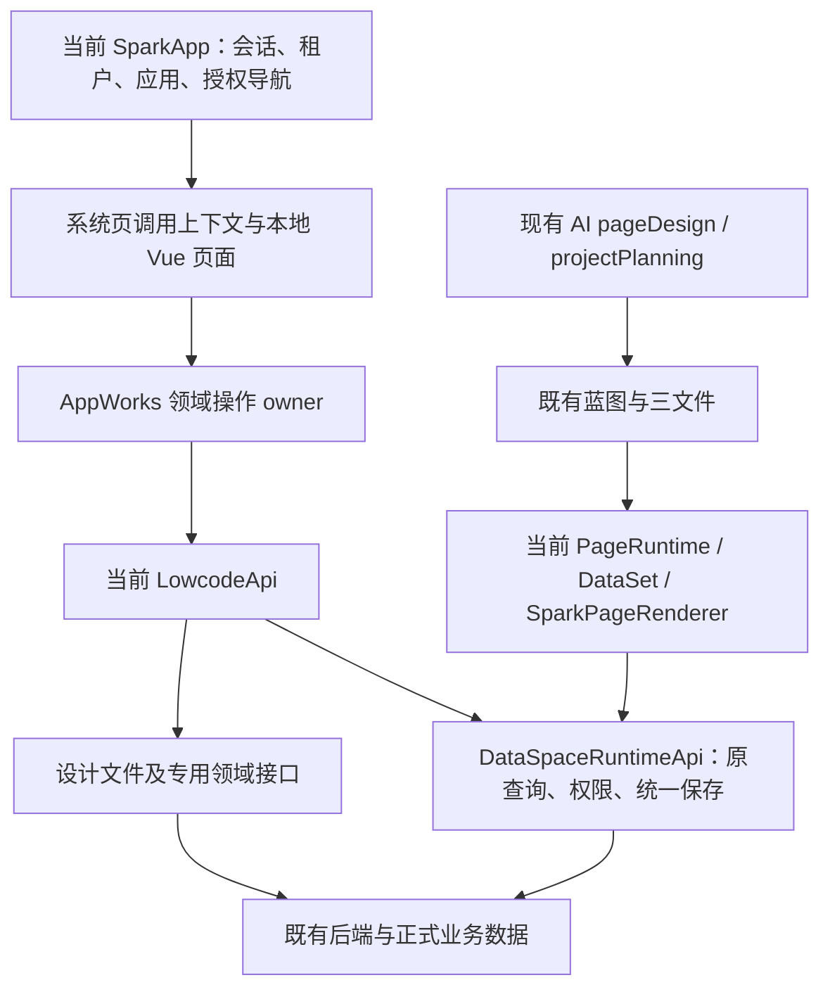

状态：superseded

替代方案：[AppWorks 控制面完整集成计划](./plan-appworks-control-plane-integration.md)。2026-10-07 目标代码已从 `9c225cad78ddca2ac9e80fdb00782d90f3391590` 更新至 `0b6c85d9979205cf733da8b0ba663c63e89ec395`；运行实例、场景注入、测试路径和目录门禁等前提发生变化，本文件仅保留历史推演与取证，不再作为开工依据。

# sparkproject AppWorks 完整集成方案

## 任务目标

以 `D:/SPARK_AppWorks` 的宿主、组件、DataSet/页面运行时和 API 为底座，补齐 `E:/r/sparkproject` 固定提交中 AppWorks 的全部有效人工操作能力，保留存量蓝图、页面地址与参数，并逐模块取得工程和测试租户验收证据。

本文件是完整范围的总体研究方案，附首个可独立执行闭环。尚未全读的领域实现不能凭此文件直接批量编码；实施到该领域前，补齐操作清单、精确文件范围与验证记录，再按根 AGENTS.md 审核。此边界不缩减最终范围。

## 已确认的八项决策

| 项目 | 用户决定 |
| --- | --- |
| 底座与界面 | 当前 SPARK_AppWorks；功能和操作完整等价，界面使用当前组件与交互 |
| 参考基线 | `842dec4f11b333df904b9a4e26b6566b0802bab8`；未提交差异单列 |
| 后端边界 | 仅前端集成，复用既有接口和存储，不修改后端或数据库结构 |
| 存量资产 | 保留蓝图节点、页面地址及参数语义 |
| 组件与引擎 | 优先复用本仓；确有缺口时引入必要引擎，统一封装、按需加载 |
| AI | 保留现有 AI；本轮不增加 AI 工具、治理写入入口或 workflow binding |
| 验收 | 工程检查 + 测试租户逐模块浏览器操作、权限、保存回读 |
| 顺序 | 依赖与风险优先；一个最小闭环通过后再进入下一闭环 |

当前研读基线：HEAD `9c225cad78ddca2ac9e80fdb00782d90f3391590`，分支 `feat/agent-workflow-node-contract`。本轮只修改研究和计划文档，不建分支、安装依赖、修改业务代码或提交数据。

详细证据见 [研读记录](./research-sparkproject-appworks-integration.md) 和 [可行性与回归验证账本](./validation-sparkproject-appworks-integration.md)。2026-10-07 已按用户要求继续真实登录、只读探测、根/包测试及生产打包验证，并据结果修订下文。产品事实以源码为准。

## 架构结论

采用“沿用当前运行时、按领域重建控制面”的路线。迁入的是操作合同、业务约束和必要算法；页面改用当前组件，数据操作接入当前 LowcodeApi。参考仓的第二套根 runtime、认证、导航、HTTP 和权限模型不整体迁入。

| 路线 | 结果与代价 | 结论 |
| --- | --- | --- |
| 原包直接挂载 | 参考 17 个直接 workspace 依赖、23 个依赖闭包，形成双宿主、双查询上下文、两套 UI；难以满足当前底座要求 | 不采用 |
| 为原页面模拟整个参考 runtime | 短期减少改页，但把整套内部合同变成长驻兼容层，保存归属与权限映射风险集中 | 不采用 |
| 当前底座 + 领域操作迁入 | 需要逐项改接上下文、保存、表单和图编辑；能够保留现有页面与 AI，同时统一错误和权限行为 | 采用 |



### 当前已有能力如何保留

- **蓝图**：继续由现有 `LowcodeProjectBlueprintApi` 管理 `Base_NavigationInfo`，`DevSystem` 保持编辑入口。只补参考操作缺口，不重新创建一份蓝图数据源。
- **DataSet 和页面**：正式模型仍由 `dataSpace.design` 读取，场景 `pagedata.json` 只定义视图及级联。参考正式模型/字段/关系设计作为独立治理能力接入，不能覆盖 `DevDataSetDesigner` 的视图语义。
- **查询与保存**：继续由当前 `DataSpaceRuntimeApi` 持有真实查询基线、权限及同模型保存队列。UI 使用投影，保存持有原 context；不复制一个伪 context，不经 JSON 序列化重建权限。
- **AI**：保留目前 pageDesign/projectPlanning 与 Agent workflow。业务流程、数据工作流另有各自领域模型和存储，不与 `agent.workflow.design` 合并。
- **登录、应用切换、租户**：只使用当前 LowcodeApi 的 session/application/request scope。参考中的 designTarget 作为被管理业务对象单独校验，不拿它替换控制面执行身份。

## 功能覆盖清单

统计口径：参考源共 297 个 TS/TSX/Vue 文件，其中 116 个 Vue（含面板和辅助组件），不能直接换算成 116 个功能。以下覆盖有效领域及配套能力；最终逐按钮账本要包含查询、跳转、增删改、导入导出、权限、取消与失败处理。表中“目标”是拟实施落点，不表示当前已存在或已验收。

源路径以下均相对固定提交的 `apps/appworks/src`。

| 编号 | 完整范围与关键操作 | 参考入口/owner | 当前承接与关键验收 |
| --- | --- | --- | --- |
| A1 | 应用目录、维护、文档、应用关联数据库 | `data/api/ApplicationManager/ApplicationManager.ts`，`ui/features/application/application-manager` | 扩展当前 AppList 及独立应用配置页；应用 A/B 数据隔离、关联与文档保存回读 |
| A2 | 功能蓝图、属性、设计入口、发布引用、维度来源与提交配置 | `data/api/ApplicationFunMan`，`ui/features/application/application-function-management` | 复用现有蓝图 owner/DevSystem；补节点操作、来源合同；原节点 ID、版本指针、地址不变 |
| A3 | 导航宿主维护、目标应用与宿主选择 | `data/api/ApplicationManager/DataMenu.ts`，`ui/app/navigation-host.ts` | 统一授权导航；多宿主须明确选择，不能按第一个或名称猜测 |
| A4 | 企业登记、审核、配置、应用授权、密码操作 | `data/api/ApplicationManager/EnterpriseRegistManager.ts` | 对照现有租户管理逐操作补齐；平台/租户边界及敏感操作权限按后端证据验收 |
| A5 | 应用授权申请、我的申请、审批 | `data/api/ApplicationManager/EnterpriseAppAuthApplication.ts`，对应 feature 的三个 page | 申请→查询→审批→状态回读；申请与实际授权变更分别验证 |
| D1 | 正式数据空间目录、新增、编辑、删除 | `data/api/data-set/list.ts` | 独立正式数据空间目录；禁止用场景 JSON 编辑器充当目录治理 |
| D2 | 正式模型、字段、关系设计、布局和预览 | `data/api/data-set/design`，`ui/features/data-platform/data-set-management/design` | 扩展现有设计域写入；模型/字段/关系与图布局分开保存并分别确认 |
| D3 | 数据空间授权、功能节点授权 | `data/api/data-set/auth.ts`，`data-set-auth-page.vue` | 复用权限域与查询权限；删除/授权回读，拒绝场景不误报成功 |
| D4 | 服务器、数据库目录、连接测试、登记及维护 | `data/api/DataBaseManage/ServiceManager.ts`、`DataBaseManage.ts` | 补 DBMS 当前显式 blocked 的接线；逐项核对后端，不能用按钮存在证明实现 |
| D5 | 表/视图目录、创建、设计、登记、元数据同步、关系 | `data/api/DataBaseManage/AddTable.ts`、`TableAndView.ts`、`TableAndViewRegister.ts`、`TableDesign.ts`、`ViewDesign.ts` | 区分物理变更、登记记录和同步；实际字段/目录回读；本轮不修改数据库结构定义代码 |
| D6 | 字典类型、字典配置及参考实际提供的数据维护 | `data/api/StructuredConfig/DataDictionary.ts` | 按类型字段约束、应用归属、分页与字段权限验证，不擅自扩成全新字典平台 |
| D7 | 编码目录、规则、父码、序列、时间片及初始化 | `data/api/StructuredConfig/DataCode.ts`、`DataCodeEdit.ts`，对应 editor | 规则保存与编码分配专用接口分别验收；无失败自动重试生成新编码 |
| D8 | 逻辑视图目录、图设计、保存、输出预览 | `data/api/StructuredConfig/LogicView.ts`、`LogicViewDesign.ts` | 元记录走模型保存；设计/预览走真实专用合同；预览分页和输出字段核对 |
| D9 | 维度定义、规则、来源绑定、账本、来源提交配置 | `data/api/DimensionDesign.ts`、`DimensionSourceBinding.ts`、`DimensionSourceCommit.ts` | 独立高风险批次；保持来源身份、投影版本、事实与提交先后关系；不能仅迁定义表 |
| D10 | 数据工作流目录、触发表、节点/边设计及保存 | `data/api/StructuredConfig/DataWorkFlow.ts`、`DataWorkFlowDesign.ts` | 与业务流程和 AI workflow 分开；已有图数据无损加载→编辑→保存→重开 |
| O1 | 部门树、岗位、人员、人员选择 | `data/api/organization/TenantOrganization.ts`、`system/PersonSelector.ts`，`ui/features/organization` | 迁入参考实际提供的查询与选择能力；树及祖先上下文、原始分页/total、选中身份一致。尚无证据的 CRUD 不冒充已有能力 |
| G1 | 角色分类、角色、角色用户、角色授权 | `data/api/SafetyProtectionManager/RoleClassManagement.ts`、`RoleAndUserManagement.ts`、`RoleAuthManagement.ts` | 补治理编辑；授权前后用受限用户复验，不能用管理员可见替代 |
| G2 | 导航权限与用户应用授权查询 | `NavigationPermissionConfig.ts`、`UserAppAuth.ts` | 菜单、按钮、数据字段与行权限分层验证；不增加前端自定授权事实 |
| G3 | 脱敏规则 | `DesensitizationRuleConfig.ts` | 配置保存、字段显示及写入约束核对；不把显示掩码当作原数据 |
| I1 | 文件管理、上传、下载/预览及删除 | `data/api/FileDataManager/FileManager.ts` | 复用当前文件基础并补二进制/目录能力；原字节、命名空间、作用域、删除回列验证 |
| I2 | JSON 数据目录、树内容设计及保存 | `data/api/SemiStructuredDataManager/JsonDataManager.ts` | 配置记录与 JSON 树内容分别读写；使用当前 JSON 组件能力，保留现有树协议 |
| I3 | Excel 导入目录、模板上传、Sheet 布局、转换规则及实际调用 | `ExcelImportConfig.ts`、`ExcelImportConfigConfigSet.ts`，`ui/features/data-platform/semi-structured/excel-import` | 目录、布局、转换规则、文件及调用结果形成闭环；界面参数与后端模板字段逐项核对 |
| I4 | 接口服务商、配置、接口列表、参数和执行 | `data/api/APIManage` | 登记记录走统一模型保存；执行走已登记接口专用 API，覆盖 JSON/FormData 及错误回执 |
| I5 | 报表目录、设计、预览、输入参数、数据源同步、模板保存及参考宿主提供的输出 | `data/api/ReportManage`、`system/ReportComp.ts`、`runtime/report.ts`、`ui/views/ReportManage` | Stimulsoft 懒加载；模板归一化回读、真实数据查询、取消/切域拒绝；运行授权与静态资产单列门禁 |
| W1 | 业务流程模型目录、节点/边、角色岗位/表单配置、模板 | `data/api/FlowManage/FlowModel.ts`、`FlowDesign.ts` | 依赖模型、组织、角色；流程结构与模板文件分别回读；保留已有流程格式 |
| W2 | 业务流程运行页、明细、参与人追加、运行操作及移动端页 | `FlowRunPage.ts`、`FlowRunDetail.ts`、`FlowAppendUser.ts`，`ui/features/workflow/flow-runtime` | 用测试实例完成参考实际操作链；权限、重复操作、状态转换及移动端交互逐项核验 |
| S1 | 缓存管理 | `data/api/SystemSupportManager/CacheManager.ts` | 对照当前 CacheManager 补差；查询与实际动作分开记证据 |
| S2 | 流程监控、数据恢复、问题管理 | `FlowMonitor.ts`、`DataRecover.ts`、`BugManage.ts` | 监控读取、恢复写入、问题状态分别回读；恢复仅对验收创建的测试记录执行 |
| P1 | 图面板、业务表选择、字段、人员、对话框权限等支撑组件 | `ui/components`、`ui/composables`、`data/api/system/BusinessTableSelector.ts` | 转成当前 UI/上下文消费者，与所属功能一起验收，不搬一套参考 UI 基础包 |

**占位和演示也要对账。** `ui/views/appworks/{field,table}`、`schema/relation`、`system/{menu,role,user}` 是参考占位页；`schema/design` 是组件图编辑演示。它们的有效地址列入路由映射，已有正式功能由对应本地治理页承接；示例保存不得计入后端保存验收。参考 AI 按钮依第 6 项决定不单独迁成新的 AI 能力，当前已有 AI 保留。

### 操作级补充：静态清单发现的易漏项

固定提交的 AST 清单位于 `notes/evidence/sparkproject-appworks-integration/reference-inventory.json`，记录 297 个文件哈希/导入及 54 个 owner 文件、59 个类、524 个非 private/# 方法入口。它是检索索引，**不是已逐按钮验收的 524 个功能**。以下动作必须进入各批次验收，不能只以目录 CRUD 代替：

| 范围 | 必须覆盖的具体操作及限制 |
| --- | --- |
| A1/A2 | 需求/详细设计文档导出复用当前能力；蓝图移动/删除、导航关系及投影；原型图片上传、版本查询/创建/删除；桌面配置读取/创建/删除 |
| A4 | 企业初始化、模块授权树及增加/移除模块授权；与申请审核及实际授权结果分别核对 |
| D2 | 正式来源绑定/同步、输入参数、布局缺失的 prepare/confirm 重建、关联设计记录级联删除、模型预览；prepare 不算实际重建 |
| D5/D7 | 表复制与元数据同步分别验收；编码示例测试、初始化数据、序列/分类设计；初始化查询的真实副作用需核对，不能仅凭 GET 判为只读 |
| D10 | 整图测试/单节点测试、节点/连接/模型/字段/关系级联维护、来源字段与输入参数；测试执行属于真实服务调用，不能以本地图可运行替代 |
| I4 | 服务商、账号、公共参数、headers、接口输入/输出字段的嵌套管理及实际调用 |
| I5 | 报表版本分页/创建/修改/删除/激活，文件上传、绑定数据空间；当前激活版本不能用最大版本号推导 |
| W2 | 启动/提交、退回发起人、按历史退回、强制退回、后续自动提交判断、步骤已读、追加/撤销参与人；每个动作独立状态回读 |
| S2 | 恢复记录查询、执行恢复及撤销恢复；仅在可逆的专用测试对象上验收 |
| O1/I1/P1 | 组织保留已证实查询/选择，不虚构 HR CRUD；文件 owner 的目录/上传/删除与共享 UI 的下载/预览分别追踪；公共组件隐含的写入及未保存保护随消费者验收 |

每项须补齐 UI 触发点→owner 方法→实际请求→目标实现→证据；尚未全读的调用链保持“待研读”，不得以本静态清单直接开工。

## 技术方案

### 1. 建立可验收的迁入账本

1. 从固定 Git 对象读取每个功能的 Vue、composable、领域 owner、直接依赖、调用方和测试；未提交源依赖变化单独记录，不混入基线。
2. 每个实际用户操作登记：来源文件/方法、入口地址、参数、管理 scenarioId、模型 metaName、目标应用、执行应用、请求合同、确认/回读、权限来源、目标文件、验证证据。
3. 标识三个状态：参考源码存在、目标实现已接通、真实验收通过；不以文件复制率或菜单数量代替完成率。
4. 对参考模块的所有入口、按钮、表格行操作、弹窗提交、隐含自动写入、图命令、下载、移动页逐项覆盖；删除或合并 UI 仍须保留有效操作。源占位、未实现动作、明确排除的新 AI 单列说明。
5. 当前既有功能先判定复用/补差，只有源码证明不存在的部分新建，避免又写一份蓝图、DataSet 或权限运行时。

### 2. 先打通系统页身份与生命周期

已证实：DynamicRouter 按去除 query/hash 的 path 去重；系统页 meta 未保存独立 nodeId；useNavigation 按路径选首个系统路由；useTabPages 非配置页按 route.path 合并标签。因此适配必须同时覆盖注册、打开、标签恢复和异步调用。

真实授权导航进一步确认：元数据管理应用有 39 个目标节点、32 个不同路径，7 组路径复用。6 组有不同 scenarioId；导航权限的 2 个节点连 scenarioId 都相同。当前仅映射 5 个路径 / 6 个节点，27 个路径 / 33 个节点缺映射；浏览器点击数据空间管理已显示明确映射错误。该集合是本测试应用的实际样本，不冒充所有应用的完整导航集合。

- 页面调用身份包含：当前 tenant/application scope、授权 nodeId、系统页路径、原参数快照及真实 scenarioId/designTarget。由操作声明应用级或场景级要求：应用级操作允许场景为空，场景级操作缺失则明确拒绝。实际文件管理节点的 scenarioId 为空，不能为了统一结构编造默认值；不同含义不复用一个 conid。
- 菜单点击从授权节点传递身份；页面内跳转走统一导航 owner。禁止以页面路径反推第一个节点、默认场景或任意应用。
- 原业务路径/query/hash 保留。URL 可由现有参数唯一解析时直接恢复；若两个授权节点的完整 URL 相同且没有可恢复的调用身份，则让用户从有权限的入口选择，不能无依据自动选择。具体标签承载合同在此批次完整阅读调用链后收束，不能悄悄新增持久化参数约定。
- 捕获作用域与调用快照；切租户、切执行应用、切 designTarget、撤权、关闭页面后拒绝旧响应与旧保存。真正的异步取消不等于已经发出的写入被回滚。
- 系统页实例按调用身份区分，未保存编辑遵守关闭/切换保护；权限和缓存不得只按组件或路径缓存。
- 配置页 PageRuntime 的既有生命周期与三文件加载继续回归，不借此整体重写路由。

### 3. 延迟装配页面与重型资源

- 将 buildComponentMap 从立即调用所有 loader 改为返回可按需实例化的组件。保留路径注册、source 校验和公开函数的现有使用方式；同一 source 的多个入口复用组件加载结果。
- 页面加载存在第二条链：`vite.config.ts` → `COMPONENT_SCAN_PATTERNS` 扫描 `src/views/**/*.vue` → `ComponentAnalyzer.determineStrategy` 按文件名/大小默认为同步 → `SparkApp.start` 导入 `virtual:spark-components`。生产构建已报告 Settings.vue 静态/动态导入冲突，登录页请求也证实 16 个注册页面模块被加载。C1 两文件修改只能修第一条链，必须追加 C1b 独立验证组件扫描，保留现有注册名及消费者后才能宣称首屏按需加载达成。
- 加载失败显式显示错误并允许明确重试；不显示成功空页，不把失败缓存成有效组件。
- 图引擎、报表脚本和 CSS 都在对应页面打开后加载。离开/关闭时释放实例及监听，切域时取消后续读取与写入。
- 静态页面登记只是“组件可解析”，不向未授权菜单授予访问权；参考风格入口仍沿现有 hidden/shellTool 规则登记。

### 4. 接入当前数据与专用接口

常规模型操作继续使用 `dataSpace.runtime.query/save`。源 owner 的 create/update/remove 按操作语义转换成当前查询基线与 changes；主键、字段别名、动作排序、空值和后端失败合同逐项对应，不依赖字符串替换或类型断言。

当前 API 组合根保持单一；在 `spark-lowcode-api` 中按领域增加缺少的专用能力，复用同一 HTTP、会话与 readRequestScope。新增成员是本方案拟定义的本地合同，不冒充已经存在的 API。UI 不接受任意 URL 或绕过身份的通用 invoke。真正共享的协议留在包内，业务 owner 只暴露必要领域动作。

| 能力 | 固定参考实现的底层相对路径 | 本仓承接方式与差异 |
| --- | --- | --- |
| 文件文本、字节、删除 | `/File/content/text`、`/File/DownFile`、`/File/RemoveFile` | 复用 LowcodeDesignApi；校验 appType/customPath/文件名，不把 homepage 与设计文件目录互换 |
| 文件上传 | `/File/UploadFile`、`/File/uploadFileByStr` | 复用文本上传 owner，二进制补正式合同；上传确认与字节/文本回读分开 |
| 表/视图登记 | `/Table/registerTable/{databaseId}`、`/View/registerView/{databaseId}` | 新增数据库领域方法；表与视图 payload 不相同，视图不能照抄表的 flags |
| 元数据同步 | `/Table/SyncMetaData/{databaseId}/{tableName}` | 应用级专用操作；参考明确不接收场景/资源身份，不能机械添加 scenarioId |
| 逻辑视图 | `/ViewData/GetView`、`/ViewData/SaveView`、`/ViewData/GetViewData` | 专用设计读写/输出预览，成功条件和分页按照实际 executor 合同移植 |
| JSON 树 | `/JsonData/GetJson`、`/JsonData/SaveJsonData` | 目录元数据与内容分开；保留 treeData 格式及唯一结果检查 |
| 已登记接口执行 | `/dataInterface/callApi/Body`、`/dataInterface/callApi/FormData` | 实际 provider、接口名称、inputParams、文件与 resultFilter；取消/错误不包装成空结果 |
| 业务编码 | `/Codeing/GetCodeString` | 维持显式场景、记录、规则输入；确实收到编码才成功 |
| Excel 与文件转换 | `/File/ExportExcel`、`/File/importExcel`、`/File/ConvertFile` | 核对模板/encodingId、参数、Blob 与回执；不默认所有页面都需这些动作 |
| 菜单子动作权限 | `/Function/GetNavChildPermissions/{nodeId}` | 结合现有权限域，保留真实 nodeId 与场景头；不由按钮名称自造权限 |

来源：固定提交的 `packages/data/spark-api/src/kernel/endpoints.ts`、`protocol/executor.ts` 和相关 runtime-api。表中是参考相对路径，实际 `/api` 前缀由当前 HTTP 配置核对后组合，避免双前缀。目标部署在线状态尚未验证。

参考 `spark.json-data`、`spark.api-call` 等是前端内置能力登记名，不是可以直接传入当前模型查询的普通 metaName。当前前端缺接口方法不等于后端缺接口；后端返回未注册/不支持时记录证据并阻止该操作验收，不增加静默 fallback 或本地假保存。

**第三类合同是 application service 的 resource/intent。** 固定源 `shared/application-service-registry.ts` 组合 application/metadata/platform 三个路由清单；AppWorks 以下调用实际来自 `application/metadata-service-catalog.generated.ts`，不是普通模型。完整 17 条登记保存在 `service-routes.json`，实际 owner 调用保存在 `service-operations.json`。

| 服务/动作 | 方法与底层相对路径 | 迁入约束 |
| --- | --- | --- |
| application.documentation：export-srs / export-sdd | GET `/File/exportSRS`、`/File/exportSDD` | 优先复用当前文档任务入口，核对异步任务/文件回执，不重复建设 |
| application.lifecycle：initialize-enterprise | POST `/Enterprise/initEnt` | 企业初始化单独治理动作，不作为只读可行性探测 |
| designer.code：initialize-code-data / test-code | GET `/Codeing/CodeInitDataList`、POST `/Codeing/TestGetCodeString/{{busTableRowid}}` | 合同和副作用单独核对，不自动重试 |
| designer.execution：run-workflow-test / run-single-node-test | POST `/Workflow/runWorkflowTest`、`/Workflow/runSingleNodeTest` | 使用专用测试数据，返回执行证据，不能伪造本地运行结果 |
| workflow.runtime：查询 | GET `/Flow/GetExeUsers`、`/Flow/GetOptionButtonHandleUserOptionData`、`/Flow/GetStepHistory` | 当前步骤、流程实例及权限必须来自真实记录 |
| workflow.runtime：提交/退回/判断 | POST `/Flow/FlowSubmitOrStart`、`/Flow/FlowToCreator`、`/Flow/FlowBack`、`/Flow/FlowForceBack`、`/Flow/CanAutoSubmitAfter` | 动态 intent 展开为明确领域方法；已读还涉及模型动作，不由此表替代全部操作 |
| workflow.runtime：参与人 | POST `/Flow/FlowAddReceiveUser?stepId={{stepId}}&wfId={{wfId}}`、`/Flow/FlowRevoke?curStepID={{curStepID}}&wfid={{wfid}}` | 保留大小写及参数语义，回读参与人与步骤状态 |

以上是固定前端协议证据，未进行服务写入探测，不能宣称目标部署全部支持。正式模型已按当前 wire 合同只读探测 Base_DataSet、_Base_DictType，均返回 200；分别总数 68/4，读取首批 5/4 行。该结果只证明测试身份下对应目录读取可行。

### 5. UI、权限和设计器

- 列表、表单、树、对话框使用当前 spark-component/Element Plus 及已安装表格能力；先核对当前 DataView 的列、行、字段权限消费，再接领域表单。
- 在原查询 rows/total 上完成分页收集，再进行目录或关键词投影，避免通过前端过滤伪造“少页”。组织搜索保留必要祖先上下文。
- 运行数据权限和治理授权编辑是两层：前者消费后端事实，后者经正式接口修改后回读。无权限字段不进入导出、剪贴板或保存载荷。
- 图结构需保留节点/边 ID、类型、业务 properties、条件、顺序和已有布局。先用来源样本做往返校验，再连接实际保存；只画出相似图形不算等价。
- 当前 Vue Flow 可用于已有 Agent workflow；参考 AppWorks 的 SchemaGraph 消费 LogicFlow。新治理图先验证现有图能力能否无损承载；不能承载时采用来源 LogicFlow 最小依赖与当前 UI 外壳，不引入整个 graph-ui 基础包。
- 报表采用原格式兼容的 Stimulsoft loader/host 适配，模板地址来自真实记录，数据来源读取正式模型；只有真正的模板不存在才能走新建，不把错误/取消当作空模板。

### 引擎与资源决策

| 引擎 | 取证结果 | 拟策略 / 门禁 |
| --- | --- | --- |
| Vue Flow | 当前已使用 | 优先复用，图语义和旧格式通过往返验证才选用；现有 Agent workflow 维持 |
| LogicFlow | 参考 manifest/catalog 范围 `@logicflow/core ^2.2.4`，SchemaGraph 有直接消费者 | 必要时新增，实施时核对固定 lockfile 的解析版本与依赖门禁，不盲目安装最新；按页动态加载 |
| TinyFlow | 参考 manifest `@tinyflow-ai/vue ^1.3.6`，未找到 AppWorks 直接消费者 | 不列为默认新依赖；若后续出现确切消费者，再补文件范围与理由 |
| Stimulsoft | 固定提交包含 `packages/ui/optional/report/assets/Report` 下 73 个资产；runtime 先 reports，再 dashboards/viewer，设计态再 designer；vite-plugin 从包内资产提供 `/Report/` | 资产存在性已证实，当前宿主部署路径、版本/授权与浏览器运行仍待验；提取报表所需最小链，不迁无消费者的 OCR/工作簿基础设施，不记录 license 值 |

依赖批准只覆盖有证据的必要引擎；不同时引入多套图引擎试用后遗留。静态资源未确定前不编造具体文件名或版本，相关批次不得标为开工就绪。

## 影响范围

### 已定位的现有文件与修改职责

以下是总体候选范围，不代表每个文件都必须改；编码批次必须根据完整研读收敛。发现表外文件必须先更新计划，不能边实现边扩散。

| 精确路径（相对当前仓） | 拟修改内容 |
| --- | --- |
| `src/registries/vue-page-registry.ts` | buildComponentMap 改为按需加载组件，保留登记/校验与地址映射 |
| `tests/config/vue-page-registry.test.ts` | 加载时机、重复 source、失败/重试与既有入口回归 |
| `tools/vite-plugin-spark-components.ts` | C1b：按文件路径识别应异步的页面，保持注册名和同步核心组件合同 |
| `packages/vite-plugin-spark-catalog/src/scan-config.ts` | C1b：集中声明页面异步路径策略，不删除已有组件登记 |
| `vite.config.ts` | C1b：将集中策略传入现有插件；分包调整仅在构建证据要求时另列范围 |
| `config/navigation/vue-pages.json` | 分批加入现有正式地址到本地页面的映射；不重写后端蓝图 |
| `src/lowcode/lowcode-runtime.ts` | 蓝图到系统页上下文投影、复用当前根 API 和文件 owner |
| `packages/spark-app/src/navigation/runtime-navigation.ts` | 增补系统页必要的授权调用身份合同；不塞入业务编辑状态 |
| `packages/spark-app/src/router/dynamic.ts` | 系统页注册、身份快照、同路径多节点解析及失效规则 |
| `packages/spark-app/src/navigation/useNavigation.ts` | 菜单点击保留节点身份，页面内打开走统一解析 |
| `packages/spark-app/src/navigation/useTabPages.ts` | 系统页按调用实例区分标签，恢复/关闭保留身份和未保存保护 |
| `tests/auth-nav/lowcode-runtime-navigation.test.ts` | 正式蓝图→授权运行导航→系统页身份回归 |
| `tests/auth-nav/dynamic-router-platform-pages.test.ts` | 平台/租户/应用系统页注册回归 |
| `tests/auth-nav/navigation-platform-paths.test.ts` | 平台地址与当前作用域前缀回归 |
| `packages/spark-lowcode-api/src/lowcode-api.ts` | 组合新增领域能力，共享现有 HTTP/scope，不创建第二根 |
| `packages/spark-lowcode-api/src/index.ts` | 显式最少公共导出；新增公共面需消费者与导入验证 |
| `packages/spark-lowcode-api/src/platform/data-space/design/data-space-design-api.ts` | 正式设计写入接线，保留已存在读取合同 |
| `packages/spark-lowcode-api/src/platform/data-space/design/data-space-design-mutation.ts` | 按真实后端合同收束设计变更与确认，不能把 prepare 当执行 |
| `packages/spark-lowcode-api/src/platform/permission/design/permission-design-api.ts` | 治理写入及确认，与运行权限消费分开 |
| `packages/spark-lowcode-api/src/platform/permission/design/permission-design-mutation.ts` | 正式授权变更命令及失败合同 |
| `packages/spark-lowcode-api/src/design/lowcode-design-api.ts` | 仅补实际缺少的文件读/列/删除合同，不改变既有版本语义 |
| `packages/spark-lowcode-api/src/design/lowcode-design-file-upload.ts` | 仅在领域明确需要时补上传类型与取消；保留确认/回读 |
| `src/views/tenant/AppList.vue` | 应用操作补差，保持现有应用切换 |
| `src/views/platform/PlatformTenantManagement.vue` | 租户/企业治理操作补差 |
| `src/views/app/DBMS.vue` | blocked 操作逐个接入真实治理 owner，错误保留明确状态 |
| `src/views/tenant/CacheManager.vue` | 按参考缓存操作补差 |
| `src/views/app/dev-system/DevSystem.vue` | 接入缺少的治理设计入口，保留页面编辑和预览 |
| `src/views/app/dev-system/DevNodeProps.vue` | 仅补参考节点属性/设计目标/来源相关缺项 |
| `src/views/app/dev-system/useDevSystem.ts` | 上述入口和当前蓝图 owner 编排 |
| `pnpm-workspace.yaml` | 仅在采用新引擎时登记具体依赖，遵循当前 catalog |
| `package.json` | 仅登记实际新增引擎直接消费者；不降类型/lint 门禁 |
| `pnpm-lock.yaml` | 依赖变化时由 pnpm 更新，不手写 |

`spark-app` 公共导出、构建入口或 alias 如需变化，必须在该批次列出其实际文件并补导入冒烟验证；当前不预先扩大包公共面。`spark-data`、`spark-project-model`、`spark-ai` 目前是复用/回归对象，不列为自动修改范围。

### 新增领域文件的规划落点

不把参考 297 个文件平铺复制。页面放 `src/views/appworks/`，其下仅 application、data-platform、governance、organization、integration、workflow、system 七组；按模块再建组件专属目录。API 优先扩展已有领域；缺失领域放 `packages/spark-lowcode-api/src/control/`，对外由一个控制面门面组合，不公开所有内部 helper。

以下路径为计划中的入口与 owner 文件，**尚未创建**。复杂模块的属性面板、模型、测试等额外文件须在所属批次的逐文件计划中补齐后才能创建；本表不授权通配符增文件。

| 范围 | 本地页面入口（相对 `src/views/appworks/`） | owner 落点（相对 `packages/spark-lowcode-api/src/`） |
| --- | --- | --- |
| 控制面组合 | 使用现有宿主，无新 App.vue | `control/lowcode-control-api.ts` |
| A1/A3 | `application/management/ApplicationManagementPage.vue`、`application/navigation/NavigationHostPage.vue` | `control/application/application-management.ts`、`control/application/navigation-host.ts` |
| A4/A5 | `application/enterprise/EnterpriseRegistrationPage.vue`、`application/authorization/ApplicationAuthorizationPage.vue` | `control/application/enterprise-registration.ts`、`control/application/application-authorization.ts` |
| D1/D2/D3 | `data-platform/data-space/DataSpaceListPage.vue`、`data-platform/data-space/design/DataSpaceDesignPage.vue`、`data-platform/data-space/authorization/DataSpaceAuthorizationPage.vue` | 现有 `platform/data-space` 与 `platform/permission` 域优先扩展 |
| D4/D5 | 现有 DBMS + `data-platform/database/table-design/TableDesignPanel.vue`、`data-platform/database/view-design/ViewDesignPanel.vue` | `control/data-platform/database/database-management.ts` |
| D6/D7 | `data-platform/structured/dictionary/DictionaryPage.vue`、`data-platform/structured/code/CodeDesignPage.vue` | `control/data-platform/structured/dictionary-design.ts`、`control/data-platform/structured/code-design.ts` |
| D8/D9 | `data-platform/structured/logical-view/LogicalViewPage.vue`、`data-platform/structured/dimension/DimensionPage.vue` | `control/data-platform/structured/logical-view-design.ts`、`control/data-platform/dimension/dimension-design.ts`、`control/data-platform/dimension/dimension-source.ts` |
| D10 | `data-platform/structured/data-workflow/DataWorkflowPage.vue` | `control/data-platform/workflow/data-workflow.ts` |
| O1 | `organization/department/DepartmentPage.vue`、`organization/job/JobPage.vue`、`organization/user/UserPage.vue` | `control/organization/tenant-organization.ts` |
| G1/G2/G3 | `governance/role/RolePage.vue`、`governance/navigation/NavigationPermissionPage.vue`、`governance/user-application/UserApplicationAuthorizationPage.vue`、`governance/desensitization/DesensitizationPage.vue` | `control/governance/role-management.ts`、`control/governance/navigation-permission.ts`、`control/governance/user-application-authorization.ts`、`control/governance/desensitization.ts` |
| I1/I2/I3 | `integration/file/FileManagerPage.vue`、`data-platform/semi-structured/json/JsonDataPage.vue`、`data-platform/semi-structured/excel/ExcelImportPage.vue` | 现有 design 文件域 + `control/integration/file-management.ts`、`control/data-platform/semi-structured/json-data.ts`、`control/data-platform/semi-structured/excel-import.ts` |
| I4/I5 | `integration/api/ApiManagementPage.vue`、`integration/report/management/ReportManagementPage.vue`、`integration/report/design/ReportDesignPage.vue`、`integration/report/viewer/ReportViewerPage.vue` | `control/integration/registered-interface.ts`、`control/integration/report/report-management.ts`、`control/integration/report/report-template.ts` |
| W1/W2 | `workflow/model/FlowModelPage.vue`、`workflow/design/FlowDesignPage.vue`、`workflow/runtime/FlowRunPage.vue`、`workflow/detail/FlowDetailPage.vue` | `control/workflow/flow-design.ts`、`control/workflow/flow-runtime.ts` |
| S2 | `system/monitor/FlowMonitorPage.vue`、`system/recovery/DataRecoveryPage.vue`、`system/issue/BugManagePage.vue` | `control/system/flow-monitor.ts`、`control/system/data-recovery.ts`、`control/system/bug-management.ts` |

类名按领域路径命名，如 DataWorkflow、ReportTemplate、NavigationHost，不机械添加 Impl/interface，也不为每个页面创建公开 API。进入每批前检查同级目录 ≤7、源文件 ≤10、组件配对同目录；新增超限时先在批次计划里明确组织，不顺手迁移全仓。

## 实施顺序与交付关口

批次是依赖排序，不是一次提交或一次改动的大小。每批内部依然一次只推进一个问题、一个局部改动与一次相应验证。

| 批次 | 输入依赖 | 逐步交付 | 进入下一阶段的条件 |
| --- | --- | --- | --- |
| B0 源操作及环境核验 | 固定源、本仓、测试租户 | 完成操作账本、真实导航/参数映射、目标接口只读探测、引擎资源盘点 | 无猜测 scenarioId；前端缺口与部署缺口有区分；写入探测对象明确 |
| B1 基础接缝 | B0 | C1a 注册表加载 → C1b 组件扫描加载，分别验证；再系统页节点身份→多标签/切域→原查询/三类 API 最小接线 | 同路径不同场景不串页、不串写；无第二 runtime；首屏不加载重型资源 |
| B2 应用与基础治理 | B1 | A1/A3 → O1 → G1/G2/G3 → A4/A5；蓝图已有功能保留 | 应用/租户权限与目标隔离通过；流程所需组织/角色选择可用 |
| B3 数据底座 | B1/B2 | D4/D5 → D1/D2/D3 → D6/D7；文件 I1 按消费者需求先行 | 从数据库资源→正式模型→场景视图→现有页面预览可回读，原三文件链不回归 |
| B4 复杂数据与集成 | B3 | D8 → I2/I3/I4 → D9及A2来源配置 → D10，各自闭环 | 专用调用、图往返、来源合同和失败处理逐项通过 |
| B5 业务流程与报表 | B2/B3及所用B4能力 | W1 → W2 → I5；引擎可用性在 B0 先核验，不到此时才发现缺资源 | 真实测试流程运行/详情/追加及报表设计/数据/保存/重开通过 |
| B6 系统支持与总验收 | 前述领域 | S1/S2；旧地址、权限矩阵、构建分包、现有 AI 回归 | 全部有效操作有浏览器/后端证据，残留项为零或有明确范围变更批准 |

若某接口确实不在目标部署可用，停止对应闭环并保留证据；可以继续不依赖它的已审核研究/实施项，不能把该模块标为完成，也不能暗中新增后端。需要超出前端边界时先修订总体方案。

### 首个可审核实施闭环 C1a：仅修复注册表提前装配

**目标**：消除 `buildComponentMap` 在启动时调用全部页面 loader 的行为；维持现有地址、组件映射消费方式和权限。

**精确文件范围**：只修改 `src/registries/vue-page-registry.ts`、`tests/config/vue-page-registry.test.ts`。无新依赖、无路由/导航合同改动、无新生产文件。

1. 用户明确审核通过后，更新本计划状态；先核对这两个文件的当前版本、调用方 `src/main.ts`、根工作树及当前分支，记录 typecheck 基线。
2. 将对应测试补成可观察行为：只构建 map 不加载页面；打开一个页面才加载对应模块；同 source 多地址不重复创建加载状态；失败显式可见且可按既定重试方式恢复。先运行该测试验证故障来自当前加载行为。
3. 最小修改装配策略：保留 `Promise<Record<string, Component>>` 的调用形状，以 Vue 按需组件承载 loader；不修改导航配置或把加载职责移到一个新全局 runtime。
4. 首次实质修改后立即运行 `pnpm exec vitest run tests/config/vue-page-registry.test.ts --maxWorkers=1 --reporter=dot`。失败只修此闭环；若需要改表外文件或消费者合同，暂停并修订范围。
5. 运行 `pnpm run typecheck`、定向 eslint 和现有系统页路由测试；浏览器验证登录、公开页、应用目录、DBMS、工作流页及失败状态，观察初始网络请求与单页打开时增量加载。
6. 核对注册表不再主动调用页面 loader。由于 C1b 静态扫描链仍存在，此时不能要求所有页面模块均从首屏消失，也不能将残余静态导入误判为 C1a 已无效；按生成模块/构建导入链定位真实来源。

此闭环只证明注册表装配时机正确。原 C1 的“只改两文件即可完成首屏按需加载”前提已被真实构建推翻，本修订取代该部分结论，不把 C1b 偷混进两文件实施范围。

### 下一独立闭环 C1b：消除页面的静态扫描导入

**目标**：保留编译时注册名与已有配置消费者，为 `src/views/**/*.vue` 建立明确异步路径策略；同步 renderer/error 组件仍遵守当前优先级。先完整核对虚拟模块实际消费者，不直接从扫描集合移除页面。

**拟精确文件范围**：`tools/vite-plugin-spark-components.ts`、`packages/vite-plugin-spark-catalog/src/scan-config.ts`、`vite.config.ts`；新增有意义的生成模块合同测试 `tests/config/spark-components-loading.test.ts`。当前 tests/config 仅 1 个测试文件，新增后未超目录限制；实施前仍需复核并发状态，不能顺手搬其他测试。

1. 插件在既有 options 中接收显式异步路径列表，扫描器以规范相对路径判定；同步核心配置优先，其余策略保持现状。集中策略由 scan-config 提供，经 vite.config 传入；浏览器运行时不得引入 Node 扫描模块。
2. 测试通过真实插件生成虚拟模块，验证页面只产生动态导入、核心组件保持同步、注册名/排除规则不变；测试覆盖实际生成结果，不仅检查配置文本。
3. 首个修改后先跑该最小测试，再 typecheck、lint、配置/注册表/启动回归。与 C1a 合并状态下进行生产打包和冷启动浏览器验证，Settings 的静态/动态冲突消失、DBMS/DevSystem/WorkflowDesigns 等未打开页不主动加载；打开后仍可用。
4. 如源页面的直接静态消费者仍导致加载，在已有源码证据中定位并修订相应精确文件后再改；不得通过隐藏构建警告或随意挪 manualChunks 掩盖问题。现有 pages-config 分块大小只是基线，不是此次已改善结果。

C1a/C1b 均完成后才可判定基础页面加载闭环通过；图/报表引擎迁入时还要独立复验脚本、CSS、资源路径和销毁。后续领域继续补齐完整研读与精确文件后审核。

## 兼容性

1. **蓝图与存量地址**：不批量更新 Base_NavigationInfo、conid、页面 FunName 或既有参数。读取真实授权导航，逐项记录原目标→本地入口；无法解析时明确提示，不能落到默认页。
2. **正式模型与视图**：继续区分模型 ID/Name、场景 ID、页面工具 ID、设计目标应用。发布版本、工作文件、快照各循现有合同；不把最大版本号当当前发布版本。
3. **权限**：后端权限是事实源；字段只读/脱敏/隐藏、行操作、菜单动作分别核验。参考 UI 权限适配不得放宽当前运行保存门禁。
4. **严格类型与包边界**：不沿用参考 strict:false，不以 any、非 as const 断言、export * 解决迁入错误。依赖和 public export 变更同步检查实际消费者。
5. **已有能力**：现有 DevSystem、PageRuntime、DataSet、平台租户管理、应用切换与 AI 必须回归；本轮不改变已有 AI 工具范围。
6. **潜在破坏性面**：系统页身份/标签生命周期和特殊接口写入是行为变化重点，必须先通过同路径不同场景、撤权、切域、取消、原地址刷新等用例；在证据完成前不承诺无风险。

## 验证计划

### 当前已留存的基线

历史研读的定向测试为本仓 114 项、参考工作树 13 项（参考非干净固定检出）。本轮新增证据：typecheck、lint、8 项架构/API 门禁全部通过；根测试 180 文件 / 2079 项，包级测试 113 文件 / 1690 项均通过；page-design 离线检查 7 文件 / 64 项、project-planning 5 文件 / 21 项通过。不同命令的重叠用例不相加作为唯一覆盖数。

直接 Vite 生产打包退出码 0，但有真实静态/动态导入冲突；不等同执行完整 `pnpm run build`。构建产物 821 个文件已从工作树证据目录移到临时目录，具体位置见 build-manifest，防止被 lint/源码扫描纳入。真实登录、授权导航、DBMS 只读和两个模型目录读取已取证；业务写入、受限身份和完整 UI 等价性仍待验。并发工作树持续变化，结果以日志运行时刻为限，最终验收须固定整合状态。

### 工程检查顺序

所有命令在当前仓执行；包命令用 `--dir` 指明路径。闭环首改后先运行对应最小测试；交付校验先通过 typecheck，再执行 lint 与相关测试/门禁。

```powershell
pnpm run typecheck
pnpm run lint
pnpm exec vitest run tests/config/vue-page-registry.test.ts tests/auth-nav/dynamic-router-platform-pages.test.ts tests/auth-nav/navigation-platform-paths.test.ts tests/auth-nav/lowcode-runtime-navigation.test.ts --maxWorkers=1 --reporter=dot
pnpm exec vitest run tests/auth-nav/lowcode-data-space-runtime.test.ts tests/auth-nav/data-space/lowcode-scenario-assembly.test.ts --maxWorkers=1 --reporter=dot
pnpm --dir packages/spark-lowcode-api exec vitest run src/platform/project-blueprint/project-blueprint-api.test.ts src/platform/data-space/design/data-space-design-api.test.ts src/platform/permission/permission-api.test.ts --maxWorkers=1 --reporter=dot
```

C1a 定向 lint：`pnpm exec eslint src/registries/vue-page-registry.ts tests/config/vue-page-registry.test.ts`。C1b 最小测试：`pnpm exec vitest run tests/config/spark-components-loading.test.ts --maxWorkers=1 --reporter=dot`，定向 lint 覆盖该测试与其三个修改文件。各领域新增的有意义测试由批次文件清单明确登记：合同响应、权限拒绝、切域迟到、保存回读与图格式往返，不为简单文案或重复实现逻辑增加测试。

整体收尾及实际受影响门禁：

```powershell
pnpm run verify:arch
pnpm run verify:deps
pnpm run verify:pages-config
pnpm run verify:ai-codegen
pnpm run verify:project-blueprint-ssot
pnpm run verify:wire-query-parity
pnpm run verify:ajax-result-parity
pnpm run verify:lowcode-contracts
pnpm run verify:page-design
pnpm run verify:project-planning
pnpm run test:all
pnpm run build
```

不得为使测试通过而降低原有门禁。并发工作引起的失败记录真实归属，不能顺手修其他任务；最终集成验收前必须在确定的整合状态重新取得结果。新增依赖还需实际包导入/打包、资源路径、CSS 和销毁验证。

### 浏览器与后端验收矩阵

| 维度 | 必须取得的证据 |
| --- | --- |
| 租户/应用 | 测试租户内至少两个目标应用隔离；切换执行应用/目标应用后旧页面不能写到新目标 |
| 身份权限 | 管理用户与受限用户分别验证菜单、按钮、行、字段、拒绝写入；撤权后刷新/重开生效 |
| 页面调用 | 旧地址直接访问、刷新、返回、书签、多个蓝图节点共用同页、不同参数、多标签切换、未保存关闭 |
| 保存 | 操作前快照→提交→后端成功确认→再次读取→关闭重开；只弹成功消息不合格 |
| 特殊请求 | JSON/FormData、文件 Blob、编码、登记、同步、图设计、分页与不同回执逐项实测 |
| 失败 | 接口未注册、权限拒绝、超时、取消、回读不一致、部分写入、过期 scope；不吞错/伪造空结果 |
| 文件/图/报表 | 原文件字节或约定归一化内容一致，图结构无损，模板/data source 正确，资源按需加载与销毁 |
| 流程 | 测试流程实例运行、状态/参与人变化、详情图及移动页；不触碰真实业务审批 |
| 当前链路 | 蓝图编辑→发布/预览→正式模型装配→数据查询/保存，以及现有 AI 的受影响路径 |

每条证据记录：操作 ID、参考版本、目标构建、租户/应用（不含凭据）、权限角色、请求/结果摘要、回读记录 ID 或内容校验、截图或测试输出、清理结果。测试数据按既有接口创建/恢复，业务恢复和删除只针对明确的验收对象。没有真实环境证据时保持“实现待验收”。

## 风险项

| 风险 | 已知程度 | 缓解/停止条件 |
| --- | --- | --- |
| 同页面路径复用导致场景或标签合并 | 源码与真实导航共同证实：7 组复用，含同场景不同节点 | B1 同时修注册/打开/标签，测试必须保留真实 nodeId，不单独给页面补参 |
| 原 context / scope 丢失导致越域或错误保存 | 两仓合同差异已证实 | 单一当前 owner、真实原查询、每个异步阶段校验；不构造兼容假权限 |
| builtin/service intent 被当数据库模型调用 | 已证实三类协议不同 | 正式模型、内建能力、application service 分别接线；每个端点对照实际 executor 及目标响应 |
| 目标后端未部署某接口/模型/权限 | 应用目录、导航、DBMS、Base_DataSet、_Base_DictType 读取成功；专用写入服务待验 | 不能从少量只读成功推出全部写入可用；确有缺口单列阻塞，不自动扩后端范围 |
| 图、维度、流程或报表只迁 UI | 高风险，未逐模块全读 | 格式样本/操作账本/依赖链/真实回读共同验收；维度单列高风险批次 |
| 文件写与记录写不是同一事务 | 不能假设后端原子性 | 分步确认和可恢复状态；写入不明时先回读，不无条件重放 |
| 重型引擎体积、静态扫描、报表授权 | 静态扫描冲突已复现；73 个报表资产已定位，授权/运行待验 | C1a/C1b 分别验收；引擎批次固定版本、校验资源路径与运行条件 |
| 源未提交公共 UI 与目标并发 AI 变化 | 已存在 | 固定源 Git 对象；每批重读工作树，不覆盖他人改动，不引用旧基线当现状 |
| 严格类型/公共出口/目录规则冲突 | 已确认目标比源严格 | 领域化收束和最少导出，不降门禁；目录/文件变更提前列入批次 |
| “全部能力”遗漏隐含动作 | 总体盘点不能替代逐按钮研读 | 完整 source→操作→目标→证据账本，所有源模块有归属或明确占位/排除说明 |

## 回滚与并发保护

每个闭环修改前保存其文件级基线并识别已有改动；仅回退本闭环产生的差异，不能用整仓 reset/checkout 覆盖用户或其他任务。普通 UI 变更恢复源文件即可；已提交的后端配置、上传或流程动作不能声称由 Git 回滚，需按验收记录执行既有逆操作或恢复原内容，并再次回读。失败先停止当前闭环、记录证据，不能继续扩大实现范围。

当前存在并发修改的 AI runtime、其测试、agent-workflow-bindings 及其他研究/计划文件。本方案不修改它们。涉及回归时重新读取当前版本，不能覆盖为研读开始时的状态。

## 完成定义与方案审核边界

- 完整有效操作清单全部映射并验收，存量入口可用，跨租户/应用/场景隔离成立，现有页面/DataSet/AI 无已知回归。
- 工程检查、真实浏览器、权限及保存回读证据齐全；没有未解释的 blocked 占位、假保存或待部署接口。
- 首轮审核具体对象为总体方向/完整范围和 C1a 的两文件闭环；C1b 已因新证据单列，须核对消费者和测试落点后独立审核。后续批次同样先完整研读与列明实现清单。不能把研究方向批准解释成任意改动数百文件的授权。
- 零回归须在固定整合状态下满足原用例零新增失败、全部迁入操作真实浏览器及保存回读通过、受影响现有链路通过。当前工程基线通过与文档迭代不等于完整集成已经零回归。
- 用户明确说“通过/开始/开工”后方可将相应方案状态改为 approved；开始代码实施再改为 implementing。当前仍为 draft。
- 实施完成并验证通过后，按根 AGENTS.md 展示待沉淀发现、由用户确认后写 knowledge，追加度量，并删除执行完成的 plan；本次研究阶段不提前执行这些完成动作。

## 方案自检

- 八项用户决策均已体现，没有新增 AI/后端范围，没有把源码存在说成运行验证通过。
- 蓝图、正式模型、场景视图、业务流程、数据工作流、Agent workflow 的所有权分开且有实际消费者。
- 列出了目前可复用能力、真实缺口、专用端点、操作级验收、存量地址和失败语义。
- 首个实施闭环有精确文件、命令、最小验证和停止条件；未完整研读的后续领域明确保持非开工状态。
- 未授权 commit/push/建分支、依赖安装或业务数据写入；当前只产出研究与 draft 方案。
