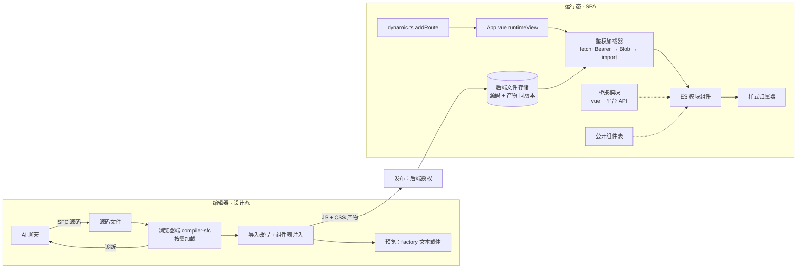

# AI 生成 Vue SFC → 编译 → ES 模块运行（SPA）研究

状态：研究成果归档；未进入方案审核，不是实施授权。本文属于 AI 编码赋能层记录，产品事实以源码、模型和产品文档为准。

## 1. 研究问题与结论

问题：在本仓 SPA 内，让 AI 聊天直接生成 Vue SFC 及相关文件，编译后上传，运行时以 ES 模块加载，这条技术路线是否成立。

结论：**技术上成立**。编译器已在本仓就位且版本与运行时一致；SPA 壳层已具备动态路由、动态渲染位与 keep-alive，可作为挂载点。但编译产物不能直接在浏览器运行，必须新增三个接缝和两条约束：

| 类别 | 内容 |
|---|---|
| 接缝 1 | 同实例桥接：`vue` 与平台公开 API 的裸导入改写到宿主桥接模块 |
| 接缝 2 | 组件映射：`resolveComponent` 改由显式公开组件表解析 |
| 接缝 3 | 鉴权加载：带 Bearer 的 fetch → Blob → `import()` |
| 约束 1 | 仅允许 `<script setup>`，禁止模块顶层可变状态 |
| 约束 2 | SPA 下 ES 模块记录不可回收，需版本加载预算；编辑预览改用可回收载体 |

本路线与现行 D 路线（classic Script ABI + `rule.json` 节点树 + SparkPageRenderer）是两条并存的渲染路径，不是 D 的增量。

## 2. 已对齐的前提（非本研究重新论证）

- 数据安全由后端强验证承担：`DataPermissionAspect`（租户隔离、角色、共享引用、`ShowFilter` 拼入 SQL、服务端脱敏）。前端不承担数据授权。
- 发布走后端授权；AI 产物经有权身份确认后发布，即视为可信作者代码，与 sparkproject 决策 A4/A7 一致，不需要运行时沙箱。
- AI 特有的剩余问题只有"审核/确认流程"，属于流程设计，不属于本技术可行性范围。
- `v-html` 等模板写法属于编码规范，不是架构问题，本文不讨论。

## 3. 已验证证据

### 3.1 编译（Node 端实测）

探针以本仓 `vue/compiler-sfc`（3.5.38，与 `pnpm-workspace.yaml` catalog 一致）编译示例 SFC（`<script setup>` + `<spark-table>` + `<el-button>` + scoped style）：

```
VERSION 3.5.38
IMPORTS [ 'import { unref, resolveComponent, createVNode, toDisplayString, createTextVNode, withCtx, openBlock, createElementBlock } from "vue"',
          "import { ref, inject } from 'vue'" ]
RESOLVE [ 'spark-table', 'el-button' ]
CSS     .box[data-v-p1]{color:red}
```

结论：模板、`v-model`、事件、scoped CSS 均正常产出；产物含裸导入 `"vue"` 与按名解析组件。

注意：裸包名 `@vue/compiler-sfc` 在仓根不可解析，须经 `vue/compiler-sfc` 子路径。

### 3.2 本仓现状（源码核对）

| 事实 | 位置 |
|---|---|
| Spark 组件注册在自定义 registry，`createSparkPlugin` 仅 `app.provide(SPARK_REGISTRY_KEY, registry)`，不调用 `app.component` | `packages/spark-component/src/core/system/plugin.ts` |
| 全局注册组件仅 `ErrorBoundary` | `packages/spark-app/src/app/error-handler.ts` |
| Element Plus 无 `app.use`，无 unplugin 自动导入 | `src/main.ts`、`vite.config.ts`、`package.json` |
| `index.html` 无 CSP、无 import map | `index.html` |
| HTTP 拦截器统一注入 `Authorization: Bearer`，含刷新流程 | `packages/spark-lowcode-api/src/lowcode-api.ts`、`platform/lowcode-platform-api.ts` |
| 版本快照文件命名 `<version>__<fileName>` | `packages/spark-lowcode-api/src/platform/project-blueprint/project-blueprint-file-version.ts` |
| 运行时 `router.addRoute` 注册页面路由 | `packages/spark-app/src/router/dynamic.ts` |
| 动态页面经 `runtimeView` 渲染，`<keep-alive :include="runtimeNames">`，`:key="runtimeInstanceId"`；支持 SPA 内"刷新配置" | `src/App.vue` |

### 3.3 sparkproject 参考证据

- `script-instance.md` 探针：原生 ES 模块顶层状态跨实例共享（`[1,2]`），导出 factory 后隔离（`[1,1]`）；浏览器无法卸载已导入模块；每次挂载换新 URL 被否决。
- `script-factory.md`：SparkPageRenderer 只接受 classic script，不接受 ES 模块。
- `alternative-c.md`：C 要求 Vue 组件脚本形态，与 D 格式不可混用；执行载体（原生 ES 模块 / 预编译 factory 文本 / Worker）未定。

## 4. 总体架构



## 5. 分环节设计

### 5.1 AI 生成

- 输出物：单个 `.vue` 源文件（可附带纯数据文件）。只允许 `<script setup>`。
- AI 可用的组件与 API 合同来自现有 ClassModel 组件索引；公开组件表（5.4）与之同源，避免 AI 引用未开放组件。
- 新增 AI 工具：`compileDiagnostics(source)` 返回编译错误、未解析组件、非法导入、顶层可变状态等诊断，AI 自修直到通过。

### 5.2 编译

- 编辑器内按需加载 `compiler-sfc` 浏览器构建（Vue SFC Playground 先例）；不进入运行态 bundle。
- 编译步骤：`parse` → `compileScript({ inlineTemplate: true })` → `compileStyle({ scoped, id })`。
- scoped id 取"页面标识 + 版本"的稳定哈希，避免多版本样式冲突。
- 编译后执行改写（5.3、5.4），产物为 JS 文本 + CSS 文本。
- 发布前可由后端再编译一次做一致性校验（可选，不是可行性前提）。

### 5.3 接缝 1：同实例桥接

问题：产物中 `from "vue"` 浏览器无法解析；宿主 Vue 已被 Vite 打入 chunk，没有可导入 URL。页面模块必须与宿主共享同一 Vue 实例，否则响应式、`provide/inject`、组件实例链全部失效。

方案：

1. 宿主启动时构造桥接对象 `{ vue: Vue命名空间, spark: 平台公开API }`。
2. 由桥接对象生成一个 blob ES 模块（导出名取 `Object.keys`），会话内只创建一次，得到固定 URL。
3. 编译期把 `import {...} from "vue"` 与平台 API 导入改写为该桥接 URL 的导入（运行时替换占位符）。

不采用 import map：SPA 入口本身是 module script，import map 必须在其之前静态声明；动态追加 import map 跨浏览器行为不一致。

平台 API 必须经桥接：`PAGE_DATASET` 等能力键可能是 Symbol，生成代码无法以字符串复现，必须拿到宿主同一引用。

桥接导出面即平台对生成代码的公开 API，需收敛为小而稳定的白名单（遵循 AGENTS.md 2.10）。

### 5.4 接缝 2：组件映射

问题：`resolveComponent('spark-table')` 先查组件实例 `components` 选项，再查 `app.component`。本仓两者都没有 Spark 组件与 Element Plus，直接运行会渲染为未知元素并告警。

方案：加载产物后、挂载前，为组件定义补 `components = 公开组件表`。公开组件表由 Spark registry 与选定的 Element Plus 组件构成，同时就是组件白名单。不改为全局注册，避免污染宿主与其他页面。

### 5.5 存储与版本

- 同一版本保存：源码 `.vue`、产物 `.js`、产物 `.css`、元数据（编译器版本、scoped id、源码摘要）。
- 沿用 `<version>__<fileName>` 版本快照命名。
- 后端无多文件原子发布：以元数据中的源码摘要校验三者对应；不一致则拒绝加载并报错（fail-fast，不静默回退旧版本）。
- 待核对：后端对 `.js`/`.css` 的 MIME、单文件大小上限、同名写入行为。

### 5.6 接缝 3：鉴权加载

问题：`import(url)` 无法附带自定义请求头，后端文件 API 依赖 `Authorization: Bearer`。

方案：

1. 经现有 lowcode HTTP 客户端取产物文本（复用 Bearer 注入与 token 刷新）。
2. `new Blob([text], { type: 'text/javascript' })` → `URL.createObjectURL` → `import(blobUrl)`。
3. 以"页面 × 版本"为键缓存模块 Promise，同一版本会话内只加载一次。
4. 若部署层配置 CSP，需允许 `script-src blob:`（当前 `index.html` 无 CSP，服务器头待核对）。

### 5.7 SPA 挂载

- 路由：沿用 `dynamic.ts` 动态注册；页面类型区分 D 页面与 SFC 页面。
- 渲染：SFC 页面以 `defineAsyncComponent({ loader, errorComponent, loadingComponent })` 作为 `runtimeView`。
- keep-alive：`include` 按组件名匹配，产物组件名必须与 `runtimeName` 规则一致且唯一。
- 版本切换：版本号进入 `runtimeInstanceId`；"刷新配置"拿到新版本时主动淘汰旧实例缓存。
- 错误隔离：单页加载或运行失败由 `errorComponent` + `ErrorBoundary` 收住，不影响 SPA 其他页面。

### 5.8 样式归属

- CSS 以"页面 × 版本"为单位注入 `<style>`，由样式归属器统一管理。
- keep-alive 失活不移除；实例被淘汰或切换版本时移除。
- 不允许生成代码自行操作 `document.head`。

### 5.9 实例隔离与副作用

- `<script setup>` 主体编译进 `setup()`，每实例独立；普通 `<script>` 顶层状态跨实例共享，故禁止。
- SPA 无整页刷新兜底：`window` 监听、定时器等副作用必须在 `onUnmounted` 清理；编译诊断做静态检查，残留视为缺陷。

### 5.10 载体选择与内存

| 载体 | 回收 | 适用 |
|---|---|---|
| 原生 ES 模块（blob） | 模块记录不可回收，`revokeObjectURL` 不释放 | 运行态：按"页面 × 版本"加载一次，总量有界 |
| 预编译 factory 文本（导入改写为 `const {...} = __bridge.vue`，`new Function` 执行） | 无引用后可 GC | 编辑预览：每次改动重新编译，避免累积 |

两种载体共用同一编译器与同一改写规则，仅最终加载方式不同。运行态需设会话内加载版本数预算并监控。

## 6. 与 D 路线的关系

- D：classic Script ABI（`__init__`/`__resume__`/`__dispose__`、`$page.capture()`）+ `rule.json` 节点树 + SparkPageRenderer。
- 本路线：SFC 组件 + ES 模块，不经过 SparkPageRenderer。
- 两者格式不可混用（alternative-c 已定），但可在同一 SPA 内按页面类型并存；数据能力经同一 app 的 `provide/inject` 共享。
- 不提供 D 页面自动转换；是否迁移、按页切换，需单独决策。

## 7. 未验证项与下一步探针

| 编号 | 待验证 | 探针设计 |
|---|---|---|
| P1 | 浏览器端 `compiler-sfc` 编译与包体 | 编辑器内按需 `import()` 浏览器构建，编译 3.1 示例，记录耗时与体积 |
| P2 | 桥接 blob 模块 + 导入改写 | 产物导入桥接后挂载，验证 `ref` 响应式与 `inject(PAGE_DATASET)` 拿到宿主同一引用 |
| P3 | 组件表注入 | 补 `components` 后 `spark-table`、`el-button` 正常渲染，无 resolve 告警 |
| P4 | 鉴权 blob 加载 | 经 lowcode 客户端取产物 → blob → `import()`；含 token 过期刷新 |
| P5 | keep-alive 与版本切换 | 同一页面切换两个版本，确认旧实例淘汰、样式移除、`include` 命中 |
| P6 | 内存 | 预览 factory 载体反复编译 100 次与 ES 模块载体对比堆快照 |
| P7 | 后端文件 | `.js`/`.css` 的 MIME、大小上限、同名写入 |

## 8. 待决策问题

1. 公开组件表与桥接 API 白名单的范围与维护归属。
2. 发布时是否后端复编译校验。
3. AI 产物审核/确认流程（谁确认、确认粒度、审计）。
4. SFC 页面与 D 页面的路由类型标识与入口选择。
5. 运行态加载版本预算数值与超限策略。
6. 是否允许 SFC 页面附带多文件（子组件、纯数据），以及其导入改写规则。

## 9. 风险

| 风险 | 缓解 |
|---|---|
| 桥接导出面膨胀成第二套公共 API | 白名单 + 导出面审查，变更走版本 |
| 编译器版本与运行时 Vue 不一致导致产物运行异常 | 元数据记录编译器版本，加载时比对，不一致 fail-fast |
| SPA 长会话内存增长 | 运行态版本预算；预览用可回收载体 |
| 生成代码副作用残留 | 编译诊断静态检查 + `onUnmounted` 约束 |
| 源码/产物版本错配 | 源码摘要校验，错配拒绝加载 |
| 两条渲染路径长期并存的维护成本 | 明确页面类型边界，不做隐式互转 |
