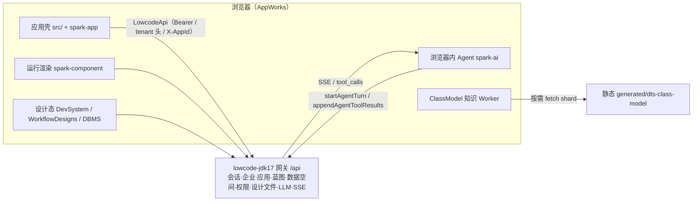
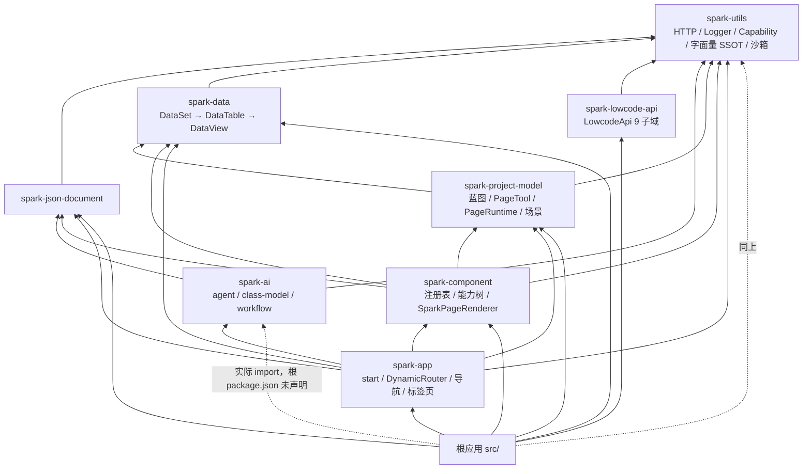
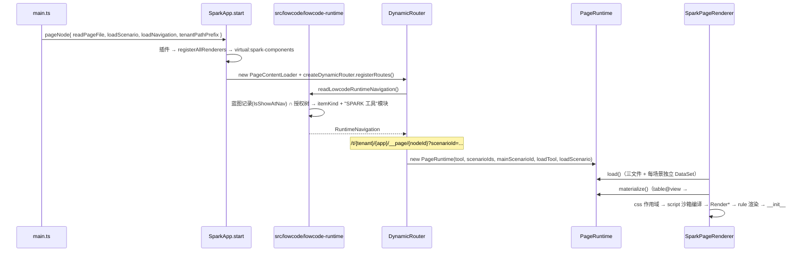
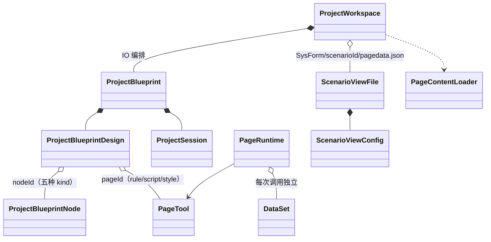
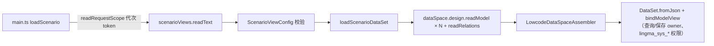
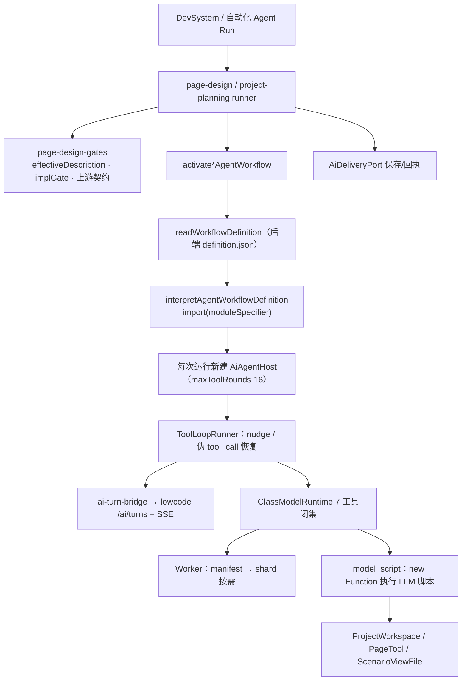

# 研读：SPARK AppWorks 当前架构（2026-10-07，基于 HEAD `9c225cad7`）

> 赋能层记录，不是产品事实源。结论均由读码 / grep / 实际运行命令得到；与源码冲突时以源码为准。
> 本版覆盖基于 `944536a31` 的旧版：`4200c7f17`（526 文件）后，`ConfigPageNode`、`loadRuntimeDataSet`、`PageDataSpaceBinding`、`route.meta.permissionMode` 等旧结论均已失效。
> 状态：问题清单待用户逐项决定是否进入 7 阶段协议。

## 0. 基线（本会话实测）

| 检查 | 结果 |
|---|---|
| `pnpm run typecheck` / `lint` | 通过 |
| 根 `vitest run` | 180 文件 / 2077 用例全过，退出码 0 |
| `verify:arch/deps/ai-codegen/workflow-designs/lowcode-contracts/ai-model/project-blueprint-ssot/pages-config/ai-business-boundaries/wire-query-parity` | 通过 |
| `verify:docs` | **失败**：扫描了被 `.gitignore` 忽略的 `.github/agents/*.md`、`.github/prompts/*.md`（仅本地） |

## 1. 系统上下文

纯前端，浏览器经同源 `/api` 直连 lowcode-jdk17 网关；开发态 `vite.config.ts` 代理到 `LOWCODE_GATEWAY_URL`（缺失即拒绝启动）。

## 2. 包分层（含源码实际依赖）

- `spark-project-model/src` 目录：`blueprint/ page/ scenario/ project/ io/`；领域说明见 `packages/spark-project-model/src/MODEL-HIERARCHY.md`。
- `spark-lowcode-api` 与 `spark-project-model` 互不依赖，只在宿主 `src/lowcode/` 汇合。

## 3. 运行主线

- `cfg:` 目标在宿主投影为 `/__page/{nodeId}?scenarioId=`（`lowcode-runtime.ts` `runtimeTargetProjection`）。
- 运行实例池：`DynamicRouter.pageInstances`，键 = `[projectId, nodeId, pageId, query, hash]`；仅 `closePageRuntime`（标签页关闭）与 `disposePageRuntimes` 释放。
- 工具装载：`dynamic.ts:228` 直接用 `pageContentLoader.getPageFileReader()` 读文件，不经 loader 缓存；`versionId` 来自 `source.VersionId`。

## 4. 设计态模型

- 三种身份互相独立：`nodeId`（蓝图节点）、`pageId`（工具）、`scenarioId`（场景）。
- `ProjectWorkspace` 场景保存是写前比较 + 写后回读，后端无 CAS（源码注释已声明）。
- 闸门字段 `implGate`、`upstreamContractsSatisfied` 从节点 `source` 原始记录读取（`project-blueprint-node.ts`），缺省 fail-closed。

## 5. 场景数据装配

## 6. AI 链路

- 知识管线：`.ts/.vue` → `tsconfig.class-model-emit.json` 内存 emit `.d.ts` → `build-dts-class-model-bundle` → `generated/dts-class-model/` → Worker 只加载 root 可达闭包。
- `config/agent-workflows/lmspark/homepage/` 下 pageDesign / projectPlanning 的 `definition.json` 中 `executableRef.moduleSpecifier` 均为 `@spark-appworks/spark-project-model`。

## 7. 问题清单

### P0 安全边界
1. **页面脚本沙箱不是安全边界**：`spark-component/src/page/createSandbox.ts:75-77` 为 `with(__ctx)` + `new Function`；`spark-utils/src/sandbox.ts:35-39` 的 `has` 对未知键返回 false → 回落全局，`sessionStorage`/`localStorage`/`navigator` 未屏蔽；令牌存于 `window.sessionStorage`（`src/lowcode/lowcode-runtime.ts:38`）；`(()=>{}).constructor('return this')()` 可绕过 `Function` 黑名单。计算列（`spark-data/src/strategies/computed-column-delegate.ts`）与 `spark-ai/.../native-script-sandbox.ts` 同模型。
2. **Workflow 定义驱动动态 `import()` 无白名单**：`spark-ai/src/agent/workflow/agent-workflow-runtime.ts:166`；校验仅非空（`agent-workflow-validation.ts:660-666`）；`definition.json` 来自后端可编辑文件。裸包名在浏览器原生不可解析，仓内无 importmap / `@vite-ignore` → 生产激活要么失败、要么等同加载任意模块。**未在浏览器实测。**
3. **`allowedOperations` 是文本扫描**：`src/services/page-design/page-design-gates.ts:349` `script.includes(marker)`。

### P1 架构与正确性
4. ~~魔法兜底 `'homepage'`~~（2026-10-07 更正）：`'homepage'` 是"应用目录/工场"作用域哨兵（URL `/t/{tenant}/homepage`、`enterLowcodeApplicationCatalog`），下游 `toolFilePath`/`scenarioViewPath`/`readRequestScope` 已对无应用请求 fail-fast，不会写错应用；仅剩约 20 处字面量重复（降为 P2）。注意 `projectType: 'homepage'` 是另一含义，不可合并。
5. 组合根含业务逻辑：`src/main.ts:408-421` 内联 `loadScenario`（scope token、读场景、装配、失败销毁）。
6. `PageContentLoader` 缓存半死：运行路径绕过缓存，壳层却暴露 `clearAllPageCache` / `getPageCacheStats`。
7. `DynamicRouter`（728 行）职责过载：路由注册 + 业务/平台导航 + 实例池 + 工具装载 + 过期校验；单页模式下 `pageInstances` 是否累积待验证。
8. 两套 AI Host 模型：全局 `appAiAgent`（`ai-turn-bridge.ts:473`）+ 每次运行新建；`page-design-ai-runner.ts:119` 取 `AI_AGENT_HOST` 只做判空即另建 Host（残留）。
9. 模块级全局可变状态：`pageDesignRunContexts`（`page-design-gates.ts:62`）、`aiTurnDiagnostics`、`nav-access._dynamicRouter`、`lowcodeApi` 单例 import 即注册拦截器，401 硬跳转（`lowcode-runtime.ts:52`）。
10. `PermissionMode` 实为常量：`SparkPageRenderer.vue:74` 写死 `'masked'`；`usePermission.ts:14` 注释仍称"随导航下发"。
11. 根 `package.json` 未声明 `spark-ai`、`spark-utils`；`verify:deps` 不校验 workspace 依赖。

### P2 可维护性与治理
12. 巨型文件：`WorkflowDesigns.vue` 5742、`DBMS.vue` 2309、`workflow-designs.ts` 1824、`useDevState.ts` 1060；`data-view.ts` 2254、`spark-node-tree.ts` 1762、`dataset.ts` 1716、`dataset-crud-tool.ts` 1606。
13. AGENTS.md §2.13 目录门禁未落地：17 个目录超限（最大 `fields/data-components` 61 文件；`spark-app/src`、`spark-ai/src/agent`、`spark-ai/src/class-model` 子目录 9），`verify:arch` 仍通过。
14. 压缩式一行多语句：`runtime-page.ts`、`project-design.ts`、`DynamicRouter.getPageRuntime`；lint 不管格式。
15. `verify:docs` 扫描 gitignored 文件，应基于 `git ls-files`。
16. spark-data 感知路由：`DataSet.setPageRoute` + `resolveRouteTemplateParams` 读 tenantId/projectId。
17. 过期注释：`main.ts` 头部仍描述 PageNode、FileLoader 过期分级、L1–L6。
18. 闸门字段是否由后端真实持久化待确认（见 §4）。

## 8. 迭代计划

规则：一次迭代 = 一个问题 + ≤4 个文件 + 一个验证动作；做完验证再开下一轮。每轮仍走 7 阶段，但按"简单/中等"分级控制提问量。
约束（2026-10-07 用户）：暂不能改后端。任何需要后端接口、合同或行为变更的迭代一律暂缓；纯前端迭代照常推进，且不得以"顺便适配后端"为由扩大范围。

| # | 状态 | 目标 | 主要文件 | 验证 | 对应 |
|---|---|---|---|---|---|
| 1 | ✅ | `executableRef` 改为宿主注入的白名单解析，去掉动态 `import()` | `agent-workflow-runtime.ts`、`agent-workflow-bindings.ts`、`agent-workflow-definition.test.ts` | spark-ai 测试 + typecheck | P0-2 |
| 2 | ✅ | 删孤儿生成脚本与 `resolvePageDesignModuleClass`（离线校验收紧已判定低价值、移除） | `generate-workflow-design-data.mjs`、`page-design-agent-workflow-binding.ts` | `verify:workflow-designs` + 根测试 | P0-2 |
| 3 | ✅ | 沙箱黑名单补齐存储/网络/跨窗口全局（放弃 has 恒 true，见 knowledge/vue-frontend.md） | `spark-utils/src/sandbox.ts` + 测试 | utils / component 测试 | P0-1 |
| 4 | ⏸ 暂缓（需后端） | 令牌不再对脚本可达：同 realm 下只有 httpOnly 刷新令牌才根治，需后端能力；仅内存存储会导致刷新即登出，不单方面做 | `lowcode-session-store.ts`、`lowcode-runtime.ts` | lowcode-api 测试 + 手工登录 | P0-1 |
| 5 | ✅ | pageDesign editor 按 `allowedOperations` 包对象级守卫（nodeTree/script/style 三域，越权抛 `PAGE_DESIGN_OPERATION_FORBIDDEN`） | 新 `page-design-operation-guard.ts`、`agent-workflow-bindings.ts` | 守卫测试 | P0-3 |
| 6 | ✅ | `'homepage'` 字面量收为 `APPLICATION_CATALOG_PROJECT_ID`（仅 id 语义，不含 projectType） | `tenant-scope.ts` + 调用点 | 根测试 | P1-4（已更正为 P2） |
| 7 | ✅ | `loadScenario` 从 `main.ts` 下沉为 `loadLowcodeRuntimeScenario` | `main.ts`、`src/lowcode/data-space/lowcode-data-space-runtime.ts` | 新增 3 用例 | P1-5 |
| 8 | ✅ | workspace 依赖声明 + `verify:deps` 检查源码 import；`verify:docs` 尊重 .gitignore | 根 `package.json`、`verify-dependency-catalog.mjs`、`verify-docs.mjs` | `verify:rules` 全绿 | P1-11、P2-15 |
| 9 | ✅ | AI Host 收敛为每次运行独立（删 `appAiAgent` 与能力判空，修复切换项目后 projectPlanning 失配）；`PermissionMode` 仅修正注释 | runner、useDevState、App.vue、ai-turn-bridge | 新增 1 用例 | P1-8、P1-10 |
| 10 | ✅ | `DynamicRouter` 拆出 `PageRuntimePool`；删除死代码 page-cache，改注入 `readPageFile` | `dynamic.ts`、新 `page-runtime-pool.ts`、`start.ts`、App.vue | spark-app 测试 | P1-6、P1-7 |
| 11a | ✅ | 目录规模棘轮 `verify:dirs`（基线 20 个超限目录，只许减少） | `tools/verify-directory-limits.mjs`、`directory-limits-baseline.json` | 5 用例 + verify:rules | P2-13 |
| 11+ | ✅ 目录部分 | 四批拆分超限目录（tests、包测试、源码目录、组件目录），基线 20 → 0 | `scripts/move-source-files.mjs` + 移动计划 | `verify:dirs` / 全量测试 / build | P2-13 |
| 11w | ✅ 第一阶段 | `WorkflowDesigns.vue` 机械抽取：117 个纯类型/纯函数/常量 + 样式移入 `workflow-designs/`（6239 → 4390 行）。有状态逻辑拆 composable/子组件须先补视图测试，暂不做 | `src/views/app/workflow-designs/*` | typecheck/lint/build | P2-12 |
| epic | 远期 | 页面脚本真正隔离：重新设计脚本 API（不直接产出 VNode）后迁隔离 realm | 待立项 | — | P0-1 |

当前断点（2026-10-07）：迭代 1–3、5–10、11a、11+（目录）完成；`verify:dirs` 基线已清零；verify:rules、typecheck、lint、build 全绿，根 vitest 183 文件 2093/2093，test:packages:run 0；改动均未提交。剩余：11w 第二阶段（需先补视图测试）；4 与 epic 需后端，暂缓。新发现：生产构建把 `new URL('../class-model-knowledge.worker.ts', import.meta.url)` 内联为 `data:video/mp2t` 的 TS 源码（Vite 只在 `new Worker(new URL(...))` 直接写法时打包 worker），ClassModel worker 在生产环境大概率不可用，待立项修复。

## 9. 未核实 / 不确定
- P0-2 浏览器实际行为；P1-7 单页模式实例累积。
- 后端是否持久化 `implGate` / `upstreamContractsSatisfied`。
- spark-component 组件实现仅读机制，未逐个读。
