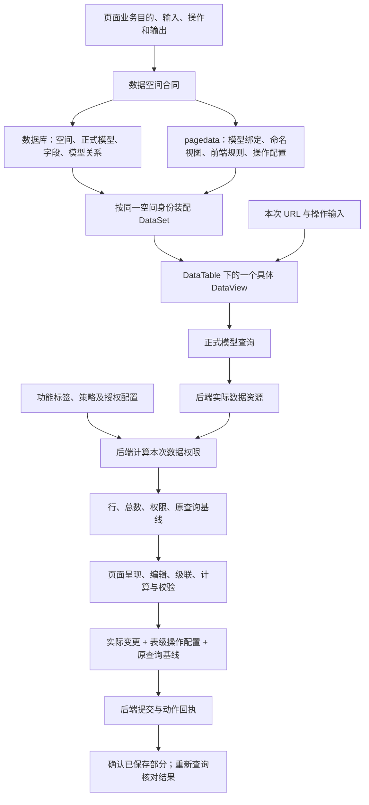
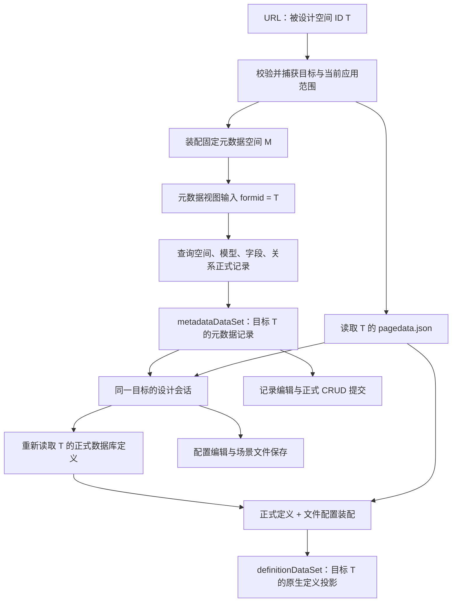

# 数据空间整体数据链路：语义、责任与现状

本文先梳理整体语义，再逐项标明当前实现与缺口。主控直接核源，不再委派代理。2026-10-09 语义研读阶段仅修订本文；随后按持续实施授权修复定义失配后的会话恢复，结果见 metadata-dataset/definition-recovery/result.md。此前正式视图字段输出与行身份的验证见 projection-query/result.md。两个记录都是限定闭环证据，本文不是完整 DataSet 或 AppWorks 验收结论。

整体语义是：**业务目的和输入 → 数据空间定义 → 原生实例装配 → 按视图查询 → 按数据权限交互 → 提交实际变化 → 回执与重开验证**。设计数据空间本身也走这套流程，其业务记录恰好是空间、模型、字段和关系的定义记录。



图中配置是持久定义，本次输入和查询结果是运行状态。前端只消费数据权限；查询范围过滤不能替代后端授权。共同装配不意味着共同存储或共同事务。

## 0. 先按业务结果贯穿整条链

数据空间要把“页面需要怎样的数据和操作”变成可配置、可执行、可保存并能重新恢复的数据合同。业务含义先成立，然后才是类、文件和端点的分工。

| 环节 | 输入 | 处理的业务含义 | 输出及后续消费者 |
| --- | --- | --- | --- |
| 定义数据合同 | 页面目的、业务输入、要读取/修改的数据、操作结果和异常要求 | 确定模型、字段、多个使用视图、参数、两类关系与操作要求 | 可维护的空间定义，供页面配置和运行装配使用 |
| 持久化定义 | 空间/模型/正式字段/模型关系，以及模型绑定/视图/前端规则 | 已有 DB 和 pagedata 各自保存其拥有的定义 | 同一个空间的两类权威来源；运行装配时组合 |
| 建立运行实例 | 空间 ID、当前应用范围、正式定义、pagedata | 验证身份和引用，建立 DataSet → DataTable → columns + views | 每次调用独立的原生实例；尚未等于已有业务行 |
| 查询并呈现 | 本次参数值、视图字段/过滤/排序/分页 | 经正式模型连接实际资源，后端同时计算数据权限 | DataView 的行/总数/选择等状态，以及私有原查询基线；页面按数据权限消费 |
| 交互并提交 | 当前行、用户字段输入、父字段当前值、实际变更 | 级联、计算、校验；按表级操作配置和原查询身份提交 | 确认的操作回执及新基线；失败保留可修正或待核验状态 |
| 重新打开验收 | 已保存的 DB 定义和文件、新的业务调用 | 新实例装配、重新查询并消费相同语义 | 验证定义确实生效、业务结果可重现；内存变化和 HTTP 成功不能替代这一步 |

这张表是目标语义；下面分别标明当前代码已接通的部分和真实缺口。字段权限、原查询主键和保存凭据贯穿查询到提交，不能在字段投影时丢掉，也不能写入 pagedata。

数据空间设计本身就是一个业务用例，输入为被设计空间 ID。其操作应逐项对到持久结果：

| 设计操作 | 定义最终归属 | 成功还必须证明什么 |
| --- | --- | --- |
| 修改空间、模型来源或正式字段 | 已有 DB 元数据记录 | 正式回执与精确回读；目标模型重新装配后使用新定义。改模型字段不能直接等同于修改物理数据库表 |
| 配置模型下的命名 DataView | 目标空间 pagedata 的 tables → views | 保存重开后仍属于同一模型，查询、结果、编辑和选择按该视图合同执行 |
| 配置正式字段的前端校验或本地计算扩展 | pagedata 的表级 columns 扩展 | 不覆盖 DB 正式字段；重开后计算/校验有实际消费者 |
| 配置模型关系 | DB 正式关系，再适配为 resourceRelations | 完整过滤表达式保留并能被目标消费者解释；节点连线本身不证明关系生效 |
| 配置字段输入级联 | pagedata 的 viewCascades | 任一父字段当前值改变后，目标值和选项按配置变化；取消、迟到和权限限制仍正确 |
| 配置模型操作及执行策略 | pagedata 的 DataTable.api / crudConfig | 配置进入实际请求、回执及异常处理；只保存配置不等于操作已接通 |

DB 定义尚未提交、文件草稿尚未保存、运行行尚未提交是三种不同的未完成状态。当前没有把三者合并为一次原子保存的合同。

端到端验收以“修改目标模型的一个正式字段，并调整其命名视图”为样板：输入目标空间 ID → 用元数据空间读取该目标 → 编辑并确认数据库记录 → 用已保存正式定义验证视图候选 → 保存目标 pagedata → 新实例重新装配 → 真实查询、编辑、提交并回读。每一步都须标出当前对象、持久归属和失败后可继续的入口；任一步失败，不能把其他已成功步骤说成已回滚。目前字段输出别名变更样板已通过真实前端对象与 HTTP/文件边界夹具贯穿验证；线上只读验证失配诊断与修复，未做线上写入验收。

## 1. 先立意：数据空间组织的是页面完成业务所需的数据合同

页面先说明要完成什么业务、需要什么输入、读取和改变什么、输出交给谁。数据空间把这些语义组织为前端可用的模型、字段、视图、关系和操作，再连接后端资源与授权结果。

这里有三个方向，缺一不可：

- **向上承接页面**：页面按数据合同绑定和编排，查询、编辑、校验、权限呈现、提交等通用过程由平台执行。
- **向下连接资源**：模型将数据库表、数据库视图、逻辑视图、字典、接口、JSON 等来源组织为统一输出；页面不负责重新解释物理资源。
- **旁接配置与授权**：功能标签、数据对象策略和授权记录交给后端形成当次数据权限，前端消费结果，不建立角色判断。

目标同时是配置驱动、让页面开发流程化和标准化。验收对象是业务闭环，不是“JSON 能解析”或“控件能显示”。

## 2. 原生结构及各层责任

```text
DataSet（数据空间 / 一个场景的运行实例）
├─ tables
│  └─ DataTable（模型）
│     ├─ modelBinding：正式模型身份
│     ├─ resourceType / resourceId：资源语义
│     ├─ columns：模型输出字段、允许的前端校验与本地计算定义
│     ├─ api / crudConfig：表级操作端点、调用策略
│     └─ views
│        ├─ default: DataView
│        └─ 其他命名 DataView：查询、结果、当前行、选择、编辑、分页等
├─ resourceRelations：模型之间的稳定关系（完整过滤表达式）
├─ viewCascades：前端运行数据依赖
├─ saveChanges：空间级保存协调配置
└─ layout：原生设计布局配置
```

同模型多个 DataView 共享模型、字段及表级操作配置，各自拥有查询结果和编辑状态。一个视图改了某行，不意味着其他视图中的同主键行已自动更新。完整刷新和冲突策略须按使用场景定义，不能把“共享 DataTable”理解成“共享 rows”。

当前原生类型的范围大于正式模型装配链已经支持的范围。`TableMetadata`、`ViewMetadata`、`DataSetMetadata` 声明某属性，不等于 `ScenarioViewConfig → 装配 → 查询/保存` 已完整消费该属性。

当前装配器按 pagedata.tables 中的绑定读取并装配正式模型；数据库里新建一个模型，不会自动把它补进文件，也不会自动产生其命名视图。需要把“正式模型已保存”和“该模型已进入目标前端 DataSet”作为两个结果核对。模型字段与命名视图同属 DataTable；DataView 选择和使用模型字段，不另造一份正式字段定义。

依据：`packages/spark-data/src/types.ts`（TableMetadata、ViewMetadata、DataSetMetadata）；`packages/spark-project-model/src/scenario/scenario-view-config.ts`；`src/lowcode/data-space/lowcode-data-space-assembler.ts`。

## 3. 先分清定义数据和业务运行数据

| 对象 | 回答的问题 | 当前持久来源/状态归属 |
| --- | --- | --- |
| 空间、模型、正式字段、模型关系、参数声明 | 这个空间有哪些数据，来自哪里，结构是什么 | 现有数据库正式记录 |
| 命名 DataView、查询配置、前端级联、校验/本地计算扩展、表级操作配置 | 页面按什么方式使用模型 | 场景共享 `pagedata.json`，由场景文件 owner 维护 |
| 功能标签、策略、授权配置 | 后端依据哪些配置计算数据权限 | 现有相关配置记录；不由 pagedata 另存一套权限 |
| 本次参数值、查询结果、当前行、选中行、编辑行、dirty、权限凭据 | 当前调用正在处理什么 | DataSet/DataView/查询上下文；不写回定义文件 |
| 业务记录 | 最终新增、修改、删除了什么 | 后端实际资源，依正式提交合同写入 |

**数据库记录 + pagedata.json 共同表达完整数据空间定义；运行 DataSet 是组合装配结果。** 不把整个 `DataSet.toJson()` 回写成定义真源。尤其不能把数据库中的空间/模型/字段复制到文件后再独立维护。

场景文件路径由当前应用与空间身份定位：`{applicationId}/SysForm/{scenarioId}/pagedata.json`，沿现有设计文件读取/上传通道持久化。工具三文件 `rule.json / script.js / style.css` 通过数据绑定使用共享场景，不能各自拥有一份不同的模型定义。

依据：`src/lowcode/lowcode-runtime.ts` 的 `scenarioViewPath/createLowcodeProjectGateways`；`packages/spark-project-model/src/scenario/scenario-view-file.ts`；`packages/spark-project-model/src/project/project-workspace.ts`。

## 4. “数据空间的数据空间”完整含义

设 **M** 为固定元数据空间，**T** 为 URL 传入的被设计空间。M 和 T 是符号，不是新造的场景 ID。



输入只有 **T** 一个业务目标。M 是平台内部用于查询元数据的身份，不让调用者再传入多组设计场景。当前元数据 loader 的实际参数名为 **`formid`**：T 是参数值，不能拿 T 替换 M 的 `DataSet.scenarioId`。

实际读取链：

1. 校验 T 和当前应用/请求范围。
2. 使用元数据空间自己的配置和正式模型，装配 M。
3. 给四个元表的所有命名视图设置 `queryContext.formid = T`。
4. 默认视图执行完整分页读取；配置里的 `GetInputParam(formid)` 绑定为本次目标值。
5. `Base_DataSet` 必须唯一返回目标行；其他三表每行的 `dataSetId` 必须等于 T，并且归属字段可读。越界、缺页或不可核验则失败、销毁候选实例。
6. 设计会话加载 T 的场景文件，将文件与正式定义装配成目标定义投影。

两个 DataSet 的差别：

| 运行对象 | DataTable 是什么 | DataView 的 rows 是什么 | 怎样保存 |
| --- | --- | --- | --- |
| `metadataDataSet` | `Base_DataSet / Base_DataModel / Base_DataModel_Field / Base_DataModel_Relation` | 被设计空间的定义记录 | 既有正式查询/CRUD 管线 |
| `definitionDataSet` | 被设计空间自己的业务模型 | 定义装配时不代表已查到业务数据 | 投影不直接整体保存；定义改动回到数据库或场景文件各自责任方 |

**元表查询用的 DataView，与被设计模型的 DataView 定义是两个层次。** 当前没有正式的数据库 DataView 元表；后者存在于 T 的 `pagedata.tables[tableName].views[viewId]`。目前由设计会话连接四表数据与文件编辑 owner，不能把“四张表都有 default 视图”当成已完整维护目标 DataView。

没有 pagedata 的空间仍可加载正式元数据；会话将文件缺失单独表达，后续显式创建草稿。不能为了进入设计器先要求目标业务空间已有完整视图，或偷偷创建文件。目标定义投影应可丢弃重建；修改文件草稿会使旧投影失效。

当前装配回调会重新读取正式数据库定义，再组合当前文件草稿；**不会自动把 metadataDataSet 中未提交的模型/字段编辑当成已生效定义**。因此数据库编辑的保存确认、文件草稿验证、目标投影刷新需要明确衔接。也不能推断数据库保存后，所有打开的定义投影和页面实例都已自动刷新。

研读发现的恢复断点已复现并修复：文件成功加载后的装配失败通过 `definitionError` 明确表达，会话保留元数据和文件供处理；`definitionDataSet` 仍抛出失败原因，未修复文件仍不可保存。`stageDefinition/stageView` 可以在该失败状态下验证修复候选；成功后重新装配并清除错误。损坏 JSON、文件读取失败、scope 失效及迟到结果不伪装成可用定义。数据库保存仍需显式 refresh；没有自动更新所有页面实例。HTTP/文件边界集成与线上零写入验证见 definition-recovery/result.md。

现状边界：以上单 ID **数据入口已存在**。旧页面脚本仍读取 `dataSpaceId` 并保留旧多场景页面设施；本轮未验证或完成新入口与界面的统一接线。一般 `PageRuntime` 也没有自动把全部 URL 参数灌入视图上下文，不能以元数据 loader 的显式 `formid` 绑定推断普通业务页已自动接通。

依据：`src/lowcode/data-space/lowcode-data-space-runtime.ts` 的 `loadLowcodeDataSpaceMetadata`；`src/lowcode/data-space/lowcode-data-space-design.ts` 的装配注入；`src/lowcode/data-space/view-design/lowcode-data-space-view-design.ts` 的 `openDesignSession/LowcodeDataSpaceDesignSession`；`config/pages/data-platform/data-space-design/pagedata.json`；旧 `script.js` 的 `designCurrentTarget`；`packages/spark-project-model/src/page/runtime-page.ts`。

## 5. 从业务页面到后端再回来的查询链

```text
页面业务输入（URL、操作输入、父字段当前值）
  → 校验并绑定本次 DataView 查询上下文
  → DataView 的投影、过滤、排序、分页等查询配置
  → DataTable.modelBinding + DataSet.scenarioId
  → 正式查询 owner 将原生配置翻译为 SPARK 请求
  → X-FormKey + 正式模型 Name + 本次 InputParams
  → 后端解析正式模型、字段与授权，路由到实际资源
  → 数据、总数、主键、新增权限、行/字段权限与凭据
  → 私有查询基线 + 可供页面消费的结果
  → DataView 行、选择、聚合/本地计算、组件绑定
```

| 阶段 | 输入 | 输出及责任 |
| --- | --- | --- |
| 页面装载 | 工具 ID、声明的场景列表/主场景、当前应用范围 | 每次调用独立 PageRuntime；装载失败或代次失效销毁候选 DataSet |
| 绑定解析 | `#scenarioId@tableName@viewId`；有明确主场景时可用局部形式 | 精确定位一个命名视图，未声明场景/不存在视图报错 |
| 参数绑定 | 参数声明与本次值 | 声明描述可输入什么；`queryContext`/本次 context 提供实际值；缺少被引用输入明确失败 |
| 查询捕获 | 当前视图配置及本次覆盖 | 参数、过滤、分页的独立请求快照；不修改保存的定义 |
| 模型映射 | 正式模型、输出字段规范名 | 请求使用正式模型 Name、字段 Name；不拿物理资源名或前端表别名代替 |
| 后端执行 | `/api/DataOperation/GetData` 请求 | 模型和安全白名单、资源路由、权限与实际结果由后端执行 |
| 结果接纳 | 数据包及当前调用范围 | 对外数据投影与私有原查询基线分开；失效范围结果不得回填 |

参数须进一步拆清：空间输入参数声明描述“允许传什么”；模型来源参数映射描述“怎样交给下游资源”；`queryContext` 描述“本次实际传了什么”。当前 `readSpaceDefinition()` 只返回空间 ID 和名称，装配器未建立完整参数声明/校验合同；查询入口会传递上下文并校验被过滤表达式引用的 `GetInputParam`。能传 `formid` 不等于一般参数声明、默认值、必填校验和来源映射都已贯通。

重要身份不能混用：

| 名称 | 语义 |
| --- | --- |
| targetId / formid 的值 | 被设计空间 T，只是元数据查询的业务输入 |
| scenarioId / X-FormKey | 当前执行所用数据空间；元数据查询是 M，目标业务查询是 T |
| applicationId / X-AppId | 当前应用上下文；不能代替数据空间身份或所有后端设计归属判断 |
| tableName | 前端配置中稳定的表名，供页面绑定 |
| modelBinding.modelId / modelName | 正式模型记录身份及数据库模型 **Name**，用于请求定位 |
| FormalModel.metaName | 当前 DTO 的历史命名，实际对应上述模型 **Name**；不要按字面误判 |
| FormalModel.sourceName / resourceId | 数据库模型 **MetaName** 所表达的来源资源名；不同于请求模型 Name |
| DbId | 具体来源的数据库/provider/记录等定位信息，不统一当作 resourceId |
| viewId、字段规范名、行主键 | 分别定位使用方式、输出字段、当次操作记录；不是同一层身份 |

后端本地 `GetData` 实现已见六种分支：数据库表、数据库视图、字典、接口、JSON、逻辑视图。注释提到“文件”，但当前 switch 没有文件分支，应作为未接通能力记录。资源类型存在也不代表该来源支持增删改，更不代表所有来源已做线上验收。

依据：`captureDataSpaceViewQuery`；`DataSpaceRuntimeApi.executeQuery`；`DataSpaceRequest.query`；`DataSpaceQueryContext`；`DataSpaceDesignApi`；本地 `E:/lowcode-jdk17/lowcode-mainbody/src/main/java/com/htong/service/impl/BasicFunServiceImpl.java` 的 `GetData`；同仓 `BasicFunController.java` 的 GetData 合同。

## 6. 两类关系分别表达什么

| 关系 | 业务语义 | 输入 → 输出 | 定义归属 |
| --- | --- | --- | --- |
| 模型之间的关系 | 哪些记录按什么条件存在稳定关联 | 模型字段/表达式与行数据 → 关联匹配、引用或聚合等消费 | 数据库正式关系 → 原生 resourceRelations |
| 前端字段输入级联 | 当前编辑输入改变后，另一个字段的值及可选项怎样变化 | 一个或多个父字段当前值 → 选项查询、目标值处理、校验状态 | pagedata 的显式级联定义 → 前端执行 |

模型关系用完整过滤表达式表达，不能压缩成“父字段=子字段”的外键对。前端可消费的表达式由运行时解释；不支持的表达式应有可见诊断，不能默默简化。当前适配器对无法解析的关系返回诊断并不装配该关系，不能宣称所有关系都无损进入运行态。

用户最新纠正：级联端点不包含“当前行/编辑行”的业务语义。当前行仅为值构成使用的指针；字段提供字段值本身，tablegrid 提供选中行主键值数组。取值绑定负责指针、选中集合、编辑覆盖与读取权限，级联只消费最终值。指针变而值不变，不构成新的级联输入。

完整闭环是：输入值集合变化 → 子选项视图带值查询 → 新选项反过来约束并按配置调整子字段值 → 子值实际变化后驱动后续级联。子值保留/清空等策略须显式配置，不能擅自默选首项；异步结果必须属于同一输入版本和有效写值目标。

取值入口 `DataMember.Value`：有 dataField 则返回指针定位和编辑覆盖后的实际字段值，没有则返回选中主键数组；同一查询读取权限生效，返回独立快照。field 级联现在由 `DataViewFieldCascadeBinding` 复用此入口，按多输入值快照比较驱动查询，子值变化继续下游。`DataView.value` 字符串合同保留，编解码提取为内部 `DataViewSelectionValue` 供原选择委托和级联绑定共同消费；原取值入口证据见 native-value-binding，新执行链证据见 value-cascade-runtime。

字符串兼容的闭环包括回写：目标显式选择 native/selection-string，选项 DataView 是 valueField/labelField/selectionDelimiter 的唯一配置源。普通字符串不猜测拆分，原生选中主键数组不能代替业务序列化值。新 HTTP 边界集成已覆盖文件保存、新工作区装配、父值变化、新选项使 "01|0|gone" 保留为 "01|0"、真实签名提交载荷、按该载荷更新测试存储、独立装配并读取已存值；标量清空保留 null。该证据是本地正式管线集成，非线上写入。

field 分支的 rowMode 与运行地址 rowId 已删除，旧地址显式失败。父输入可跨表、跨视图；字段缺省表示选中主键数组，空数组保留。行定位与写入权限只在绑定层，运行层不持有行端点；指针改变使旧目标写入失效，即使相同父值不重查。query 分支也已复用通用值绑定，视图事件只通知重读，最终值变化才重新查询。普通选项组件已接独立字段级联状态并按显式格式写回；分别见 query-value-cascade/result.md、field-cascade-components/result.md。

统一配置 CRUD 已接入原生 DataSet/DataSetCrudTool：按 cascadeId 维护字段值级联，列表包含所有定义并支持显式类型过滤，旧 query 完整端点多命中时报错。更新先验证引用、目标唯一性及依赖图，再替换定义；失败保留运行视图和工具历史。保存测试由实际 CRUD 生成配置，只将 viewCascades 交给所属 pagedata 文件；新工作区恢复后执行原生查询/字符串提交，删除定义再重开亦保留模型关系及视图格式。定向141项已通过，最终验证记录见 value-cascade-crud/result.md。

当前值策略为 retain / clear / retain-valid，并要求显式清空值；retain-valid 对多值保留有效子集，未保留任何项才使用 clearValue。手动初次刷新只核验，父值变化后自动处理。已覆盖跨视图主键数组、复合 valueField 字符串、读取/写入权限、旧响应、取消编辑、指针等值切换及输入失效恢复。首次未加载不同于正式空选择；输入失效再恢复可重查，不能永久停在 idle。设计界面仍未恢复。

现有 `viewCascades` 的 query 分支已删除 dependencyType。filterBindings 中提供 sourceField 取得实际字段值，省略则取得选中主键数组，再形成子查询过滤。旧行依赖配置显式拒绝，不能自动猜测迁移。2026-10-09 对已授权测试空间及元空间的远端 pagedata 只读核查均为 viewCascades=[]，仅证明这两个空间无此类迁移记录。

设计器自身也遵循同样逻辑：先定位空间和模型；字段定义与命名视图同属模型，选定视图后再配置其使用的字段、参数及选项来源。改变上游配置后须重新校验下游引用与候选项；保存的错误引用不能用自动选第一项或静默清空掩盖。当前字段级联公共能力存在，不代表这些设计器输入已全部接入。

依据：`src/lowcode/data-space/lowcode-model-relation-adapter.ts`；`packages/spark-data/src/resource-relation/`；`packages/spark-data/src/strategies/cascade/field-cascade-definition.ts`、`field-cascade-runtime.ts`；`DataView.queryOptionRows`。

## 7. 数据权限贯穿读取、编辑和提交

```text
功能标签 + 数据对象策略 + 授权配置
  → 后端结合当前用户、空间与资源计算权限
  → 本次查询返回新增、行操作、字段权限及凭据
  → 查询上下文 / DataView 公共接口
  → 页面呈现、编辑和提交检查
  → 后端提交再次校验
```

前端没有角色业务模型；admin 只是测试登录身份。配置维护本身需要的数据权限，与该配置对业务查询产生的数据权限，属于两个不同场景，必须分别验证。

当前协议中 `e` 是可写字段集合，`r` 是其中必填字段集合；`h` 隐藏、`m` 脱敏影响读取，不能简单转换为“行可编辑/不可编辑”。`d` 为删除，`c=true` 才表示允许新增子项，表级新增由 `allowAdd` 提供。页面与业务校验只能进一步限制操作，不能扩大服务端授权。

当前代码有两处必须如实登记：

1. `PermissionDesignApi` 仍将旧 `granttype` 映射为 role/position/user。这是与用户确认的前端原则不一致的遗留表达，不能拿来作为后续设计依据；功能标签/策略应保留。
2. `DataSpaceRowPermission` 存在权限快照缺失时的策略，默认是 allow；当前正式查询创建上下文未统一覆盖成 deny。因此不能宣称系统已经“所有缺失权限即拒绝”。应结合真实后端响应合同核定，不能在本轮语义梳理时悄悄改成另一种规则。

当前旁接配置读链已见 `_Base_FunctionNode.prowid → 空间`、`Base_FunctionDetail.FunId → 标签`、`FunctionNodeAuth.pageID/functionoption → 页面与标签`。本轮未证明修改这些配置到真实业务权限变化的完整线上闭环。

依据：`packages/spark-lowcode-api/src/platform/permission/design/permission-design-api.ts`；`runtime/protocol/data-space-permission.ts`；`runtime/query/data-space-query-context.ts`（后两者位于 data-space 模块）。

## 8. 编辑与提交：定义保存和业务保存各走自己的链

### 8.1 记录的新增、修改、删除

```text
正式查询基线
  → DataView 编辑行与字段值变化
  → 字段级联、计算、校验、权限检查
  → apply 编辑，形成待新增/修改/删除集合
  → DataSet 选择提交视图并协调，或 DataView 保存当前视图
  → 捕获原查询基线、操作差异、所属表操作配置
  → 正式模型/字段映射、凭据与权限校验
  → SPARK CrudModel 请求
  → 后端操作结果
  → 核对实际动作回执，推进基线并清除本次已确认变化
```

元数据记录也用这条链，只是其业务数据恰好是“空间、模型、字段、关系”。目标业务空间日后运行时，保存的是其自身业务记录。二者不会因为共用机制而拥有相同场景身份。

`api` 与 `crudConfig` 当前名称不直观，但语义应先固定：

| 层级 | 回答的问题 | 当前合同与限制 |
| --- | --- | --- |
| DataTable.api | 查询、增删改、批量及树等操作分别调用哪个端点 | 原生类型范围很广；正式模型链当前只接 create/update/delete 的 SPARK 兼容端点，不是任意 REST 请求适配 |
| DataTable.crudConfig | 调用执行时采用什么策略 | 当前正式持久链支持 timeout、retryCount=0、validateData=true；函数转换等未形成持久合同 |
| DataView.commitMode / 编辑状态 | 何时把本视图变化交给提交机制 | 正式查询绑定视图不会因 immediate 直接走普通 CRUD；需显式 saveChanges |
| DataSet.saveChanges | 提交哪些视图，怎样协调结果 | 当前正式场景不支持 transaction；同一模型多个脏视图同批保存明确拒绝 |

当前表级配置闭环允许改变 SPARK 请求的投递端点、附加参数/非身份请求头和超时；仍使用原 SPARK CrudModel 与动作回执协议。一个批次所有实际操作必须解析到相同端点与超时，否则在发送前拒绝；跨端点部分成功协调尚未实现。查询仍走正式 GetData，不能声称配置 api.list 已生效。先前提出的新名字尚未决定，也未修改。

两个属性都是配置：api 表达操作与端点的对应关系，crudConfig 表达执行策略。真正触发提交的是 DataView/DataSet 的保存行为；实际变更由视图提供，所属表提供端点/策略，原查询 owner 提供身份、权限与请求/回执协议。任何一层都不能单靠一个 URL 接管其他层的责任。

回执成功只能确认实际提交并返回的变化；提交期间的新编辑应保留。网络异常或回执非法不等于服务端一定没有写入；不得清空 dirty，不得盲目重试后宣称成功。当前数据库提交没有文件 owner 那样完整的 unknown 核验状态机，跨端点及部分完成恢复仍需独立设计。

依据：`DataView.shouldDirectCommitCrud/saveQueryViews`；`DataSet.saveChanges/assertScenarioSaveTargets`；`DataSpaceRuntimeApi.save`；`DataSpaceSaveConfig`；`DataSpaceRequest.save`；`DataSpaceQueryContext.prepareSaveChanges/buildSaveRequest/acceptSaveReceipt`。

### 8.2 pagedata 配置编辑与持久化

```text
当前场景文件及保存基线
  → 修改模型下的 DataView 等定义候选
  → 配置形状、正式身份、引用及装配验证
  → ScenarioViewFile 草稿（撤销/重做、revision、dirty）
  → ProjectWorkspace 比较远端与原保存基线
  → 既有上传通道写入场景 pagedata
  → 原文读回确认，或进入 unknown 并核验
  → 新工作区重新读取 + 正式数据库定义重新装配
```

文件写前比较与写后回读能发现冲突，后端没有 CAS，不能宣称原子防并发覆盖。`unknown` 核验区分“远端等于提交文本”“仍为原基线”“与二者均不同”。确认某次提交不能清掉等待期间的新草稿。

数据库写入与文件写入没有共同事务。比如新增模型成功、文件补视图失败，必须分别呈现成功与失败并保留恢复入口。重新打开要能根据真实数据库和文件状态继续处理，不能只留一句“保存失败”或假装已整体回滚。

依据：`LowcodeDataSpaceDesignSession.stageDefinition/stageView/saveViews`；`ScenarioViewFile`；`ProjectWorkspace.saveScenarioViews/verifyScenarioViews/adoptScenarioViews`。

## 9. 用一个业务用例贯穿验证

示例仅用于说明验收语义，不新增模型、字段或 ID：订单页面编辑某行配送信息，城市选项同时依赖该行的“国家”和“配送方式”。

1. 业务先定义页面输入、需要读取的订单信息、可修改字段、保存结果及失败恢复要求。
2. 订单 DataTable 绑定正式模型；列表和编辑等命名 DataView 各自表达查询用途。后端字段和页面本地计算定义分清来源。
3. URL/操作输入进入本次查询上下文；后端按模型和权限返回订单行及可编辑范围。
4. 任一父字段值改变，读取两个父字段当前值，查询城市选项。按配置保留或清空城市值；无写权限时不能借级联修改。
5. 订单与明细的稳定关系继续用模型过滤表达式，不能随配送选项改变而改写。
6. 保存使用订单所属 DataTable 的提交配置；视图提供原查询基线和实际变更。回执确认后才推进已保存状态。
7. 设计期修改了该级联或视图配置，另走 pagedata 保存；新页面实例重新装配后必须表现一致。

同理，设计器中“选择模型后选择其视图和字段”也应复用配置驱动的依赖处理，不能逐个表单重写联动。

## 10. 异常路径与当前差距

| 触发条件 | 应保留/产生的结果 | 现状 |
| --- | --- | --- |
| 目标 ID 缺失、非法、请求范围改变 | 不查询全库、不借旧身份继续读写 | 单 ID 数据入口及 scope 校验已存在；新页面接线未验 |
| 元数据缺页、跨空间或归属字段不可读 | 报错并销毁候选 DataSet | loader 已处理 |
| pagedata 缺失 | 元数据可进入，显式新建文件草稿 | 设计会话已表达；一般业务运行装配仍要求文件存在 |
| 文件引用已删模型/字段/视图 | 诊断并保留可修复状态，不猜绑定 | 已修复装配失败阻断会话的问题；失败明确可读，修复候选须验证，文件读取/解析失败仍单独拒绝 |
| 模型关系表达式无法解释 | 可见诊断，不能宣称完整关系 | 适配器会返回诊断并跳过；消费者是否显著呈现须后续验收 |
| 级联父值缺失/不可读、目标不可写、结果迟到 | 错误或失效状态，不错误回填 | 通用值链已支持跨视图字段值与主键数组，保留显式子值策略、写权限和异步失效；设计界面整体仍未验收 |
| 投影输出漏掉正式主键 | 显式处理行身份依赖，不以可见列代替保存所需结构 | 已由正式视图请求补齐模型主键，显示列不变；无主键模型保持只读，限定线上与保存夹具已验 |
| 校验或权限失败 | 不提交非法变化，保留编辑以供修正 | 正式链已有校验；缺失权限策略仍待对齐 |
| 同模型多脏视图、不同端点同批、要求事务 | 请求前显式拒绝 | 目前支持边界，不能写成完整能力 |
| 数据保存超时、部分执行、回执无法确认 | 保留待核实变化，不推断未写入 | 原查询/回执校验存在，完整恢复流程有缺口 |
| 文件冲突/不确定写入 | 保留草稿，比较远端并核验 | 文件 owner 已实现；无服务端 CAS |
| DB 成功、文件失败，或反之 | 分别记录结果并按真实状态继续 | 字段别名变更后文件修复、保存及 unknown 核验已在边界集成样板中贯通；无共同事务，数据库保存后仍显式刷新，非所有定义操作的线上验收 |

继续实施前的差距顺序应由业务链决定：

1. 确认完整 DataSet 属性在数据库、文件和运行态中的归属，特别是当前未完整接通的表级操作、静态数据、列默认/自增等；不能只放开配置。
2. 对齐参数传入、定义编辑与业务数据编辑、模型关系与字段级联这几条边界；补清调用入口，避免重复 owner。
3. 对齐权限缺失策略和遗留角色表达；旁接配置到业务权限生效单独验收。
4. 将数据库/文件分别持久、重开装配、真实查询/提交及失败恢复串成样板闭环，再恢复层次化界面。

这不是已批准的新代码范围。下一份实施修订应从上述完整语义选择闭环，不再根据某个类型属性或某个测试最容易通过来决定方向。

## 11. 本轮验证边界

语义研读阶段只读取源码和接口；随后按主计划限定七路径修复正式视图字段输出。metadata-dataset/projection-query 下的旧五次比较手动设置模式，用于诊断；online-native-result.json 则通过实际原生装配和 DataView 查询验收，未改写请求模式。相关15套件642项、根类型、七文件lint及规则扫描通过，线上业务/配置写入为零。原 table-submit 改动保留；共享 runtime 文件的新改动使用独立前像和最终哈希记录。完整 DataSet、页面迁移及全局零回归仍未完成。

后续每个用例验收均应给出：业务输入 → 实际配置/记录 → 原生装配 → 真实请求与响应 → 可见结果/持久结果 → 新实例重开 → 异常后状态。缺少任一关键环节，就保留该用例未完成状态。

## 12. 原生合同逐项复核补充

配套 `notes/research-data-space-native-contract.md` 已逐项覆盖当前源码四层定义的53项属性，另外核对端点、策略、投影、树与关系子合同。AST清单与只读内存结果见 `metadata-dataset/semantic-contract.json`；其中9份源码哈希属于研读时快照，后续投影改动另见 projection-query/final-hashes.json。属性覆盖只证明研读没有遗漏这些声明，不证明53项功能全部完成。

新增的实际断点改变了后续实施顺序：

- 字段投影原先只影响列与 Fields，未选 REQUEST；线上已复现全字段返回及省略主键造成的权限/编辑失效。当前正式视图已接通 REQUEST＋正式主键依赖，真实原生查询和签名保存夹具已验。页面可见列、请求输出和原查询行身份继续分别管理。
- 命名视图 autoLoad 已修正并经保存重开验证：遍历全部明确开启的 Idle 视图，等待父 requestData 在途请求，正式模型父行变化继续查询。见 named-view-autoload/result.md；不扩大为任意直接 loadFromServer 依赖路径均已验证。
- 正式请求中仅切换 treeMode、保留 treeConfig，不改变封包；显式树参数及 TreeManager 是不同执行路径，须明确业务语义后接通。
- 模型关系的 cascadeUpdate/cascadeDelete 在已核前端代码中是声明/保留属性，未见依据标志自动执行增删改的消费者；不能据配置存在推断执行已完成。

自动加载、树配置和模型关系标志仍是源码及内存核验发现的缺口；字段投影已有额外线上与实施证据。下一闭环继续围绕完整定义编辑、查询、提交与重开流程，不能只开放文件配置。
