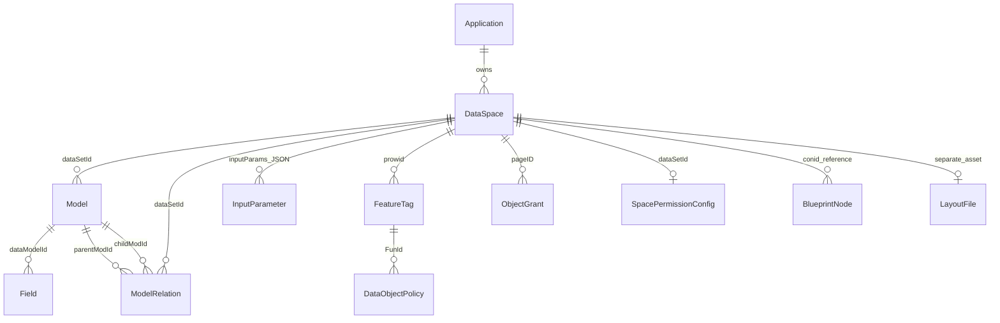
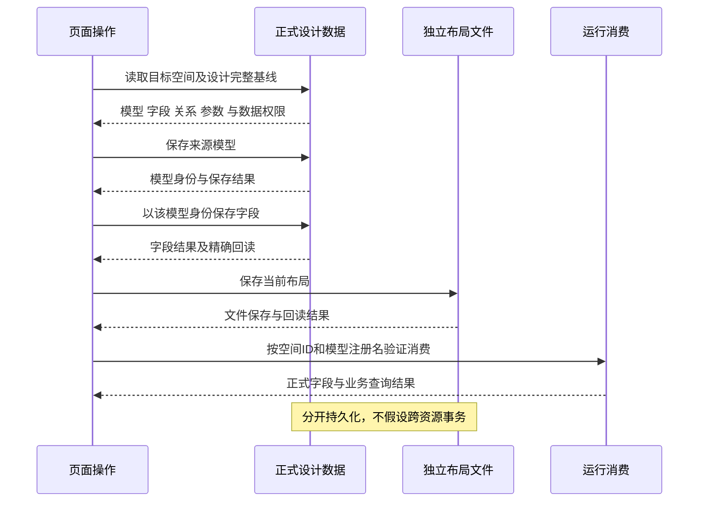

# 数据空间原页面语义分析与迁移依据

状态：按用户最新要求暂停界面，先建立元数据空间 DataSet。唯一业务输入为被设计空间 ID；2026-10-08 线上已核元数据空间已有输入参数 formid、四个正式元模型及一条空间→模型关系。当前实现计划为 `notes/plan-data-space-metadata-dataset.md`。下文历史实现状态须结合对应验收记录；未上传视图页签候选。

## 当前输入输出合同

“数据空间的数据空间”是设计器的数据合同：元数据 DataSet 的身份固定为正式设计场景，输入 formid 为被设计空间 ID；四个 DataTable 分别承接空间记录、模型记录、字段记录和模型关系记录，每表包含正式 columns 与多个命名 DataView。空间记录按 rowid 过滤，其余按 dataSetId 过滤；过滤值来自 GetInputParam(formid)。原生 DataSet 的 resourceRelations 来自正式元模型关系，不能与 Base_DataModel_Relation 表中查询出来的目标关系记录混淆；viewCascades 另行配置。字段和模型真源仍是数据库，目标 DataView 配置仍由现有 ScenarioViewFile 维护，不发明后端视图表。在线结构证据见 `notes/evidence/sparkproject-appworks-integration/four-file-correction/metadata-dataset/contract.json`。

## 1. 分析对象与证据边界

这是首份页面业务分析，已覆盖原数据空间目录、它打开的设计器及部分直接下游；按用户补充的数据空间定义，功能标签及授权等旁侧配置一并纳入语义范围，其具体用例和生效链继续核实。其余 AppWorks 页面仍须逐页完成同样分析，不能从这份样板推断全仓功能已掌握。

- 原仓：`E:/r/sparkproject`，提交 `842dec4f11b333df904b9a4e26b6566b0802bab8`。本轮核实 HEAD 一致，数据空间 UI/API 路径无未提交修改。
- 目标：`D:/SPARK_AppWorks` 当前工作树。已有实现只是待核对资产，不能反过来裁剪原页面需求。
- 文中区分：**原实现事实**（源码可证）、**迁移要求**（用户约束及设计决定）、**待实证**（需接口/运行结果）。分析不是上线验收报告。
- 前端只有数据权限，没有角色模型、角色判断或角色映射。admin 只是测试账号，不产生额外权限。前端消费当次正式查询返回的表、行、字段权限，不决定服务端授权。
- 功能标签、数据对象策略及授权配置属于数据空间业务，必须保留；排除旧前端角色机制不等于排除整个授权配置域。现有 API 中出现角色类型仅说明存在目标差距，不改变用户确认的原则。

用户确认的恢复顺序是：**完整语义梳理 → 按语义恢复 → 对照原页面找差距并恢复细节**。第一步把目的、流程、数据结构、输入输出、异常讲清；第二步在当前底座和四文件中恢复完整业务结果；第三步才以原页面逐项核对操作、交互与边界细节。数据权限、身份、持久结果和异常语义属于前两步核心，不能留到细节阶段。

## 2. 业务目的：这一页到底产出什么

**数据空间是 SPARK 前后端数据交换中心。** 这是用户确认的产品定义，不应缩成模型关系设计器。目录负责定位和维护空间，设计器及关联配置页共同维护其交换合同：

| 方向 | 输入 | 组织和配置 | 输出与消费 |
| --- | --- | --- | --- |
| 上接页面功能语义 | 业务目的、操作流程、调用参数和页面需要的结果 | 前端所需模型、字段、关系、参数与处理配置 | 页面/场景可消费的数据结构及查询、处理合同；不能从物理表直接推定页面需求 |
| 下接后端资源 | 多种后端来源及其正式合同 | 来源定位、字段映射、请求条件、依赖与处理目标 | 按空间身份和模型注册名获取或处理后端数据；各来源分别核实 |
| 旁接功能标签与配置 | 空间关联标签、数据对象策略、授权等配置 | 标签与对象/字段、条件及授权记录的关联和维护 | 配置持久结果，以及由服务端返回、前端消费的数据权限；二者分别验证 |

这三个方向形成完整语义，不要求把所有维护操作塞入同一页面；必须保留各自入口、关联和责任，不能因旧源码有角色分支而漏掉旁侧配置。

用户确认这套体系的两个核心意义：**配置驱动**，以及**让前端页面开发流程化、标准化，封装公共的通用逻辑**。因此，本页分析既要说明交换什么数据，也要说明业务语义如何形成正式配置、配置如何由公共运行时执行。每项恢复用例须区分配置、公共能力与本页业务差异；已有公共能力按实际合同复用，真实缺口单列，不能让每个页面重写查询、状态、数据权限消费和保存等通用逻辑。

可重复的页面开发流程是：业务语义 → 数据空间合同 → 页面配置与绑定 → 必要业务编排 → 标准验收。完整样板还应证明其他页面可以沿此流程复用公共能力；文件形式正确和功能等价都不能单独证明这两个设计目的已经达成。

该业务链有四个不同层次的成果，必须分别验收：

1. **业务元数据**：空间记录、模型、字段、模型关系、输入参数。更改这些会影响后续模型装配或运行请求。
2. **旁侧业务配置**：功能标签、空间默认权限、数据对象策略与授权记录。维护这些记录所需的数据权限，与它们对业务查询产生的授权结果分开核实；不在前端重建授权决策。
3. **设计表现**：独立的关系画布布局文件。坐标变化不等于模型合同变化，布局保存成功也不等于业务元数据都保存成功。
4. **消费与影响信息**：复制出来的调用常量、预览结果、绑定到空间的蓝图路径。这些是读出的信息，不是发布动作或另建数据源。

典型工作链：明确页面业务目的及所需输入输出 → 进入应用范围并查找/创建空间 → 选择后端来源并形成前端模型结构 → 配置字段、参数、关系与处理目标 → 关联功能标签及授权等配置 → 保存并重开 → 在页面/场景中查询或处理数据并核验数据权限。预览用于核对交换结果，目录“查询绑定”反查消费影响范围。这是语义顺序，不声称原 UI 强制按此顺序操作。

业务例子（说明语义，非真实测试数据）：订单空间包含“订单”和“明细”两个注册模型。两者各有稳定模型 ID 和来源名，关系把当前订单字段带入明细查询；调用方按空间身份和模型注册名读取。移动两个节点只修改布局；修改输出字段会改变下游能获得的数据；改模型注册名可能影响原调用方，不能按改标题处理。

## 3. 边界与上下文输入

### 3.1 目标领域归属与参考实现覆盖范围

用户最新明确：**数据空间对应 DataSet，模型对应 DataTable，DataTable 包含字段和多个 DataView**。设计器与配置应遵循本仓这一结构；DataView 归属具体模型，按本仓合同配置并承接独立的查询及交互状态。源码直接依据：`DataSet.tables`、`DataTable.columns`、`DataTable.views` 与 `DataView.dataTable`。模型关系与数据级联是两类关系：前者以过滤表达式定义模型之间的稳定结构；后者由一个或多个父字段当前值驱动具体视图中目标字段值与选项。

此前“sparkproject 数据空间与本仓 DataSet 不完全一致、原仓只使用模型层”描述参考实现覆盖范围，不否定上述领域映射。参考模型合同经本仓装配形成 DataTable，再复用多个 DataView；正式定义、配置存储与运行实例仍有各自生命周期，不能把参考仓数据对象直接当成运行实例。现有 viewCascades 的查询依赖机制也不能单独证明完整数据输入级联已实现。

| 层次 | 固定参考实现 | 本仓实际承接及边界 |
| --- | --- | --- |
| 空间与正式模型 | `Base_DataSet`、`Base_DataModel`、`Base_DataModel_Field`、`Base_DataModel_Relation`；模型、来源、参数和关系合同 | `readModel/readRelations` 读取正式定义；装配器核模型身份，生成 DataTable 定义与绑定。原元数据记录不是运行实例 |
| 页面视图配置 | 不能从原空间模型合同推导出本仓命名视图机制 | 一个模型对应多个 DataView；`ScenarioViewConfig`/`pagedata.json` 声明 modelBinding、多命名 views 和显式 viewCascades。模型定义共享，视图输入和状态各自独立；级联端点必须包含 viewId，拒绝塞入正式模型真源和运行数据 |
| 页面运行 | 参考预览按 `{scenarioId: dataSpaceId, metaName: model.Name}` 查询模型；批量预览另行编排 | `loadScenarioDataSet` 将正式模型、关系与场景配置装配为 DataSet，PageRuntime 每次调用独占实例；DataView 管理查询结果和交互状态 |
| 模型关系 | 原模型关系含模型端点、依赖、过滤及删除配置 | 用户明确本仓以过滤表达式定义模型关系；稳定的是定义，不能限定为等值字段映射。当前 resourceRelations/适配器的字段映射承载不足是待修差距，不能丢弃合法关系或缩减产品语义；页面选择/输入/查询不改关系定义 |
| 数据输入级联 | 不能据原关系中的 depType 推导本仓前端交互规则 | 用户要求父字段值变化驱动目标字段值与可选项，且一个子字段可依赖多个父字段。本仓现有 viewCascades 是视图查询依赖，尚不满足这一语义；不能由模型关系或选項视图关系代替真实字段级联 |
| 设计器本身 | 以设计场景查询目标空间的模型记录，再以目标空间身份预览 | 四文件设计页自己的 DataSet/DataView 用于读写元数据；被设计空间及其未来运行实例是另一对象，身份和持久结果分别验证 |

当前源码依据：参考 `apps/appworks/src/data/api/data-set/design/{contracts.ts,data-space-design.ts,preview.ts}` 固定提交；本仓 `packages/spark-data/src/{dataset.ts,data-table.ts}`、`packages/spark-project-model/src/{scenario/scenario-view-config.ts,page/runtime-page.ts}`、`src/lowcode/data-space/{lowcode-data-space-runtime.ts,lowcode-data-space-assembler.ts}`。`loadScenarioDataSet` 的真实输入是正式模型/关系加场景视图配置，绝非将参考空间对象直接转成 DataSet JSON。

对当前实现的复核门：设计页通过 DataSet.saveChanges 修改设计元数据这一机制可以复用，但必须核实它写入的是设计场景的正确模型和目标记录；fixture 通过不证明线上完整合同。模型 `Filter`、字段 `ValueFun/type=inputParams` 是被编辑的设计内容，不能因为编辑器自身也有 DataView.filterExpression 或运行 inputParams，就将二者合并。恢复原模型层业务后，由本仓原有运行管线消费其结果；不搬入参考页的第二套通用运行逻辑。

用户进一步明确两层关系后发现的现有差距：`LowcodeModelRelationAdapter` 同时生成 resourceRelations 和默认视图 viewCascades，装配器在场景未指定 viewCascades 时采用后者；适配器还用 dependencyType 是否可识别来筛掉结构关系。该行为与稳定模型关系/纯前端输入级联分离的目标不符。需移除默认级联推导和结构映射的 dependencyType 门槛，明确配置的前端级联继续通过原 DataSet 机制运行；未配置时不能触发额外父查询或附加联动过滤。此处是发现及待验证修复要求，不表示修复已完成。

进一步纠正：主控曾把“显式到命名视图”视为输入级联的充分条件，该判断失效。实际 `DataView.updateEditingValue` 发出含 viewId/rowId/field/previousValue/nextValue 的 editingFieldChanged；现有 CascadeDelegate 订阅 rowsChanged/currentRowChanged/selectedRowsChanged 等视图事件，而不是父字段编辑事件。useFieldOptions 读取 optionDataViewKey 的选项，未见父字段值到子字段编辑值与选项联动的配置执行链。多父字段、同一行的编辑值、目标值策略、选项输入映射和异步代次需在重新设计中一起覆盖。另有现存查询路径缺口：CascadeDelegate 仅用 crudService 判是否远程，在正式 query executor 场景误走内存过滤；已保留失败证据，不借这次概念纠正盲改通用引擎。

模型关系表达式的实施前核查：`DataSpaceDesignApi.readRelations` 已通过正式 codec 返回完整 `DataViewFilter`；原适配器只接受 AND + eq + GetTableField，其余整条关系丢弃并诊断。该差距现已修复：DataResourceRelation 使用必填过滤树，适配/往返/CRUD/引用维护与既有聚合消费者已接通。主控根类型、数据包类型及 647 项、宿主 48 项、精确 lint 与门禁通过；详见 `model-relation-expression-review.md`。模型关系仍不承担多父字段输入级联。服务端函数不在本地模拟，多关系/命名视图的显式聚合选择仍未实现。

实施前影响面（以下保留发现依据；当前实现与验收以以上段落及审查记录为准）：

| 当前落点 | 当前事实与下一步约束 |
| --- | --- |
| `spark-data/src/types.ts` 的 DataResourceRelation | `condition` 明确标注预留且不消费，不能把表达式放进去就报告完成；正式合同须承载完整、强类型的过滤树 |
| `spark-data/src/dataset.ts` 的关系读写 | JSON读取主要校验两侧表名；新增/更新仍围绕父子字段校验和判重。表达式须参与校验与无损往返，关系身份不能只靠字段对定位 |
| `spark-data/src/dataset-crud-tool.ts` | 列删除保护只查字段映射；改列通用遍历未覆盖 GetTableField.Field 及两侧限定名，改表未改表达式限定名。须同时维护引用，不能留下可保存但已失效的关系 |
| `spark-data/src/strategies/computed-column-delegate.ts` | 聚合只取同 childTable 的首条关系，固定读取 default 视图，再等值匹配。完整表达式消费、同端点多关系身份和实际视图选择尚有缺口，不能根据模型名擅选视图 |
| `spark-data/src/query/filter/data-view-filter-local.ts` | 支持完整公开树的本地操作符、常量和当前单行 GetTableField；不具备父/子双域，也明确拒绝服务端值函数。可复用已有能力，但不得模拟未经证实的服务端函数 |
| `DataSet.getSaveChangesTableOrder` | 保存顺序只消费关系端点，继续与条件求值、前端字段级联分开；关系条件本身不被页面交互改写 |

验收应覆盖非等值、OR/AND嵌套、常量/受支持值函数、序列化往返、引用维护、同模型多视图与多关系消歧，并验证不自动派生输入级联。纯结构通过不等于运行求值通过。过滤式模型关系和多父字段输入级联分别记录合同与用例。

### 3.2 身份与调用输入

| 输入 | 原实现来源和语义 | 约束/输出影响 |
| --- | --- | --- |
| 租户/执行域 | runtime.execution.capture 与 assertCurrent | 页面离开、作用域变化后，迟到结果不得覆盖新页面 |
| 目录查询场景 | deliveredPageContext.scenarioId | 表名相同不代表查询场景相同；不能把设计场景当目录场景 |
| 应用范围 | navigation contexts + host inputs → useApplicationScopeBinding | 唯一宿主应用时锁定查询/新增归属并隐藏应用选择；无绑定时由用户选择。多个宿主维度未指明入口关系时显式报错 |
| 目录搜索 | 名称或 ID、应用、页号、页大小 | `(Name contains keyword OR rowid = keyword) AND sysid = application`，创建时间倒序；不是前端截断全表 |
| 设计目标 | 当前目录行 rowid → DataSetDesign 的 rowid prop | 是被设计空间 ID，不是设计器自身场景 ID |
| 设计控制场景 | 原入口明确使用 8D1AB14DD8277F3E7017CD38F77B09FD | 在该场景读取目标空间的模型/字段等设计资源 |
| 蓝图读取场景 | runtime.api.blueprint.scenarioId 解析正式蓝图场景 | 读取目标应用完整蓝图，再按空间绑定筛选；不是直接使用目录 owner 的旧导航查询方法 |
| 操作权限 | 当次 queryContext → 数据权限消费接口 | 数据可见与可写分别判断；读到名称不代表有权编辑/删除 |

**必须避免的身份混淆**：应用 ID、目录查询场景 ID、设计控制场景 ID、被设计空间 ID、页面工具 ID、模型 ID、模型注册名、物理来源名、蓝图 nodeId 各有职责，不能互相填补。

## 4. 领域数据与关联

图中 InputParameter 是 JSON 数组内元素，LayoutFile 是文件；这不是要求建立对应数据库表。ObjectGrant 的 functionoption 关联功能标签，DataObjectPolicy 的 ConName 指向模型注册名，须核实际合同，不能按名字猜关联。图表达客户端已用的关联，不承诺数据库外键或唯一约束。关系端点数量/方向由正式关系数据决定，画线不能自行成为正式关系。

| 对象 | 身份与归属 | 核心内容及业务意义 | 真源/持久方式 |
| --- | --- | --- | --- |
| 应用 | Base_AppSystemList.rowid | 名称/描述用于识别所属应用 | 正式应用查询，只作为本页选择和显示来源 |
| 空间 | Base_DataSet.rowid；sysid 指向应用 | Name、description；Type；inputParams | 目录增改删；参数单独更新同一空间行 |
| 模型 | Base_DataModel.rowid；dataSetId 指向空间 | Name 是注册调用名；MetaName 是来源名；Type 和来源标识确定取数机制 | 正式模型记录；不能由画布内容取代 |
| 字段 | Base_DataModel_Field.rowid；dataModelId 与 dataSetId | 源字段/输出别名、数据类型、主键、输出、计算、排序分组等 | 正式字段记录；展示列不是全部字段合同 |
| 关系 | Base_DataModel_Relation.rowid；空间及父/子模型 ID | 依赖类型、过滤、联表相关设置与删除相关信息 | 正式关系与相关模型字段；与图文件分别保存 |
| 输入参数定义 | 空间 inputParams JSON 内的稳定 rowid | Name、Description、IsBusParam；这是调用参数定义，不是本次运行参数值 | 整体序列化回 Base_DataSet.inputParams |
| 功能标签 | _Base_FunctionNode.rowid；prowid 关联空间 | 标签名称及相关配置入口 | 原授权 API 的标签读取与维护；不是前端权限角色 |
| 对象策略 | Base_FunctionDetail.rowid；FunId 关联标签，ConName 指模型注册名 | 对象操作、条件及字段策略 | 持久配置；实际如何影响运行查询须另核服务合同 |
| 空间默认权限 | Base_DataSet_Config；dataSetId 关联空间 | DefaultPermission | 读取/维护配置；不能由前端自行解释为运行放行 |
| 授权记录 | FunctionNodeAuth.rowid；pageID 关联空间，functionoption 引用标签 | 标签授权及相关作用范围 | 保留有效配置与关联；旧角色建模部分不能原样作为目标合同 |
| 布局 | 目标空间对应文件 | 节点坐标、连线表现与图版本 | 场景文件能力；不是 pagedata.json，也不是业务表 |
| 蓝图绑定 | nodeId；应用；conid 引用空间 | 功能路径和导航地址 | 本页只读影响范围，不修改绑定 |
| 创建人显示 | 空间 createuser 保存业务用户标识 | 查询 Base_UserInfo.ROWID → UserName，保留原标识用于关联 | 显示投影不写回；无法解析须标明，不能拿姓名充当 ID |

详细字段合同、不同来源结构与下游使用在数据分析附件中核对；不能从本概览推断未列字段可以丢弃。

## 5. 目录完整用例：输入、过程、输出

| 编号/业务任务 | 前置条件与输入 | 原实现过程 | 输出与结束条件 | 异常/取消 |
| --- | --- | --- | --- | --- |
| C01 定位空间 | 当前应用范围；搜索/分页参数 | 正式查询 Base_DataSet，关联创建人及应用显示 | 列表、服务端 total、当前选中行；筛选重置到第一页 | 失败清查询权限上下文；迟到响应丢弃；创建人未解析单独提示 |
| C02 新建空间 | 表级允许新增；正式应用、名称、描述 | UI 名称必填；长度限制 100/500；提交 trim；Type 固定 datasource；创建正式记录 | 空间记录及新身份，刷新目录 | 取消不写；无正式应用拒绝。仅 await 原调用并提示成功不是精确回读证明 |
| C03 维护空间 | 当前行和可写字段；名称/描述 | 原 UI 禁止修改应用；更新按 rowid；不改 Type | 同一空间的名称/描述变化 | 不可写字段应保留；取消不写。目标实现还需提交时重核字段权限及新值 |
| C04 删除空间 | 当前行允许删除；确认目标名称 | 原 owner 只对 Base_DataSet 发 remove | 刷新列表；页末唯一行被删则退一页 | 取消不写；原代码未证明服务端会清模型、字段、关系或绑定，不可宣称级联清理 |
| C05 设计空间 | 当前有效空间身份 | 当前行 rowid 传给设计器 | 该空间的模型设计工作台 | 空间加载失败不可当空设计；切换空间不能串用旧数据 |
| C06 获取调用信息 | 当前空间；可读取模型与字段 | readApiInfo → buildDataSetApiInfoText → clipboard | 文本含 DataSetId、模型注册名/类型/主键常量 | 复制失败单独报错；这不是执行 API 或发布。原 helper 主键缺失时写 rowid，目标不可据此认定真实主键 |
| C07 查影响范围 | 当前行空间 ID、所属应用 | 读取同应用完整蓝图 → 核身份和 conid 可读性 → 组父链路径 → 筛 conid | nodeId、完整功能路径、导航地址 | 重复 ID、缺父节点、循环父链、隐藏/脱敏 conid、读不完整时报错；不能伪装“无绑定” |
| C08 切应用/关闭 | 新宿主应用或卸载 | 清选中/弹窗/权限/列表，推进请求代次，重新查询 | 新范围的干净界面 | 旧异步结果不能回填；不意味着服务端已回滚旧请求 |

“功能存在”和“语义正确”分开：源目录直接 await CRUD 后提示成功、API 文本主键兜底等是待改进的原实现事实，不是必须照搬的产品规则。

## 6. 设计器用例与输入输出

详细证据：[交互语义](./evidence/sparkproject-appworks-integration/four-file-correction/semantic-interaction-analysis.md)、[数据合同及消费者](./evidence/sparkproject-appworks-integration/four-file-correction/semantic-data-analysis.md)。两份附件给出源码符号与行号；以下为主控合并后的业务合同，后列冲突优先于附件的概括。

| 编号/任务 | 输入和业务规则 | 实际输出/持久边界 | 取消、失败与验收重点 |
| --- | --- | --- | --- |
| D01 打开完整设计 | 空间 ID、设计场景、当次数据权限 | 完整空间/模型/字段/关系/参数/依赖字典与图；显示主业务模型和统计 | 任一读取失败不能显示为空设计；空间切换后旧响应失效 |
| D02 编排模型与画布 | 新建占位节点、位置、选择、缩放、对齐 | 临时节点或布局草稿；双击打开节点/关系配置 | 新增节点不等于新增模型；布局变更不等于业务保存 |
| D03 选择来源并创建模型 | 六种来源的真实候选、唯一注册名；来源可筛选/分页 | 正式模型 → 来源字段/入参字段 → 正式字段 → 刷新 → 布局 | 保留来源身份与业务模型身份区别；中途失败可能只建了模型；不能重复创建凑成功 |
| D04 替换模型来源/同步来源 | 现有模型 ID、新来源；替换保留模型 Name | 替换来源确认会持久化；“从来源更新字段”先读取差异到本地草稿，明确保存才写 | 来源替换和普通按 Name 合并同步不是同一算法；须证明计算字段、其他类别字段及用户设置去留；打开面板本身不隐式写字段 |
| D05 编辑模型/字段合同 | 模型名；字段描述、别名、输出、值函数、排序分组；计算字段增删 | 模型保存与字段 Added/Changed/Deleted 分开；合同变更前核基线，部分路径回读校验 | 名称唯一；主键须输出且非计算；源字段名只读，计算字段可改名；冲突不覆盖最新合同 |
| D06 配置请求 | Filter、模型级输入字段、业务标志、OutputType、自引用、缓存、完成事件 | 持久到模型/字段记录；和“元模型”保存合并，不执行实际业务写操作 | 接口/逻辑视图采用入参字段路径，其余显示过滤器；运行含义须用实际查询验证 |
| D07 单模型预览 | 当前草稿模型、输出字段/排序、过滤、测试入参、分页或树参数 | 调运行场景 `scenarioId=dataSpaceId, metaName=Name`，输出响应/数据 JSON 与样例表格 | 不保存设计；关闭清结果；失败不留旧结果冒充新结果；预览草稿成功不等于正式保存 |
| D08 前端模型输出 | 输出字段投影、脱敏表达式、既有 allowAIAdd 标记 | 修改对应字段 Expression/allowAIAdd；重读字段与图 | “生成输出”会重建本地投影；脱敏表达式不代替后端字段数据权限；不迁入参考新增 AI |
| D09 数组模型 | 名称、表头定义、唯一主键、行数据；表头名称唯一 | 模型 items JSON + 字段记录分别保存；表头改名按身份迁移行值 | 行草稿/弹窗取消不写；模型成功字段失败属于部分成功；重开核表头与每行值 |
| D10 数据处理配置 | owner 模型；新增/编辑/删除各自目标模型和字段值函数 | 暂存目标在最终保存时与 owner 的 addApi/updateApi/deleteApi、目标模型/字段一起持久 | 此处保存处理配置，不是执行业务增删改；换页签/目标有保存、放弃、取消路径 |
| D11 配置/删除模型关系 | 同空间父/子模型、depType、关系 filter；可选 JoinType/ForeignKeyFields/JoinFilter | 关系记录 + 子模型联表字段同批保存、独立回读，再写图；PId 在有联表条件时派生父 Name | 联表三项须全空或齐全；关系 filter 与 JoinFilter 不可混用；临时边零业务写；结果未知锁定重复提交 |
| D12 维护空间参数 | Name、Description、IsBusParam、稳定参数 rowid | 整体写 Base_DataSet.inputParams JSON | Name 必填，源未要求重名唯一；取消零写；保留既有扩展属性和身份，重开核对 |
| D13 保存布局/重建缺失布局 | 当前图 JSON；或明确文件缺失时的正式模型关系快照 | 普通保存写独立文件；重建先只读预览，再核 fingerprint/文件仍缺失、写后逐字回读 | 已有损坏文件不属于缺失重建授权；原自定义坐标不能靠自动排布恢复；业务数据不随重建修改 |
| D14 删除模型/关系 | 当前选中持久元素或临时元素 | 临时元素只删图；正式模型涉及字段、关系及数据处理关联等资源；随后保存图 | 原代码多段删除且无事务证明；必须展示确切影响集合，不能只删画布或笼统报告失败 |
| D15 导出调用信息 | 当前模型/字段快照或正式读取 | 剪贴板调用常量；同 C06 | 不执行查询、不发布；必须区分当前草稿快照和已持久合同 |

### 6.1 六种来源不是一个通用表选择器

| 来源 | 候选资源 | 模型来源定位 | 初始字段与重要差异 |
| --- | --- | --- | --- |
| 数据库表 | View_TblList | MetaName=tblname；DbId=dbid；DTO DatabaseName 保存为 DbName | 来源字段读 Base_TblField；正式运行合同另核唯一有效非租户主键 |
| 数据库视图 | View_ViewList | MetaName=vewname；DbId=dbid | 不可因同有 rowid 列就推断它被声明为正式主键 |
| 字典 | _Base_DictType | 来源 TypeName、来源 rowid | rowid/val/txt/ordIdx 静态字段；全部输出、ordIdx 升序；模型 Type 取“字典”标签；sourceTableMap.dict.type 在已读查询链未被消费，不能解释为保存 Type 或筛选条件 |
| 接口 | Base_DataServiceInterface | 来源 Name、ProviderID（源代码存在退回来源 rowid 路径） | 输出字段及 _Base_ParamList 入参；普通新增与绑定来源同步的输出默认值路径不同，不能合并成统一规则 |
| JSON | Base_JsonData | 来源 name、来源 rowid | id/pid/name/type/haschild/value 静态字段；现有全空间预览明确排除此类型，不能声称所有类型同样预览 |
| 逻辑视图（UI“视图”） | Base_DataViewList | 来源 name、来源 rowid | 来源字段 + _Base_ParamList 入参；UI 与 normalizeSourceType 共同证实 logicView/视图对应 |

六类都支持来源选择，但数组模型是节点面板的另一条编辑路径；不能因为不在来源 tabs 中而漏掉数组。数据处理也借用此选择器，却先暂存而不是立即建立正式模型。

### 6.2 参数、模型标志、字段与关系的精确含义

- 空间级 inputParams 是调用参数定义；模型字段 `type=inputParams` 是接口/逻辑视图来源入参映射。当前查询的参数值又是第三件事，由调用方或预览测试输入提供。
- `IsBusParam` 已找到报表界面的“业务参数”标签消费，尚不能断言它会改变过滤或授权。`IsBusinessMain`/`IsBusiness` 被流程/主业务模型选择消费，是业务结构标志，不是权限。
- `Name` 与 `AsName` 决定字段及其输出名称；正式主键必须映射到唯一有效输出字段。主键、别名、输出和计算定义的变化会改变运行合同。
- `depType/cascadeDel` 是已存关系数据；现有全空间预览只依据关系图和 filter 执行，并不解释它们全部业务含义。不能把该预览的实现当全部运行语义。
- `addApi/updateApi/deleteApi` 在本页是模型处理目标配置；“数据处理保存”不等于已经对业务表执行三个操作。
- 预览 API 具备全空间按依赖查询能力；当前页面明确可达的是节点预览。API 存在不自动算作页面存在一个“全空间预览”按钮。

### 6.3 关键流程示意

这是迁移验收要求的正常流程；原普通创建路径并非每一步都有精确回读，因此图示不表示原实现已经保证全部步骤。

### 6.4 旁侧配置用例：功能标签、策略及授权关联

详细源符号及字段证据见[侧向配置分析](./evidence/sparkproject-appworks-integration/four-file-correction/semantic-data-analysis.md)。S 编号表示数据空间语义的旁侧配置链，不意味着全部控件必须放进图设计页；维护入口、空间关联与返回路径必须纳入恢复清单。

| 用例 | 输入与操作流程 | 输出及持久边界 | 异常路径与目标差距 |
| --- | --- | --- | --- |
| S01 空间默认权限 | 当前空间 ID → 读 Base_DataSet_Config → 编辑 DefaultPermission → 按已有 id 更新或新增 | 同一空间的配置值；原 UI 后续还顺序保存 dirty 对象策略 | 原读取取首条，未证明重复配置的唯一性保障；后续策略失败不能抹去前段成功。目标 PermissionApi 尚无该配置读写路径；标记含义须由服务合同确认 |
| S02 功能标签维护 | 按 prowid=空间 ID 读标签；输入标签名称，新增或修改 Nodetext | _Base_FunctionNode 的标签身份、名称及空间归属 | 当前配置数据权限、必需身份及空间切换分别检查；目标已有标签只读投影，prepareMutation 不执行写入 |
| S03 删除标签并处理授权引用 | 选定标签 → 完整读取同空间 FunctionNodeAuth.functionoption → 核可见/可写 → 移除该标签 ID，保留其他标签 → 保存 | 原实现同请求删除标签并更新授权引用，随后分别读回 | 引用不完整、无权修改、结果未知或读回不符须显式失败；不自动重复删除，不宣称跨资源原子事务，也不推断其他策略记录会被服务端级联清理 |
| S04 数据对象策略 | 选择标签与模型注册名 → 按 FunId+ConName 读取 → 编辑对象操作、条件及字段策略 → 保存 | Base_FunctionDetail：allowAddData、AllowAddChildFilter、ShowFilter、AllowEditFilter、AllowDeleteFilter、EditDataSaveFilter、AllowEditFields、RequiredFields、DesensitizationFields、displayNoneFields 等 | 目标 DTO 未完整映射原字段；AllowAddFilter 与 AllowAddChildFilter、AllowShowFields 与原可见/隐藏/脱敏配置不能假定等价。原路径未统一精确回读，恢复后须核保存字段及重开 |
| S05 授权关联与运行验证 | 核空间 pageID、functionoption 标签引用、有效配置作用范围；同空间/模型发起正式业务查询 | 配置记录的持久结果、后端功能响应以及当次表/行/字段数据权限，各自保留证据 | 目标现有 granttype 到 role/position/user 的类型映射属于与前端无角色原则的差距；不能原样迁入。当前只证实 GetFormUserFunction 读取 childFun/allowAdd，配置到查询回执的服务端生效链尚待证实 |

配置维护自身也受数据权限约束；修改策略记录所需的权限与该策略最终控制的业务数据权限不是一回事。前端既不能从静态标签/策略自行放行，也不能因没有角色模型而删掉配置维护能力。

## 7. 状态与一致性要求

**业务状态**：未加载 → 加载完整设计 → 可查看/可编辑 → 本地变更 → 保存中 → 回执确认 → 精确回读 → 可继续消费。失败分为未提交、明确失败、部分成功、结果未知、读回失败，不能统称“保存失败后重试”。这是目标状态设计，原实现各路径保障程度须逐条核对。

- 取消本地表单应零写；已提交的请求不能靠关闭弹窗撤销。
- 正式数据与图文件是两个持久边界。模型/关系已成功而布局失败时，显示各自结果，不宣称全部回滚。
- 加载失败与真实空空间不同；缺失布局与空布局不同；无权读取与没有记录不同。
- 保存前校验本次目标身份、有效查询状态、允许动作及实际修改字段；保存后核相同身份与字段，再重新打开验证。
- 同一空间的两个页面实例、切换应用、关闭重开、在途返回，都必须按本仓已有 PageRuntime/DataSet 生命周期处理。
- 并发修改和未知回执的具体恢复能力依当前服务合同，未证明事务、版本锁或自动补偿时不得写进承诺。

## 8. 从业务语义到四文件设计

| 语义职责 | 四文件/现有底座落点 | 必须保持的边界 |
| --- | --- | --- |
| 用户看到的目录、表单、弹窗、工具栏、属性面板 | rule.json 组件树、数据绑定与事件 | 页面业务结构可审阅；不能套一个整页 Vue 壳冒充转换 |
| C01-C08 与设计器用例的流程、校验、提示、返回 | script.js 薄编排，既有正式宿主能力 | 不另造查询/保存/权限 owner；不把页面本地数据当正式记录 |
| 布局和视觉 | style.css，按页面实例隔离 | 不影响其他标签页 |
| 查询哪些正式模型、视图如何筛选排序与级联 | 共享场景 pagedata.json | modelBinding 引用正式模型；禁止放正式模型副本、运行数据或凭据 |
| 图画布、专用字段编辑交互 | 当前组件或必要的窄组件 | 组件处理交互，业务目标/权限/持久化仍归页面和正式数据层 |
| 正式业务数据写入 | 本次 PageRuntime 的 DataSet/DataView 与统一 owner | pagedata 文件保存不是业务保存；不同场景不混用 |
| 设计图持久化 | 既有独立布局文件 API 的受限宿主能力 | 与工具三文件、共享场景文件分别核回执 |

当前静态代码核对：目录已有 CRUD、复制 API、绑定、打开设计的脚本入口；设计页已有读取、只读图、参数编辑入口，但模型/字段/关系完整写流程未在该脚本中出现。正式菜单仍映射 DataSpaceCatalogPage.vue。因此不能宣称样板已完整或正式入口已替换。

## 9. 软件开发全过程与交付门

| 阶段 | 本页面必须回答的问题 | 产物/通过标准 |
| --- | --- | --- |
| 需求分析 | 为什么用、完成什么业务任务、边界是什么 | 本文用例与范围，原行为/目标要求/未证实项分开 |
| 领域与数据分析 | 哪些实体、身份、关联、来源和消费者 | 数据字典、关系图、读写与下游影响表 |
| 可行性分析 | 每项操作有没有现有 API、数据权限和组件承接 | 逐用例标“已有/需补齐/待合同核实”，缺口不能用假按钮替代 |
| 总体设计 | 页面、共享场景、运行实例与数据 owner 怎样协作 | 四文件职责映射和明确持久边界 |
| 详细设计 | 每次输入怎样校验、状态怎样转移、失败怎样恢复 | 每用例输入/输出/请求顺序/权限/异常表；不先扩公共框架 |
| 实施 | 如何交付一个完整可用页面 | 单页由一名低阶执行者负责，主控验收；现有有效代码按语义复用 |
| 验证 | 怎样证明行为和下游结果都成立 | 需求 ID → 源码 → 目标落点 → 自动化/真实操作证据逐项追踪 |
| 入口切换 | 真实用户怎样进入新页面 | 四文件保存读回、正式 URL/nodeId/参数和标签生命周期验证后切入口 |
| 回归与交付 | 是否破坏既有能力 | 类型/lint/相关测试/构建与真实样板完整流程；现有 AI/蓝图/页面设计保持可用 |
| 后续维护 | 谁能定位失败、重现问题与继续迁移 | 明确错误状态与证据、受影响合同清单；下一页复制语义分析方法，不复制业务假设 |

本轮只完成分析及设计依据，未执行后续实施/上线。零回归是最终验收目标，不是源码阅读或历史绿灯能证明的结论。

## 10. 验收追踪规则

每一项用例都记录：源入口/合同 → 四文件目标 → 输入数据 → 期望可见输出 → 期望持久结果 → 下游消费 → 权限与失败用例 → 当前证据。无证据记“未验”，不以“测试通过 N 项”替代。

共用验收维度：正常路径；取消零写；读取隐藏/脱敏、写拒绝、必填、删除拒绝；目标切换/迟到响应；网络失败与未知回执；保存读回与重开；已有数据兼容；下游绑定与预览。测试权限来自正式查询管线夹具，无角色测试分组。

### 10.1 可行性与当前缺口

| 用例 | 已有承接基础 | 仍要解决/证明 | 证明方式 |
| --- | --- | --- | --- |
| C01-C08 | 目录四文件已有对应入口和正式视图 | 完整应用范围行为、字段权限、删除后关联边界、正式入口替换 | 当前四文件逐操作＋同身份回读＋真实旧 URL 重进；历史局部证据不作当前整页结论 |
| D01-D02 | 设计四文件读取、只读图已存在 | 可编辑图与面板流程、草稿/运行实例衔接 | 完整基线、空/错误/权限分支、切页重进 |
| D03-D04 | DataSet/DataView 保存 owner 与来源 API 素材 | 六类可信来源读取和写入合同；keyless 来源不能伪造主键；现来源和目标正式模型合同可能不同 | 逐种来源真实合同只读核对、唯一身份、模型＋字段写后读回；未核实来源保持缺口 |
| D05-D06/D08-D10 | 现有组件、字段/模型资源及脚本机制 | 目标脚本未完整承接节点四个页签、数组与数据处理 | 每类合同变更/取消/部分失败/重开＋下游字段消费，不能以单字段编辑代替 |
| D07 | 原 SPARK 查询/目标运行模型能力 | 草稿投影、输入值函数、输出类型/树查询的具体桥接 | 查询请求与输出逐字段核对；预览零设计写入；隐藏/脱敏不泄露 |
| D11/D14 | 目标已有模型/关系视图与统一保存机制 | 两类正式数据联动、影响集合、未知/部分结果展示 | 不同注册名和来源名样例；关系/模型/字段/引用逐项回读；布局失败独立核实 |
| D12 | 参数编辑已有实现 | 本地关闭竞态增量未验收；参数与下游消费仍需整页验收 | 编辑、取消、保存重开、未知回执与报表/请求输入核对 |
| D13/D15 | 布局只读能力、目录复制 API 文本已有 | 布局写/缺失重建及设计页导出入口尚未完整承接；输出主键不得从兜底推断 | 原文件快照、精确读回、缺失/存在/损坏分支、目录与设计页分别核导出消费 |
| S01-S05 | PermissionDesignApi 标签/策略/授权只读及 mutation prepare；PermissionRuntimeApi 读取后端功能响应 | 默认配置入口缺失、策略字段投影有损、旧角色类型不符合目标；尚未证明配置到运行查询的生效链 | 按字段对照正式配置、保存回执、重开结果与同空间同模型查询权限；保留当前权限消费方，不自行合成授权 |

### 10.2 原实现冲突与待裁定项

1. **关系名冲突（源码已证实）**：关系面板 `assignForm` 将 parentTable/childTable 设为 `MetaName || Name`，全空间预览 `topologicalSortModels` 却要求等于模型 `Name`。当注册名与来源名不同会发生合同冲突。迁移必须统一真实运行合同，不能逐行照搬；仅普通同名样例不足以验收。
2. **改名影响（调用链已证实）**：模型 Name 被 API 常量、预览、子模型 PId 和下游注册调用消费；普通节点保存未展示全引用迁移。保持“可改名”功能要同时设计引用影响处理，不能削成仅改显示标题或假定无需迁移。
3. **保存后果不统一**：普通模型/字段/数据处理、图文件以及关系路径的回读保障不同；原错误提示可能掩盖前段已经成功。目标必须按实际结果显示，不借完整事务或自动回滚的假设简化。
4. **布局缺失和损坏不同**：缺失重建会再次核实文件不存在；已有损坏/旧版本图的内存自动排布不能当已修复文件。其修复是否另设入口要在详细设计中说明。
5. **主业务标志非唯一约束**：源 UI 允许多条 IsBusinessMain，摘要/某些下游取第一条。不能擅自新增全空间唯一限制；兼容样例要包括现存多标记数据。
6. **删除影响**：目录 delete 只明确删除空间主记录；设计器 delete 涉及字段、关系与数据处理目标等多资源，且源未见二次确认。需要逐资源的影响集合与既有后端合同核对，不能承诺未证实级联。
7. **语义尚未证实**：depType/cascadeDel 的完整运行行为、ValueFun/Expression 的具体求值时点、IsBusParam 超出显示的用途、多资源事务等，保持原值并继续查其真实消费者/回执，禁止猜默认或发明产品规则。
8. **旁侧配置不可整体排除**：原 auth.ts 同时包含有效功能标签/默认权限/对象策略/授权引用和旧角色机制，须按业务语义区分。目标 PermissionDesignApi 的字段投影尚不完整，现有角色枚举也不是目标认可的前端合同；不能以“已有 PermissionApi”宣称已完成承接。

这些缺口是分析结果，也是下一轮设计的输入；当前不据此直接修改生产代码。其余领域语义分析尚未进行，仍保留原集成总范围。

## 11. 源码定位与本轮边界

原仓关键定位：

- `apps/appworks/src/ui/features/data-platform/data-set-management/ui/data-set-list-page.vue`：C01-C08 的入口与生命周期。
- `apps/appworks/src/data/api/data-set/list.ts`：AppWorksDataSpaceCatalog 的查询、CRUD、创建人关联；navigationBindingPaths 不是当前页面实际调用路径。
- `apps/appworks/src/data/api/data-set/apiInfo.ts`：复制文本的实际输出格式及主键兜底。
- `apps/appworks/src/ui/features/application/application-scope/model/application-scope-binding.ts`、`apps/appworks/src/ui/app/design-target.ts`：宿主应用输入与作用域。
- `apps/appworks/src/data/api/ApplicationFunMan/project-blueprint-owner.ts::readDataSpaceBindings`：实际影响范围读取及完整性约束；本轮根代理读取相关调用段，未审查整个蓝图业务域。
- `apps/appworks/src/ui/composables/data-table/auth.ts`：前端数据权限消费。
- `apps/appworks/src/data/api/data-set/auth.ts`、`apps/appworks/src/ui/features/data-platform/data-set-management/ui/use-data-set-auth-page.ts`：空间默认权限、功能标签、对象策略及授权关联；具体已读范围见侧向配置分析。

目标仓关键定位：

- `packages/spark-project-model/src/page/page-file.ts`：工具文件是 rule/script/style 三个。
- `packages/spark-project-model/src/scenario/scenario-view-config.ts`：共享场景文件的结构和禁止混入内容。
- `config/pages/data-platform/data-space-catalog/`、`config/pages/data-platform/data-space-design/`：当前试点；存在不等于已验收。
- `packages/spark-lowcode-api/src/platform/data-space/runtime/query/data-space-query-context.ts`：原查询身份、权限与保存基线；本轮只核相关合同，没有改实现。
- `config/navigation/vue-pages.json`：正式目录入口仍为原生页面。
- `packages/spark-lowcode-api/src/platform/permission/design/permission-design-api.ts`、`runtime/permission-runtime-api.ts`：当前侧向配置投影与后端功能响应读取；存在已列目标差距，不能原样视为完整恢复合同。

本轮不修改生产/测试/配置，不运行无关整仓测试，不将本文写入长期 memory 或 knowledge。分析结论先在任务文档中审阅。
