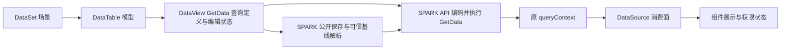

# DataSet 整合的前端契约研读候选

状态：三类骨架、九项决定与 GetData 参数归属已人工确认；本文为契约研读记录。当前工作树已有 P1/P2 改动，后续阶段的精确方案仍需审核；本文更新不是实施批准。

## 最新契约补充（2026-10-06，优先于下文单页面单实例表述）

- 用户要求一页支持多个数据空间，与 sparkproject 统一；一个 DataSet 仍对应一个场景。页面如何持有、寻址与序列化多个 DataSet 正在研读，见 `research-page-multi-data-space.md`，不能把多个场景塞进一个 DataSet 的单一 scenarioId。
- 已确认运行身份只读；绑定变化时，先明确保存/放弃未保存修改，再重建整页运行数据，旧请求与权限失效。需把该决定落实到页面全部数据空间的生命周期，不能仅替换一个实例。
- 已确认保持现有 pagedata 内 DataSet 结构：绑定表 columns 仅为设计显示快照，运行按后端定义重建；发现冲突须处理，不让 JSON 覆盖正式字段定义。页面容纳多份 DataSet 的结构仍待精确方案。
- 上述均为语义/契约确认，未批准新的生产或测试代码变更。
- 多空间寻址已确认：复用 `#dataSetName@tableName@viewId`，页面不自动选第一个空间；二段写法仅在明确选定 DataSet 的局部上下文中有效。同一个 runtime 按每次显式场景身份运行，各场景缓存/权限/保存边界隔离。
- 用户最新确认应用、租户只在请求时考虑。DataSet/Table/View 及页面 JSON 不新增这类字段或判断；由宿主与请求/API 层提供请求上下文，处理认证、缓存隔离和失效。下文涉及原 queryContext 的 scope 是 API 内部事实，不是数据层公共合同；数据层只处理通用结果与生命周期。

## 已确定的要求

1. 保留本仓主框架，以稳定的 class 组织前端能力，不扩散平级 interface/type/helper/class。
2. 场景对应 DataSet，模型对应 DataTable，SPARK API 查询上下文对应 DataSource。
3. 数据权限体系完全按 sparkproject；前端消费和呈现权限，不另建授权规则。
4. 不修改 Java。后端全 JSON 与表＋JSON 已作源码比较；用户第 8 项选择表＋JSON，后端表负责正式场景/模型/字段，JSON 负责页面绑定、视图及未匹配配置。
5. 先审核前端契约，再编写精确实施计划；代码和后端文件建立仍需正式审核。
6. 用户已选择保留 DataSet / DataTable / DataView 三类骨架，由 DataView 承接 DataSource 和原 SPARK 查询上下文；不新增独立 DataSource class。
7. 用户补充：从语义看，GetData 对应的参数就是 DataView。DataView 是查询定义的归属，DataSource 是结果与权限的消费面；同一 DataView class 承接两者，输入与结果状态分别管理。
8. 第 9 项已确认：将必要的原 SPARK 查询、保存、权限实现收进本仓既有 API 包，替换对应旧路径，并验证与参考仓一致；不引入参考仓整套 runtime、认证或菜单框架。

这里的“契约”先确定身份、职责、公开行为和生命周期。持久化格式不能倒过来决定组件应该如何访问数据，也不能把未知后端属性随意变成公共字段。

## 现有骨架和真实差异

| 源码入口 | 已确认事实 | 对契约的影响 |
|---|---|---|
| `packages/spark-data/src/dataset.ts` | DataSet 持有 tables、关系、级联、保存编排与生命周期 | 可以继续作为场景聚合根，不另建平行场景框架 |
| `packages/spark-data/src/data-table.ts:100` | DataTable 持有结构、API 及共享 CrudService，包含多个 DataView | 模型结构与视图运行结果应分开归属 |
| `packages/spark-data/src/data-view.ts:219` | DataView 实现 DataSource；维护加载、分页、选择、编辑与脏数据 | 保留既有视图能力，不把全部状态搬入远端 API 包 |
| `packages/spark-data/src/types.ts:1107` | DataSource 当前是 UI 输出 type，不是 class | 用户已确认保留这个消费边界，由 DataView 承接上下文 |
| `packages/spark-component/src/core/capability-keys.ts:220` | DATA_SOURCE 能力实例类型是 DataView | 改 DataSource 的组织方式会传播到能力、容器、动作和脚本消费方 |
| `src/lowcode/data-space/lowcode-data-space-assembler.ts` | （已于 2026-10-06 取代）原按物理资源建 Table、模型建 View；现已改为一模型一表 | 同物理资源的不同模型不再合并，旧分支已删除 |
| `packages/spark-component/src/permission/PermissionChecker.ts` | 当前直接读取行上的权限五集合 | 与 sparkproject 公共 queryContext 消费面不同，必须统一 |
| `packages/spark-component/src/permission/PermissionResolver.ts:98` | permissionMode=none 直接放行动作 | SPARK 数据权限不能被页面配置提升，需纳入迁移验收 |

相应源码均在 `D:/SPARK_AppWorks`。sparkproject 证据位于 `E:/r/sparkproject/packages/data/spark-api/src/public/contracts.ts`、`public/query-permission.ts`、`resource/query-context.ts`、`space/data-space-model-api.ts`。

## 稳定 class 的职责候选

| 对象 | 对应含义 | 持有状态与职责 | 不应承担的职责 |
|---|---|---|---|
| DataSet | 一个明确场景 | 场景绑定、模型集合、模型关系、视图级联、同场景保存编排、整体销毁 | 按菜单 conid 猜测所有模型所属场景；为查询结果自行授权 |
| DataTable | 一个明确模型 | 模型身份、列及模型定义、来源说明、多个视图的容器、模型操作入口 | 按物理表去重模型；持有供所有视图共享的“最近一次查询权限” |
| DataView | GetData 查询参数的语义模型 | 过滤、排序、投影、分页、输入参数与树查询意图；组合所属场景及模型身份发起查询；继续管理选择、当前行、编辑 patch、脏状态、请求竞态与结果替换 | 复制场景/模型身份为另一真源；把查询输入当成返回权限；把 viewId 当模型 ID |
| DataSource 消费面 | SPARK 查询上下文在本仓的承接面 | 当前查询 rows/total/rowKey、动作状态、字段访问状态及原上下文关联 | 序列化权限令牌；重新计算角色/行/字段授权；从 JSON 恢复有效上下文 |

已确认保持 DataSet、DataTable、DataView 三个既有稳定 class，以 DataView 承接 DataSource 消费面；原 SPARK 查询上下文作为该视图的运行状态被保留。用户的确认限定于此结构方向，不代表下文尚未确定的身份、保存和迁移策略获批。

### 已选定的 DataSource 组织方式

DataView 继续实现 DataSource 消费契约，内部保留原 queryContext，并集中提供权限入口。DATA_SOURCE、DataViewKey 和组件访问路径保持稳定；DataView 内部明确区分查询输入、结果上下文、UI 编辑态，不把两种 queryContext 混称同一事实。

已确认公开边界：原 SPARK queryContext 仅保留为内部状态，组件与脚本通过 DataView 的集中权限入口消费；不新增公开 sourceContext/queryResult，也不将现有查询输入 queryContext 改成结果上下文。

### GetData 参数归属（2026-10-06 用户补充）

请求语义为「DataSet 的场景身份 + DataTable 的模型身份 + DataView 的查询定义」。API 包把这份定义编码为 GetData 协议；应用、租户、登录身份及 HTTP 头由现有宿主与请求层在请求时提供，数据层不持有、不读取、不比较这些身份，也不把它们加入查询定义或页面配置。

| 内容 | 唯一归属 | 当前证据与待落地部分 |
|---|---|---|
| 场景身份 | DataSet.scenarioId | 当前工作树已存在；不能由任意 `queryContext` 覆盖 |
| 模型 ID / 查询 Name | DataTable.modelBinding | 当前工作树已存在；物理表名称不替代模型身份 |
| filter / sort / fields / page | DataView 查询定义 | `requestData`、`loadFromServer`、`_buildRemoteViewConfig` 已组装相关输入；现有宿主 `runtimeQuery` 只转过滤、排序和分页，尚未完整承接逐视图投影 |
| inputParams / tree / allPages 等 SPARK 查询选项 | DataView 查询定义及查询执行选项 | 参考 `SparkQueryOptions` 已声明；本仓现有通用 `queryContext`、树配置、聚合配置与这些字段不能未经验证直接等同，P3/P4 逐项对照并显式拒绝不支持的组合 |
| rows / total / 原 queryContext / 权限 | DataView 内部结果状态，经 DataSource 消费 | 与查询定义分离；不能落盘、不能由编辑行反造授权 |

因此，P2 删除旧的 `queryContext.kind/dataSpaceId/modelId` 路由，不代表删除 DataView 的查询输入职责，也不能因名称与 SPARK 结果上下文相同就删除仍有消费者的输入字段。新增成员签名以完整方案审核为准，不引入第四个查询定义 class。

本轮重读确认 `setPage`、`setPageSize`、`setSort`、`setFilter` 当前先改配置再刷新。落实未保存修改保护时，应在改动查询定义前拒绝操作；仅在 HTTP 响应到达时拒绝替换不足以维持查询定义与展示结果一致。

不从复制的 rows 重造权限。不新增独立 DataSource class，不采用 DataView 继承 SPARK 协议 DataTable，也不按存储后端派生不同 DataSet 类。

## 身份契约

- 场景运行身份由明确绑定提供；本仓显示名称、pageId、projectId 不能代替场景身份。
- DataTable 是模型身份；后端模型记录 ID、模型 Name、物理 MetaName 必须区分。SPARK API 的 metaName 表示模型 Name，而不是物理表名。
- 同物理表的两个不同模型应是两个 DataTable；每个 DataTable 可有多个 DataView。
- View 的稳定局部身份仍由 viewId 表达，现有组件寻址语法 `tableName@viewId` 与跨作用域语法先保持。
- 已确认：保留页面内稳定 tableName，显式绑定后端模型 ID 和查询用 Name。后端模型改名更新绑定，不直接重命名页面 tableName；本地 tableName 的主动改名仍须走页面引用完整性检查。确切字段签名待完整契约收束。
- 一个 DataSet 聚合一个场景是用户映射的候选落实方式。单页面多场景如何接入现有 PAGE_DATASET/scope 能力需另行核查，不自动扩大为多个平级全局 registry。

## 对外行为契约候选

| 行为 | 保留的前端入口或归属 | SPARK 路径的必要语义 |
|---|---|---|
| 取模型 | `DataSet.getTable(name)` | 返回模型对应的 DataTable，不扫描物理资源推测身份 |
| 取视图 | `DataSet.getView(tableName, viewId)` / `DataTable.getView(viewId)` | 返回稳定视图实例，调用方不拼装 adapter/provider/resolver |
| 查询、刷新 | `DataView.loadFromServer(params)` / `refresh()` | 内部调用场景模型查询；原结果上下文、rows、total 作为一次查询整体登记 |
| 展示权限 | DataView 的一个集中权限入口（成员名待定） | 原 SPARK 上下文保持内部；语义委托 queryContext / createSparkQueryPermission，组件和脚本不读取 wire 五集合 |
| 编辑和脏数据 | 现有 DataView 编辑 API | 工作副本与原授权快照分离；修改字段不改变原授权或令牌 |
| 保存视图 | `DataView.saveChanges(ids)` | 保留视图编辑归属，通过 SPARK 公开保存入口提交身份与变更；可信基线由 SPARK API 按正式机制选择或补查，不在本仓重造令牌 |
| 保存场景 | `DataSet.saveChanges(options)` | 尊重 SPARK 不跨场景、同批模型名不重复的限制；同模型多个视图有待提交变更时，发送前拒绝整批，要求调用方明确选择一个视图 |
| 设计编辑 | `ConfigPageNode.editDataSet` / DataSetCrudTool | 继续走本仓内存对象和撤销重做链；设计操作不等于业务数据 CRUD |
| 序列化 | 现有 DataSet/Table/View 的序列化边界 | 保存配置和允许的静态数据，不保存远端查询行、权限结果、令牌或活动上下文 |
| 生命周期结束 | 现有 `destroy()` / 页面上下文切换 | 数据层清理引用与未完成操作、拒绝迟到结果；请求/API 层负责禁止旧请求上下文用于写入 |

不为每个行为再导出一组独立接口与全局函数。跨包数据载体确有必要时，集中为小范围具名契约；运行 I/O、缓存和生命周期由已有领域 class 或其内部协作对象持有。具体注入位置和新成员签名在关键组织方式确认后再精确到文件，不先新增一批公共 API。

### 拟提交整体审核的成员面（候选，尚未批准）

| 所属 class | 成员候选 | 边界与验证要求 |
|---|---|---|
| DataSet | `scenarioId`：可缺省的只读场景身份 | 未绑定的本地 DataSet 仍可用于 pagedata 与筛选输入。SPARK 路径必须有明确场景；旧 formKey、dataSpaceId、菜单 conid 不能未经校验自动互作别名 |
| DataTable | `modelBinding`：可缺省的只读模型绑定，包含 `modelId`、`modelName` | 两项同时存在或整体不存在；属于 DataSet 的场景。查询只使用已校验的场景与模型 Name，物理 MetaName 不进入页面身份；`tableName` 保持页面内稳定 |
| DataView | 保留 `queryContext`、`viewId`、`rows`、`total`、分页、选择及现有编辑方法 | queryContext 继续表示输入；原 SPARK 结果上下文只放内部状态。结果工作副本不成为权限基线 |
| DataView | `permission`：只读集中权限入口 | 采用 SPARK 现有动作状态和 fieldAccess 语义，可用性只可收窄。缺上下文拒绝；字段读写独立，不能因为隐藏/脱敏就擅自改写 write；不会暴露原上下文或令牌 |
| DataView | `isResultStale`：只读的旧结果标记 | 配合既有 requestState/loadingError 展示失败后保留的数据；在 stale 期间阻止编辑、新增、删除和提交，查询成功才恢复。身份失效则清理旧结果和上下文，不套用普通网络失败策略 |
| DataView / DataSet | 保留 `loadFromServer`、`refresh`、`saveChanges` 的调用归属 | 现有返回通道继续报告失败；未保存修改、重复模型视图、缺绑定、缺能力在发请求前明确拒绝。不能靠按钮禁用代替领域方法的检查 |

上述名字是具体可审核的候选，不是现有 API 事实或实施批准。跨包 DTO 合并到已有契约入口，组件只需获取 DataView；不得为了这些成员额外铺开公开 Context/Provider/Resolver 类。

权限入口在一次结果成功登记时同时更新，但必须防止组件长期持有旧权限对象后跨查询使用：消费路径要解析当前 DataView 的有效状态，通用生命周期失效时旧权限不可继续使用。请求 scope 的变化由宿主与请求/API 层处理，DataView 不判断应用/租户。字段的 required/read/write/component/writeMode 直接消费 SPARK 结果；本仓验证配置只可追加业务约束。

查询输入与已登记结果须分别保存。普通失败后显示的是上次成功查询的行、total、页码和权限快照，不能把新条件或新页码显示为它们的来源；新的查询意图与错误可供重试。保留的权限只用于旧结果展示，操作暂停由视图可用性收窄。

保存入口的重要核查：sparkproject 的公开 `SparkSaveParams` 接收 identity＋变更行，没有调用方指定 queryContext 的参数。`data-space-model-api.ts:320` 保存每模型最多 16 个查询基线，`:529` 的 prepareSaveChange 经内部机制选择或补查基线；最终内部 mutateContextBatch 才使用选定上下文。因此不能承诺把 DataView 的原上下文直接传给现有公开 save。多视图同主键、不同字段投影及查询条件的写入必须对该正式路径验证，必要的前端拒绝只可收窄操作，不能改变 SPARK 授权规则。

## 权限契约：完全沿用 sparkproject

1. 权限事实来自 SPARK API 当前查询上下文；缺上下文不能提升权限。
2. 对组件暴露动作状态和字段访问结果：新增、修改、删除、可读/隐藏/脱敏、可写/只读/必填，保留原返回语义。
3. 页面业务条件只可缩小可用性，不能把后端拒绝变为允许；SPARK 绑定数据不能用 permissionMode=none 放行动作。
4. rows 为消费数据，原始系统字段和签名由 SPARK 协议内部持有。UI 和 JSON 都不成为权限协议的第二解析入口。
5. 原 queryContext 具有对象身份和私有 scope；数据层将其视为原 API 管理的结果对象，不解析 scope。JSON clone、手工拼装或跨应用/租户/会话复用的有效性由请求/API 层按原实现约束。
6. 同名主键在不同查询上下文中的授权不能串用；同一查询中的重复规范化主键按 sparkproject 行为拒绝，不选第一条。
7. import/export/create-child 和自定义动作不直接套用 canAdd/canEdit。需对照 sparkproject 对应入口，缺少对应能力时显式声明未支持，不能由本仓 feature tag 自行补授权。
8. 设计预览、静态数据编辑与真实远端业务操作须明确区分；“权限完全按 sparkproject”不意味着给无查询基线的远端操作生成默认授权。

### 生命周期及一致性

该图表示职责和数据流；DataSource 为 DataView 提供的消费面，不是第四个独立 class。

- 查询成功：只把仍有效请求的结果登记到当前视图，数据与权限同时切换。
- 已确认查询失败规则：普通网络或服务错误保留上次成功数据、标记旧结果并暂停编辑，查询成功后恢复；不得将旧授权绑定给新查询输入。首次查询失败没有旧结果可保留。应用、租户或登录变化由宿主与请求层处理旧上下文及页面生命周期，数据层不据这些身份作判断；已失效的视图不能按普通网络失败保留策略继续使用。
- 已确认刷新规则：存在未保存修改时，拒绝刷新、改筛选或级联查询替换当前结果；调用方必须先明确保存或放弃修改。DataView 领域层不自动弹窗、不自动保存、不自动重放编辑。
- 保存成功：以 SPARK 返回结果/重新查询建立后续基线；不能只清除 dirty 就宣称后端写入成功。
- 保存失败：保留可审查的编辑状态和错误；不切换上下文、不静默换接口重试。
- 已确认同模型多视图保存规则：同一次 DataSet.saveChanges 若包含同模型多个待提交视图，整批在写入前拒绝，保留全部修改，要求调用方明确选择一个视图。不自动合并、不逐视图隐式顺序提交；未修改的其他视图不构成冲突。
- 已确认跨模型保存规则：SPARK 绑定的 DataSet 将同场景不同模型变更统一交给一次公开 SPARK save；调用方要求事务保证时显式报不支持，不能隐式切到现有自定义事务接口。单次 HTTP、取消请求和异常都不证明后端已回滚；缺失/不完整回执必须报告为需要核对的保存结果，不能自动重发或把全部编辑清空。

## 保持主框架的影响面

### 已确认的旧页面过渡

按页面生成迁移预览，人工审核后逐页切换。预览至少列出原资源/模型/View 对应关系、目标模型/Table/View 对应关系、页面引用变更和无法唯一判定的项；不按物理表同名推断模型身份。切换前保留原页面四文件及绑定快照，单页验收通过后才能推进下一页。

DataSetCrudTool.renameTable 当前只更新 DataSet 内部表、视图、关系、级联和布局引用，不能证明 rule.json、script.js 等外部引用已被改全。因此迁移审核要覆盖页面规则和脚本，无法静态确定的动态引用须明确列为人工核查项。

| 范围 | 保持的部分 | 需要核对的整合差异 |
|---|---|---|
| spark-data | DataSet/Table/View、选择、分页、编辑、级联、事件及生命周期 | 模型身份、查询结果承接、上下文生命周期、保存桥接、序列化 |
| spark-component | 页面/容器/字段的渲染框架及 DataViewKey 寻址 | 权限消费者统一到 SPARK 结果消费面；按钮、表单、行操作和脚本入口均须覆盖 |
| spark-project-model | 页面模型、四文件、内存编辑与撤销重做 | 配置往返保真、远端绑定及保存接线，不能用序列化恢复运行授权 |
| 宿主 lowcode 接线 | 现有宿主向页面注入运行装载器 | 改“资源→Table、模型→View”的装配归属；真实后端配置留在接入边界 |

不要求组件、AI 或业务脚本直接依赖后端表名、文件路径或 SPARK 包内部 WeakMap。第 9 项已确定在既有 API 包内收进必要原实现，不直接依赖参考仓私有整包，不新增其认证、菜单等 workspace 依赖。

## 逐项验证与现有证据

| 验证项 | 本轮证据/状态 | 正式接入验收 |
|---|---|---|
| 现有前端编译基线 | 本仓 typecheck 通过，生产代码未改 | 每个批准闭环先 typecheck，再对应 lint/test |
| 主框架及寻址 | 本仓相关现有测试合计 66 项通过 | 模型→Table 后现有页面绑定与组件交互仍正确 |
| SPARK 权限消费 | 参考仓 query-permission 33 项通过 | 相同查询结果在本仓得到与 sparkproject 相同动作/字段状态 |
| 请求/API 层的查询上下文 scope | 参考仓 query-context-scope 2 项通过 | 跨应用/租户/会话切换后请求/API 层拒绝旧上下文保存，数据 class 不读取这些身份 |
| SPARK 模型查询及保存 | 参考仓 data-space-model-api、query-scenario-models 共 74 项通过 | 本仓委托同一正式保存语义；多视图编辑归属及基线差异单独验收 |
| 模型隔离 | 当前测试包含按资源合并模型的旧行为 | 同源不同模型形成两个 DataTable；同模型多个视图结果/权限/编辑互不串用 |
| 配置往返 | 只读探针复现 false 自动选择配置丢失 | load→edit→undo/redo→save→reload 保留 false 与未知扩展配置 |
| 运行态隔离 | 只读探针发现远端 rows 与权限字段被 toJson 带出 | JSON 不包含远端结果和权限，静态数据按既定语义保留 |
| 真实 CRUD | 尚未调用在线接口或写后端 | 查询、改删、新增、拒绝路径、部分失败及写后回读逐项验收 |
| 后端存储 | 源码确认现有文件接口及模型权限表依赖 | 前端契约确定后，对所选存储路线验证目录、身份、版本和恢复 |

通过的现有测试不能算整合目标已经通过。后端 Java 未修改、未跑 Java 测试、未访问真实数据库；测试与路径命令详见主研读文件。

## 人工审核顺序

研读复述确认已收到：保持现有三类骨架，由 DataView 承接 DataSource 和原 SPARK 查询上下文。

契约问题 1 已确认：保留页面内稳定 tableName，显式绑定模型 ID 和查询用 Name。

契约问题 2 已确认：未保存修改存在时拒绝替换当前查询结果，必须先明确保存或放弃。

契约问题 3 已确认：拒绝同模型多视图一起保存，要求调用方明确选择一个视图。

契约问题 4 已确认：原 SPARK 上下文保持内部状态，组件和脚本经 DataView 集中权限入口消费。

契约问题 5 已确认：按页面生成迁移预览，人工审核后逐页切换。

契约问题 6 已确认：保留上次成功数据，标记为旧结果并暂停编辑，查询成功后恢复。

契约问题 7 已确认：跨模型统一调用一次 SPARK save；要求事务保证时显式报不支持。

问题 8 已确认：采用表＋JSON。正式定义以表为真源，页面绑定、视图及未匹配配置以 JSON 为真源；JSON 不覆盖表定义或权限结果。

问题 9 已确认：必要的原查询/保存/权限实现收进本仓既有 API 包，替换对应旧路径，并与参考仓对照验证。

复杂度为复杂。九项问题已回答，不重复提问。当前已有 `notes/plan-dataset-data-space-integration.md`，其中 P1/P2 实施记录与早期研读基线须区分；本轮仅核对当前差异并补入 GetData 参数归属，未重跑记录中的测试，也未新增实施授权。
