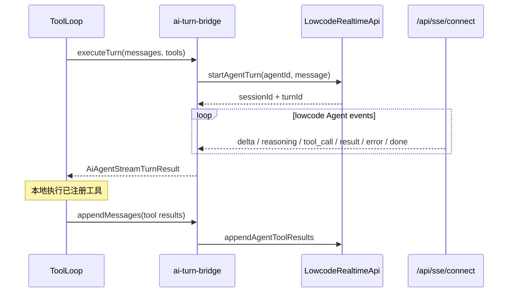

# 传输层与会话

> 状态：有效。类型 SSOT 见 [`transport-types.ts`](../src/agent/transport/transport-types.ts)；lowcode 物理端点只由 `@spark-appworks/spark-lowcode-api` 持有。

## 分层职责

```text
spark-ai（框架无关）
  transport-types.ts       消息、工具、turn 输入输出与回调合同
  app-sse-events.ts        llm-frame 等应用事件结构
  turn-event-collector.ts  聚合事件为 AiAgentStreamTurnResult

AppWorks 组合层
  src/services/ai/ai-turn-bridge.ts  本地 ToolLoop 与 lowcode Agent turn 的语义桥
  src/services/sse-events.ts         订阅 lowcode /api/sse/connect
  src/lowcode/lowcode-runtime.ts     唯一 LowcodeApi 实例与会话上下文

发布 API 包
  LowcodeRealtimeApi.startAgentTurn()          POST /api/ai/turns
  LowcodeRealtimeApi.appendAgentToolResults()  POST /api/ai/sessions/{id}/turn/append
  LowcodeRealtimeApi.connect()                 GET /api/sse/connect
```

`spark-ai` 不发起 HTTP。Agent、持久会话和模型配置由 lowcode-jdk17 持有；浏览器只运行已注册的前端工具，并通过 `AiAgentTurnCallbacks` 回传工具结果。

## 一轮 ToolLoop



关键约束：

- lowcode 返回的真实 `sessionId + turnId` 是事件归属和工具回传的唯一绑定。
- 前端本地业务 sessionId 不冒充或覆盖 lowcode 持久会话身份。
- 工具回传只接受真实 `toolCallId`、`toolName` 和序列化结果。
- SSE 事件必须同时匹配真实 session/turn；无法绑定的事件不进入当前 ToolLoop。
- 超时、畸形 envelope 和缺失 pending turn 都显式失败，不用本地假结果兜底。

## 关键文件

| 路径 | 职责 |
|------|------|
| `packages/spark-ai/src/agent/transport/transport-types.ts` | 框架无关 turn 契约 |
| `packages/spark-ai/src/agent/transport/app-sse-events.ts` | 应用 SSE 事件结构 |
| `packages/spark-ai/src/agent/tool-loop/turn-event-collector.ts` | llm-frame 聚合 |
| `src/services/ai/ai-turn-bridge.ts` | lowcode Agent turn 桥接与身份绑定 |
| `src/services/sse-events.ts` | lowcode SSE 单例连接与分发 |
| `packages/spark-lowcode-api/src/realtime/lowcode-realtime-api.ts` | 物理端点、wire envelope 与 SSE 解码 |
