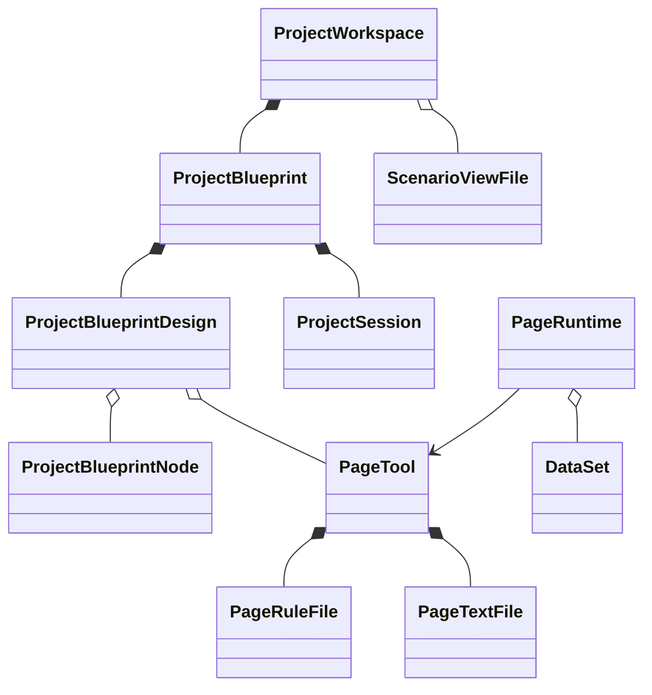

# 模型层级与生命周期

领域模型以当前源码为准。DTO 是跨边界数据合同，编辑历史、缓存和运行实例由对应 class 持有。

## 项目与节点

`ProjectBlueprint` 组合 `ProjectBlueprintDesign` 和 `ProjectSession`。设计聚合索引蓝图节点与页面工具，编辑会话保存选中节点、活动工具、草稿和脏状态。

正式节点 DTO 为：

```text
nodeId / parentNodeId / projectId / kind
capability
navigation?
dataSpace?
prototype?
source
children?   仅树投影
```

正式 kind 来自 `spark-utils` 的 module/page/embedded/service/content；unknown 保留读入诊断，不能通过正式策划完成。节点身份是 nodeId，工具身份是 pageId，业务场景身份是 scenarioId。多个节点可以指向同一工具，并保留各自的场景与策划上下文。

`capability.description` 是节点短需求；`readProjectPlanningInput()`、`readBlueprintPlanningInputs()` 和 `readPlanningProjection()` 提供策划输入与有效需求投影。`source` 保留实际后端记录，不是第二套推断字段。

## 工具与调用



`PageTool` 不继承蓝图节点。`project.openPageDesign(pageId)` 返回工具；它只持有 rule.json、script.js、style.css。`PageRuleFile` 保存 SparkNodeTree 和编辑历史；两个 `PageTextFile` 保存脚本/样式文本和历史。`toDefinition()` 输出工具定义，要求工具已装载。

`PageRuntime` 表达一次调用，持有唯一 instanceId、scenarioIds 和可选 mainScenarioId。即便共用同一工具，每次调用仍装配独立的 DataSet；运行实例不能共享业务数据集。装载失败清理已装配的兄弟场景，销毁拒绝迟到结果并释放本实例的数据。

视图引用为 `#scenarioId@table@view`。局部 `table@view` 只有明确主场景时可物化；不会把首个场景当主场景。物化会校验本次调用确实声明并装载了引用视图。

## 场景配置

`ScenarioViewConfig` 校验一个场景的 tables、正式 modelBinding、views 和 viewCascades。物理模型字段由正式模型提供，配置仅引用它们；运行装配核对字段存在性和权限。

`ScenarioViewFile` 持有原文、savedText 基线、校验后的 value 和撤销历史。`ProjectWorkspace.loadScenarioViews({scenarioId})` / `getScenarioViews(scenarioId)` 获取该场景的编辑 owner；`saveScenarioViews({scenarioId})` 执行写前原文比较和写后字节回读。身份改变、远端冲突、重复保存和回读不一致明确失败。后端没有 CAS，客户端比较不能承诺原子保护；失败不表示已写内容已撤销。

场景文件位于 `SysForm/<scenarioId>/pagedata.json`，与 `<appId>/<pageId>` 下的工具文件分离。

## IO、版本与发布

`ProjectWorkspace` 编排蓝图节点 CRUD、工具文件 IO、场景配置 IO 与跨项目引用；包不拥有服务器 URL 或认证策略。`PageContentLoader` 只读取三文件，缓存清理使相关在途读取失效；旧结果不能回填缓存。

工具工作内容使用裸文件名。快照是后端真实 `N__filename` 文件，列表摘要为 version/fileName/lastModified；没有独立版本表。创建候选号是同文件已有最大编号加一，上传最终路径和字节回读确认成功后才产生已确认事实。编号不能推断发布指针或 current。

发布引用保留在真实记录 `source.VersionId` 的 rule/script/style 分段。运行工具读取明确引用，缺分段拒绝；恢复把指定快照写回工作文件，不切换发布引用。目标工作文件 dirty 时拒绝恢复，保存期间的新编辑保留。

## UI 与 AI 消费

UI 通过 `subscribe` 和 `read*Projection()` 消费 ProjectBlueprint，工作保存经 ProjectWorkspace；场景文件 owner 和运行实例分别承担自身编辑/生命周期。

| 事件 | 内容 |
|---|---|
| blueprint.changed | 蓝图节点、树、草稿和 dirty 变化 |
| selection.changed | 选中节点或活动工具变化 |
| page.file.changed | 工具三文件编辑、保存或撤销变化 |
| runtime.changed | 工具装载状态变化 |

`blueprintDirty` 表示实际蓝图编辑，存在 draft 本身不代表 dirty。工具 dirtyFiles 只覆盖三文件；场景编辑由 ScenarioViewFile.isDirty 表达，运行业务编辑由 PageRuntime.isDirty 表达。

页面设计 AI 使用 ProjectWorkspace 根，三文件通过 `this.project.openPageDesign(pageId)` 编辑；只有输入明确 scenarioId 时才加载场景配置。每次运行使用 requestId、独立 Host 和独立编辑器；gate、交付回执及释放都遵循该身份。工具文件和场景配置分别返回实际保存结果，不以一次失败宣称全部回滚。

`SparkPageRenderer` 接收 PageRuntime 与调用 routeSnapshot；脚本 Render 组件、CSS 和状态仅属本实例，关闭 A 不会释放 B。路由/查询决定调用身份，工具 pageId 不充当运行实例 ID。

## 源码定位

| 能力 | 位置 |
|---|---|
| 正式蓝图合同、节点行为 | blueprint/project-blueprint-node.ts |
| 蓝图树投影、工具定位 | blueprint/project-blueprint-tree.ts |
| 节点索引与编辑边界 | blueprint/project-blueprint-index.ts、project-blueprint-edit.ts |
| 设计聚合与编辑会话 | project/project-design.ts、project-session.ts |
| 项目门面与投影 | project/project-blueprint.ts |
| IO 编排 | project/project-workspace.ts |
| 工具定义与运行调用 | page/page-tool.ts、runtime-page.ts |
| 场景配置与编辑历史 | scenario/scenario-view-config.ts、scenario-view-file.ts |
| 工具文件与版本 IO | io/page-file-api.ts、page-content-loader.ts |
